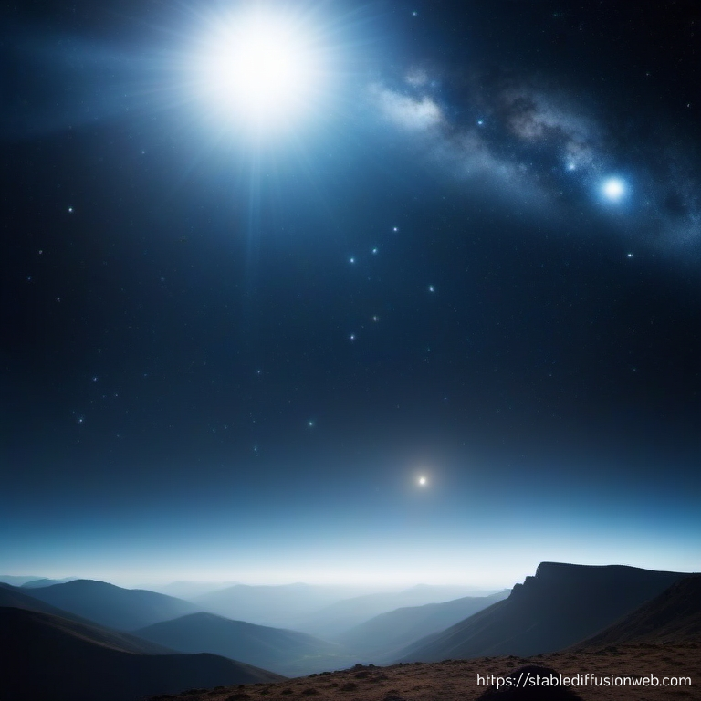

 <a href="../54%20-%20Vezot%20Haberakhah">Previous parasha (#54): Vezot Haberakhah</a> &nbsp;&nbsp; <a href="../02%20-%20Noach">Next parasha (#2): Noach</a>
# Parasha #1: Bereshit (בְּרֵאשִׁית)  
## Reading passages

Torah: <a href="https://www.stepbible.org/?q=version=NASB2020|reference=Gen.1:1-6:8&options=HNVUG" target="_blank">Genesis 1:1-6:8</a> &nbsp;&nbsp; <a href="https://tikkun.io/#/p/bereshit" target="_blank">(Hebrew: פָּרָשַׁת בְּרֵאשִׁית)</a> 
Haftarah: <a href="https://www.stepbible.org/?q=version=NASB2020|reference=Isa.42:5-43:10&options=HNVUG" target="_blank">Isaiah 42:5-43:10</a>

## Summary

Parasha Bereshit ("in the beginning") is the inaugural portion of the Torah and serves as an introduction to the Biblical narrative. It recounts the majestic creation of the world in six days and culminates on the seventh day with God blessing and sanctifying the Sabbath. The portion further sets the stage for the subsequent narratives of the Torah by describing Adam and Eve's placement in the Garden of Eden and their subsequent expulsion due to disobedience. It also introduces the genealogy of the early generations, highlighting key figures like Adam, Eve, Cain, and Abel.

## Related SHEBANQ queries

Verse | Query | Short description
--- | --- | ---
<a href="https://www.stepbible.org/?q=version=NASB2020\|reference=Gen.1:1&options=HNVUG" target="_blank">Gen. 1:1</a> | <a href="https://shebanq.ancient-data.org/hebrew/text?iid=6282&version=2021&page=1&mr=r&qw=q" target="_blank">Who is subject of בָּרָ֣א</a> | How is the word בָּרָ֣א being used? Who is creating something?
<a href="https://www.stepbible.org/?q=version=NASB2020\|reference=Gen.1:4&options=HNVUG" target="_blank">Gen. 1:4</a> | <a href="https://shebanq.ancient-data.org/hebrew/text?iid=6299&version=2021&page=1&mr=r&qw=q" target="_blank">Making separation - בדל hiphil</a> | This verse describes the first act of seperating. Where else. What is separated?
<a href="https://www.stepbible.org/?q=version=NASB2020\|reference=Gen.1:5&options=HNVUG" target="_blank">Gen. 1:5</a> | <a href="https://shebanq.ancient-data.org/hebrew/text?iid=6281&version=2021&page=1&mr=r&qw=q" target="_blank">day one or first day</a> | Does Gen. 1:5 refer to 'first day' (ordinal) or to 'one day' (cardinal)?
<a href="https://www.stepbible.org/?q=version=NASB2020\|reference=Gen.1:5,8,10&options=HNVUG" target="_blank">Gen. 1:5,8&10</a> | <a href="https://shebanq.ancient-data.org/hebrew/text?iid=6279&version=2021&page=1&mr=r&qw=q" target="_blank">God calling (קרא) + prep ל</a> | Search for paterns like the ones first found in Genesis 1:5,8 and 10 when giving names
<a href="https://www.stepbible.org/?q=version=NASB2020\|reference=Gen.1:12&options=HNVUG" target="_blank">Gen. 1:12</a> | <a href="https://shebanq.ancient-data.org/hebrew/text?iid=5623&version=2021&page=1&mr=r&qw=q" target="_blank">and it brought forth</a> | find first occurrence of וַיֵּצֵ֥א (wayiqtol) - and it brought forth. The first what was brougth forth were the green plants on the earth
<a href="https://www.stepbible.org/?q=version=NASB2020\|reference=Gen.1:16&options=HNVUG" target="_blank">Gen 1:16</a> | <a href="https://shebanq.ancient-data.org/hebrew/text?iid=6242&version=2021&page=1&mr=r&qw=q" target="_blank">dominion of large and small light</a> | Occurences of מֶמְשֶׁ֣לֶת (dominion)
<a href="https://www.stepbible.org/?q=version=NASB2020\|reference=Gen.1:22,28&options=HNVUG" target="_blank">Gen. 1:22&28</a> | <a href="https://shebanq.ancient-data.org/hebrew/text?iid=6286&version=2021&page=1&mr=r&qw=q" target="_blank">be fertile and be many</a> | Command by God to animals (v22) and mankind=Adam/Eve (v28)
<a href="https://www.stepbible.org/?q=version=NASB2020\|reference=Gen.2:4&options=HNVUG" target="_blank">Gen. 2:4</a> | <a href="https://shebanq.ancient-data.org/hebrew/text?iid=6261&version=2021&page=1&mr=r&qw=q" target="_blank">family stories - Toldot</a> | Toldot is found first time in Gen. 2:4; telling the family story of heaven and earth.

## Related Text-Fabric Notebooks

NBviewer | Short description
---|---
<a href="https://nbviewer.org/github/tonyjurg/Parashot/blob/main/WeeklyParasha/01%20-%20Bereshit/hapax.ipynb" target="_blank">hapax</a>| find unique words (*hapax legomena*) in this parasha
<a href="https://nbviewer.org/github/tonyjurg/Parashot/blob/main/WeeklyParasha/01%20-%20Bereshit/lexical_parallels.ipynb" target="_blank">Lexical parallels</a>| find lexical parallels between verses
<a href="https://nbviewer.org/github/tonyjurg/Parashot/blob/main/WeeklyParasha/01%20-%20Bereshit/delta_mt_and_sp.ipynb" target="_blank">Delta SP and MT</a>| identify differences between the Samaritan Pentateuch (SP) and Masoretic Text (MT)

## Parasha Data Sheet

<ul><li><a href="https://tonyjurg.github.io/Parashot/WeeklyParasha/01%20-%20Bereshit/hapax_legomena(Bereshit).html" target="_blank">Overview unique words in this parasha</a>
</li><li><a href="https://tonyjurg.github.io/Parashot/WeeklyParasha/01%20-%20Bereshit/differences_MT_SP(Bereshit).html" target="_blank">Differences between MT and SP for this parasha</a>
</li><li><a href="https://tonyjurg.github.io/Parashot/WeeklyParasha/01%20-%20Bereshit/levenshtein_differences_MT_SP(Bereshit).html" target="_blank">Differences between MT and SP for this parasha (Lenenshtein distance)</a>
</li><li><a href="https://tonyjurg.github.io/Parashot/WeeklyParasha/01%20-%20Bereshit/spelling_differences_SP_MT(Bereshit).html" target="_blank">Spelling differences in names between MT and SP for this parasha</a>
</li><li><a href="https://tonyjurg.github.io/Parashot/WeeklyParasha/01%20-%20Bereshit/lexical_parallels(Bereshit).html" target="_blank">Lexical paralels between this parasha and the Tenach</a>
</li></ul>

## Hebcal

Additional details about Jewish calendar and holiday information, offering users a resource for tracking Hebrew dates, candle lighting times, and other relevant information in the Jewish calendar. <a href="https://www.hebcal.com/sedrot/bereshit" target="_blank">Hebcal entry for parasha Bereshit</a>.

## AI generated image

Image created by Stable Diffusion using prompt "in the beginning God created the heavens and the earth" (cinematic-default).
