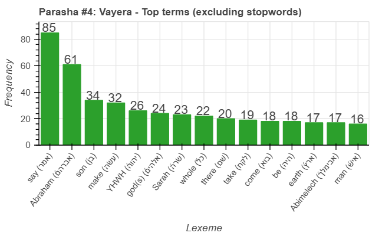
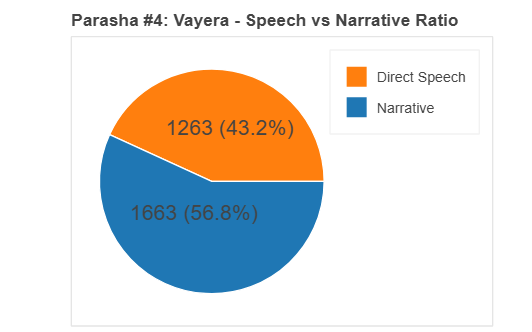
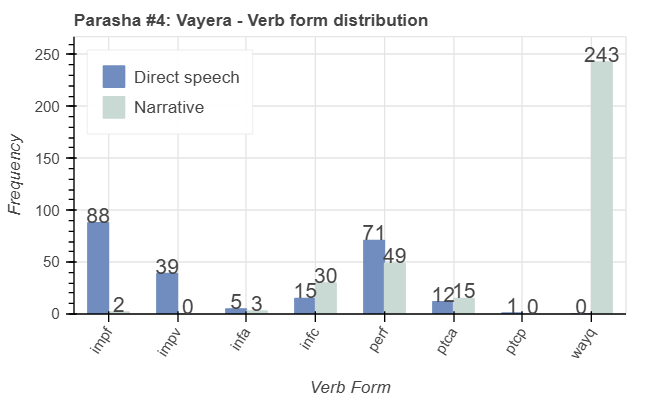
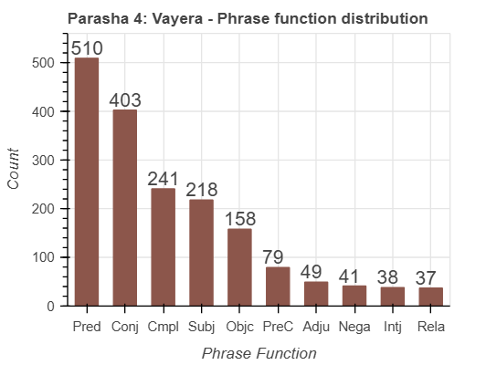

<a href="../03%20-%20Lech%20Lecha">Previous parasha (#3): Lech Lecha</a> &nbsp;&nbsp;<a href="../05%20-%20Chayei%20Sara">Next parasha (#5): Chayei Sara</a>
# Parasha&nbsp;#4: Vayera (וַיֵּרָא)  

## Reading passages

Torah: <a href="https://www.stepbible.org/?q=version=NASB2020|reference=Gen.18:1-22:24&options=HNVUG" target="_blank">Genesis 18:1-22:24</a> &nbsp;&nbsp; <a href="https://tikkun.io/#/p/vayera" target="_blank">(Hebrew: פָּרָשַׁת וַיֵּרָא)</a> 
Haftarah: <a href="https://www.stepbible.org/?q=version=NASB2020|reference=2Kgs.4:1-37&options=HNVUG" target="_blank">II Kings 4:1-37</a>

## Summary

Parasha Vayera ("And He appeared") continues the history of Abraham, focusing on his encounters with divine messengers and the impending birth of his son Isaac. The portion also includes the dramatic story of the destruction of Sodom and Gomorrah, highlighting themes of hospitality, divine intervention, and the fulfillment of God's promises to Abraham and Sarah. Additionally, it recounts the near-sacrifice of Isaac, emphasizing Abraham's unwavering faith and God's provision, which becomes a pivotal moment in the unfolding of the covenant.

## Parasha statistics

<a href="../../General/metrics_distribution.html" target="_blank">Interactive statistics for all parashot (# of words, sentences, etc.)</a>

## Parasha Data Sheets

<ul><li><a href="https://tonyjurg.github.io/Parashot/WeeklyParasha/04%20-%20Vayera/hapax_legomena(Vayera).html" target="_blank">Overview unique words in this parasha</a>
</li><li><a href="https://tonyjurg.github.io/Parashot/WeeklyParasha/04%20-%20Vayera/differences_MT_SP(Vayera).html" target="_blank">Differences between MT and SP for this parasha</a>
</li><li><a href="https://tonyjurg.github.io/Parashot/WeeklyParasha/04%20-%20Vayera/levenshtein_differences_MT_SP(Vayera).html" target="_blank">Differences between MT and SP for this parasha (Lenenshtein distance)</a>
</li><li><a href="https://tonyjurg.github.io/Parashot/WeeklyParasha/04%20-%20Vayera/spelling_differences_SP_MT(NVayera).html" target="_blank">Spelling differences in names between MT and SP for this parasha</a>
</li><li><a href="https://tonyjurg.github.io/Parashot/WeeklyParasha/04%20-%20Vayera/lexical_parallels(Vayera).html" target="_blank">Lexical paralels between this parasha and the Tenach</a>
</li></ul>

## Related SHEBANQ queries

Verse | Query | Short description
--- | --- | ---
<a href="https://www.stepbible.org/?q=version=NASB2020\|reference=Gen.18:1&options=HNVUG" target="_blank">Gen. 18:1 </a> | <a href="https://shebanq.ancient-data.org/hebrew/text?iid=6876&version=2021&page=1&mr=r&qw=q" target="_blank">God appears</a> | God (or something of God) as subject to רָאָה in nifil stem.
<a href="https://www.stepbible.org/?q=version=NASB2020\|reference=Gen.18:10&options=HNVUG" target="_blank">Gen. 18:10 </a> | <a href="https://shebanq.ancient-data.org/hebrew/text?iid=6641&version=2021&page=1&mr=r&qw=q" target="_blank">'certain return'</a> | The Lord promises to surely come back in a year time.
<a href="https://www.stepbible.org/?q=version=NASB2020\|reference=Gen.18:27&options=HNVUG" target="_blank">Gen. 18:27 </a> | <a href="https://shebanq.ancient-data.org/hebrew/text?iid=5556&version=2021&page=1&mr=r&qw=q" target="_blank">Dust and ashes</a> | The combination of 'dust and ashes' (עָפָר and אֵפֶר) is found first in Gen. 18:27. Where else?
<a href="https://www.stepbible.org/?q=version=NASB2020\|reference=Gen.18:33&options=HNVUG" target="_blank">Gen. 18:33</a> | <a href="https://shebanq.ancient-data.org/hebrew/text?iid=6306&version=2021&page=1&mr=r&qw=q" target="_blank">Completion</a> | Verb כָּלָה - completing
<a href="https://www.stepbible.org/?q=version=NASB2020\|reference=Gen.21:22&options=HNVUG" target="_blank">Gen. 21:22</a> | <a href="https://shebanq.ancient-data.org/hebrew/text?iid=5997&version=2021&page=1&mr=r&qw=q" target="_blank">It was in that time</a> |  In Genesis 21:22 we have the first instance of the phrase וַֽיְהִי֙ בָּעֵ֣ת הַהִ֔וא (it was in that time). This query finds all instances of this phrase in the TeNaCH. 
<a href="https://www.stepbible.org/?q=version=NASB2020\|reference=Gen.22:7-8&options=HNVUG" target="_blank">Gen. 22:7,8</a> | <a href="https://shebanq.ancient-data.org/hebrew/text?iid=6871	&version=2021&page=1&mr=r&qw=q" target="_blank">'the lamb' (implied or explicit)</a> |  Isaak ask: where is 'the lamb'. Where else 'the lamb' (implied or explicit).

## Related Text-Fabric Notebooks

GitHub | NBviewer | Short description
---|---|---
<a href="https://github.com/tonyjurg/Parashot/blob/main/WeeklyParasha/04%20-%20Vayera/hapax.ipynb" target="_blank">hapax</a> | <a href="https://nbviewer.org/github/tonyjurg/Parashot/blob/main/WeeklyParasha/04%20-%20Vayera/hapax.ipynb" target="_blank">hapax</a> | Find unique words (*hapax legomena*).
<a href="https://github.com/tonyjurg/Parashot/blob/main/WeeklyParasha/04%20-%20Vayera/lexical_parallels.ipynb" target="_blank">Lexical parallels</a> | <a href="https://nbviewer.org/github/tonyjurg/Parashot/blob/main/WeeklyParasha/04%20-%20Vayera/lexical_parallels.ipynb" target="_blank">Lexical parallels</a>| Find lexical parallels between verses.
<a href="https://github.com/tonyjurg/Parashot/blob/main/WeeklyParasha/04%20-%20Vayera/delta_mt_and_sp.ipynb" target="_blank">Delta SP and MT</a> | <a href="https://nbviewer.org/github/tonyjurg/Parashot/blob/main/WeeklyParasha/04%20-%20Vayera/delta_mt_and_sp.ipynb" target="_blank">Delta SP and MT</a>| Identify differences between the Samaritan Pentateuch (SP) and Masoretic Text (MT).
<a href="https://github.com/tonyjurg/Parashot/tree/main/WeeklyParasha/04%20-%20Vayera/parasha_analysis.ipynb" target="_blank">Parasha statistics</a> | <a href="https://nbviewer.org/github/tonyjurg/Parashot/blob/main/WeeklyParasha/04%20-%20Vayera/parasha_analysis.ipynb" target="_blank">Parasha statistics</a>| Create graphical statistics for this parasha.

## Hebcal

Additional details about Jewish calendar and holiday information, offering users a resource for tracking Hebrew dates, candle lighting times, and other relevant information in the Jewish calendar. <a href="https://www.hebcal.com/sedrot/vayera" target="_blank">Hebcal entry for parasha Vayera</a>.

## AI generated image

The following image was created by DALL.E as illustration for this parasha. The following prompt was auto generated based upon the name of the parasha: "A dramatic biblical scene inspired by Parasha Vayera, focusing on one of its key events. The image depicts Abraham on Mount Moriah, in the moment of the near-sacrifice of Isaac. Abraham, aged and resolute, holds a knife above an altar where young Isaac lies bound, looking both fearful and trusting. The tension is interrupted by a divine angel appearing mid-air, gesturing to stop Abraham. Nearby, a ram is caught in a thicket, foreshadowing God's provision. The setting is a rocky, sunlit mountain landscape, with clouds parting to reveal a divine glow. The atmosphere is both reverent and dramatic, emphasizing faith, intervention, and covenant. Include historical details in clothing and setting for authenticity."

