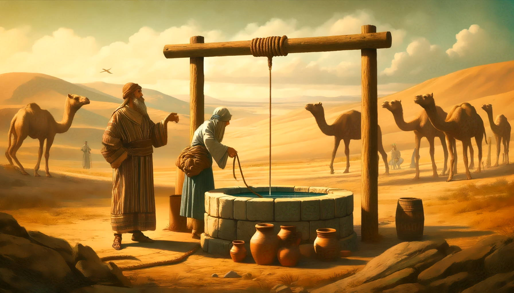

<a href="../04%20-%20Vayera">Previous parasha (#4): Vayera</a> &nbsp;&nbsp;<a href="../06%20-%20Toldot">Next parasha (#6): Toldot</a>
# Parasha #5: Chayei Sarah (שָׂרָה‎ חַיֵּי) 

## Reading passages

Torah: <a href="https://www.stepbible.org/?q=version=NASB2020|reference=Gen.23:1-25:18&options=HNVUG" target="_blank">Gen. 23:1-25:18</a>
)  &nbsp;&nbsp; <a href="https://tikkun.io/#/p/chayei-sara" target="_blank">(Hebrew: שָׂרָה‎ פָּרָשַׁת חַיֵּי)</a> 
Haftarah:  <a href="https://www.stepbible.org/?q=version=NASB2020|reference=1Kgs.1:1-31&options=HNVUG" target="_blank">I Kings 1:1-31</a>

## Summary

Parashat Chayei-Sarah ("life of Sarah") begins with the death of Sarah and Abraham's purchase of the Cave of Machpelah as a burial site for her. It also details Abraham's efforts to find a suitable wife, Rebekah, for his son Isaac, emphasizing the importance of maintaining the family line and God's providence in guiding their actions.

## Related SHEBANQ queries

Verse | Query | Description
--- | --- | ---

## Related Text-Fabric Notebooks

GitHub | NBviewer | Short description
---|---|---
[hapax](hapax.ipynb) | <a href="https://nbviewer.org/github/tonyjurg/Parashot/blob/main/WeeklyParasha/05%20-%20Chayei%20Sarah/hapax.ipynb" target="_blank">hapax</a> | find unique words (*hapax legomena*)

## Hebcal

Additional details about Jewish calendar and holiday information, offering users a resource for tracking Hebrew dates, candle lighting times, and other relevant information in the Jewish calendar. <a href="https://www.hebcal.com/sedrot/Chayei-Sara" target="_blank">Hebcal entry for parasha Chayei Sara</a>.

## AI generated image

Image created by DALL-E: Rebekah at the well.
