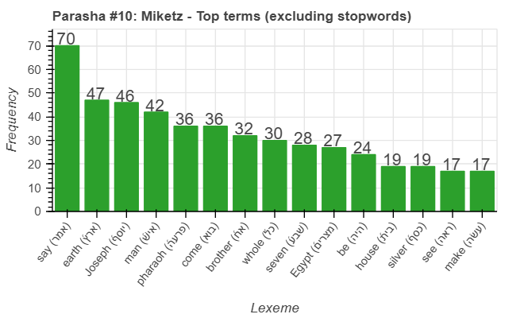

<a href="../09%20-%20Vayeshev">Previous parasha (#9): Vayeshev</a> &nbsp;&nbsp;<a href="../11%20-%20Vayigash">Next parasha (#11): Vayigash</a>

# Parasha&nbsp;#10: Miketz (מִקֵּץ) 

## Reading passages

Torah: <a href="https://www.stepbible.org/?q=version=NASB2020|reference=Gen.41:1-44:17&options=HNVUG" target="_blank">Genesis 41:1-44:17</a> &nbsp;&nbsp; <a href="https://tikkun.io/#/p/miketz" target="_blank">(Hebrew: פָּרָשַׁת מִקֵּץ)</a> 
Haftarah: <a href="https://www.stepbible.org/?q=version=NASB2020|reference=1Kgs.3:15-4:1&options=HNVUG" target="_blank">I Kings 3:15-4:1</a>

## Summary

Parasha Miketz ("at the end") continues the story of Joseph in Egypt. It begins with Joseph, now a high-ranking official, interpreting Pharaoh's dreams, which predict seven years of plenty followed by seven years of severe famine. Impressed by his wisdom, Pharaoh appoints Joseph as governor, giving him authority over the land of Egypt to manage the forthcoming crisis. The portion also follows the reunion of Joseph with his brothers, who come to Egypt seeking food during the famine. Unrecognized by his brothers, Joseph tests their integrity by placing a silver cup in Benjamin's sack, leading to a series of tense and emotionally charged encounters. These events set the stage for the intricate unfolding of their family's fate, ultimately guiding them toward reconciliation and the preservation of their lineage.

## Parasha statistics

<a href="../../General/metrics_distribution.html" target="_blank">Interactive statistics for all parashot (# of words, sentences, etc.)</a>

## Parasha Data Sheet

<ul><li><a href="https://tonyjurg.github.io/Parashot/WeeklyParasha/10%20-%20Miketz/hapax_legomena(Miketz).html" target="_blank">Overview unique words in this parasha</a>
</li><li><a href="https://tonyjurg.github.io/Parashot/WeeklyParasha/10%20-%20Miketz/differences_MT_SP(Miketz).html" target="_blank">Differences between MT and SP for this parasha</a>
</li><li><a href="https://tonyjurg.github.io/Parashot/WeeklyParasha/10%20-%20Miketz/levenshtein_differences_MT_SP(Miketz).html" target="_blank">Differences between MT and SP for this parasha (Lenenshtein distance)</a>
</li><li><a href="https://tonyjurg.github.io/Parashot/WeeklyParasha/10%20-%20Miketz/spelling_differences_SP_MT(Miketz).html" target="_blank">Spelling differences in names between MT and SP for this parasha</a>
</li><li><a href="https://tonyjurg.github.io/Parashot/WeeklyParasha/10%20-%20Miketz/lexical_parallels(Miketz).html" target="_blank">Lexical paralels between this parasha and the Tenach</a>
</li></ul>

## Related SHEBANQ queries

Verse | Query | Description
--- | --- | ---
<a href="https://www.stepbible.org/?q=version=NASB2020\|reference=Gen.41:8,38&options=HNVUG" target="_blank">Gen. 41:8&38</a> | <a href="https://shebanq.ancient-data.org/hebrew/text?iid=6312	&version=2021&page=1&mr=r&qw=q" target="_blank">Ruach as subject</a> | The use of רוּחַ as subject in a phrase
<a href="https://www.stepbible.org/?q=version=NASB2020\|reference=Gen.41:30;43:2;44:17&options=HNVUG" target="_blank">Gen. 41:30; 43:2; 44:17</a> | <a href="https://shebanq.ancient-data.org/hebrew/text?iid=6306&version=2021&page=1&mr=r&qw=q" target="_blank">Completion</a> | Verb כָּלָה - the hunger 'completed'.
<a href="https://www.stepbible.org/?q=version=NASB2020\|reference=Gen.43:11&options=HNVUG" target="_blank">Gen. 43:11</a> | <a href="https://shebanq.ancient-data.org/hebrew/text?iid=6982	&version=2021&page=1&mr=r&qw=q" target="_blank">Almond and almond blossem</a> | The various use of almond in symbolic and practical contexts

## Related Text-Fabric Notebooks

GitHub | NBviewer | Short description
---|---|---
<a href="https://github.com/tonyjurg/Parashot/tree/main/WeeklyParasha/10%20-%20Miketz/hapax.ipynb" target="_blank">hapax</a> | <a href="https://nbviewer.org/github/tonyjurg/Parashot/blob/main/WeeklyParasha/10%20-%20Miketz/hapax.ipynb" target="_blank">hapax</a>| Find unique words (*hapax legomena*) in this parasha.
<a href="https://github.com/tonyjurg/Parashot/tree/main/WeeklyParasha/10%20-%20Miketz/lexical_parallels.ipynb" target="_blank">Lexical parallels</a> | <a href="https://nbviewer.org/github/tonyjurg/Parashot/blob/main/WeeklyParasha/10%20-%20Miketz/lexical_parallels.ipynb" target="_blank">Lexical parallels</a>| Find lexical parallels between verses.
<a href="https://github.com/tonyjurg/Parashot/tree/main/WeeklyParasha/10%20-%20Miketz/delta_mt_and_sp.ipynb" target="_blank">Delta SP and MT</a> | <a href="https://nbviewer.org/github/tonyjurg/Parashot/blob/main/WeeklyParasha/10%20-%20Miketz/delta_mt_and_sp.ipynb" target="_blank">Delta SP and MT</a>| Identify differences between the Samaritan Pentateuch (SP) and Masoretic Text (MT).
<a href="https://github.com/tonyjurg/Parashot/tree/main/WeeklyParasha/10%20-%20Miketz/parasha_analysis.ipynb" target="_blank">Parasha statistics</a> | <a href="https://nbviewer.org/github/tonyjurg/Parashot/blob/main/WeeklyParasha/10%20-%20Miketz/parasha_analysis.ipynb" target="_blank">Parasha statistics</a>| Create graphical statistics for this parasha.

## Hebcal

Additional details about Jewish calendar and holiday information, offering users a resource for tracking Hebrew dates, candle lighting times, and other relevant information in the Jewish calendar. <a href="https://www.hebcal.com/sedrot/miketz" target="_blank">Hebcal entry for parasha Miketz</a>.

## AI generated image

The following image was created by DALL.E based upon the initial prompt "create an image for parsha miketz". It was expanded into: "A vivid and dramatic illustration of the biblical Parsha Miketz, focusing on Pharaoh's dream as interpreted by Joseph. The image shows Joseph, in Egyptian royal attire, gesturing toward a vision materializing in the air. The vision depicts seven healthy, fat cows grazing by the Nile, contrasted with seven gaunt, sickly cows emerging from the water. Another part of the vision shows seven full ears of grain, lush and golden, alongside seven withered, dry ears being consumed by the wind. Pharaoh watches intently from his ornate golden throne, surrounded by advisors in an opulent palace with hieroglyphic details. The atmosphere is mystical, with glowing, surreal light emphasizing the divine and prophetic nature of the scene."

