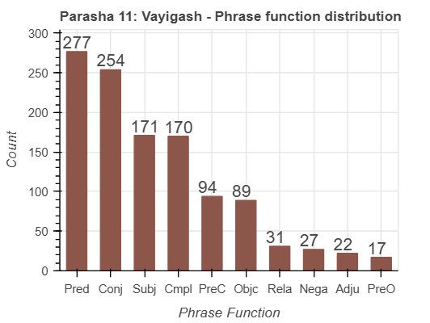

<a href="../10%20-%20Miketz">Previous parasha (#10): Miketz</a> &nbsp;&nbsp;<a href="../12%20-%20Vayechi">Next parasha (#12): Vayechi</a>

# Parasha&nbsp;#11: Vayigash (וַיִּגַּשׁ) 

## Reading passages

Torah: <a href="https://www.stepbible.org/?q=version=NASB2020|reference=Gen.44:18-47:27&options=HNVUG" target="_blank">Genesis 44:18-47:27</a> &nbsp;&nbsp; <a href="https://tikkun.io/#/p/vayigash" target="_blank">(Hebrew: פָּרָשַׁת וַיִּגַּשׁ)</a> 
Haftarah: <a href="https://www.stepbible.org/?q=version=NASB2020|reference=Eze.37:15-28&options=HNVUG" target="_blank">Ezekiel 37:15-28</a>

## Summary

Parasha Vayigash ("and he drew near") recounts the dramatic moment when Judah approaches the powerful Egyptian ruler, Joseph, pleading for the release of his younger brother Benjamin, offering himself as a slave instead. Overcome with emotion, Joseph reveals his true identity to his astonished brothers, leading to a tearful reunion and reconciliation within the family. This parasha also details Joseph's invitation to his father Jacob and his entire family to settle in Egypt, where they are provided with the best land in Goshen, ensuring their survival during the severe famine.

## Parasha statistics

<a href="../../General/metrics_distribution.html" target="_blank">Interactive statistics for all parashot (# of words, sentences, etc.)</a>

## Parasha Data Sheet

<ul><li><a href="https://tonyjurg.github.io/Parashot/WeeklyParasha/11%20-%20Vayigash/hapax_legomena(Vayigash).html" target="_blank">Overview unique words in this parasha</a>
</li><li><a href="https://tonyjurg.github.io/Parashot/WeeklyParasha/11%20-%20Vayigash/differences_MT_SP(Vayigash).html" target="_blank">Differences between MT and SP for this parasha</a>
</li><li><a href="https://tonyjurg.github.io/Parashot/WeeklyParasha/11%20-%20Vayigash/levenshtein_differences_MT_SP(Vayigash).html" target="_blank">Differences between MT and SP for this parasha (Lenenshtein distance)</a>
</li><li><a href="https://tonyjurg.github.io/Parashot/WeeklyParasha/11%20-%20Vayigash/spelling_differences_SP_MT(Vayigash).html" target="_blank">Spelling differences in names between MT and SP for this parasha</a>
</li><li><a href="https://tonyjurg.github.io/Parashot/WeeklyParasha/11%20-%20Vayigash/lexical_parallels(Vayigash).html" target="_blank">Lexical paralels between this parasha and the Tenach</a>
</li></ul>

## Related SHEBANQ queries

Verse | Query | Description
--- | --- | ---
<a href="https://www.stepbible.org/?q=version=NASB2020\|reference=Gen.45:27&options=HNVUG" target="_blank">Gen. 45:27</a> | <a href="https://shebanq.ancient-data.org/hebrew/text?iid=6312	&version=2021&page=1&mr=r&qw=q" target="_blank">Ruach as subject</a> | The use of רוּחַ as subject in a phrase

## Related Text-Fabric Notebooks

GitHub | NBviewer | Short description
---|---|---
<a href="https://github.com/tonyjurg/Parashot/tree/main/WeeklyParasha/11%20-%20Vayigash/hapax.ipynb" target="_blank">hapax</a> | <a href="https://nbviewer.org/github/tonyjurg/Parashot/blob/main/WeeklyParasha/11%20-%20Vayigash/hapax.ipynb" target="_blank">hapax</a>| Find unique words (*hapax legomena*) in this parasha.
<a href="https://github.com/tonyjurg/Parashot/tree/main/WeeklyParasha/11%20-%20Vayigash/lexical_parallels.ipynb" target="_blank">Lexical parallels</a> | <a href="https://nbviewer.org/github/tonyjurg/Parashot/blob/main/WeeklyParasha/11%20-%20Vayigash/lexical_parallels.ipynb" target="_blank">Lexical parallels</a>| Find lexical parallels between verses.
<a href="https://github.com/tonyjurg/Parashot/tree/main/WeeklyParasha/11%20-%20Vayigash/delta_mt_and_sp.ipynb" target="_blank">Delta SP and MT</a> | <a href="https://nbviewer.org/github/tonyjurg/Parashot/blob/main/WeeklyParasha/11%20-%20Vayigash/delta_mt_and_sp.ipynb" target="_blank">Delta SP and MT</a>| Identify differences between the Samaritan Pentateuch (SP) and Masoretic Text (MT).
<a href="https://github.com/tonyjurg/Parashot/tree/main/WeeklyParasha/11%20-%20Vayigash/parasha_analysis.ipynb" target="_blank">Parasha statistics</a> | <a href="https://nbviewer.org/github/tonyjurg/Parashot/blob/main/WeeklyParasha/11%20-%20Vayigash/parasha_analysis.ipynb" target="_blank">Parasha statistics</a>| Create graphical statistics for this parasha.

## Hebcal

Additional details about Jewish calendar and holiday information, offering users a resource for tracking Hebrew dates, candle lighting times, and other relevant information in the Jewish calendar. <a href="https://www.hebcal.com/sedrot/vayigash" target="_blank">Hebcal entry for parasha Vayigash</a>.

## AI generated image

The following image was created by DALL.E based upon the initial prompt "A dramatic biblical scene depicting Joseph revealing his identity to his brothers. Joseph, dressed in Egyptian royal attire, stands with open arms, tears in his eyes, as his brothers react with shock, awe, and emotion. The setting is intimate, with only Joseph and his brothers present. The brothers wear traditional Hebrew-style robes, some kneeling, some standing in disbelief. Warm golden light filters through the scene, highlighting the deep emotions of the moment."

