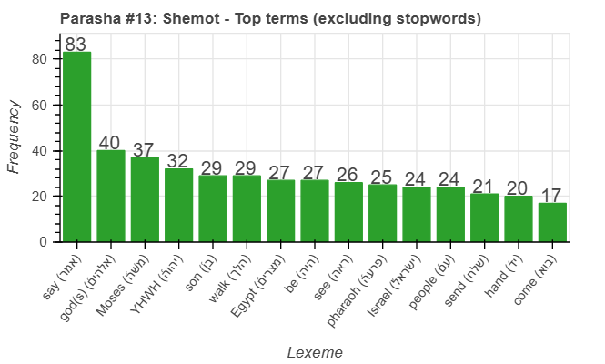
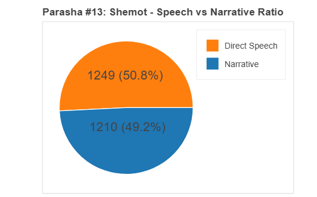
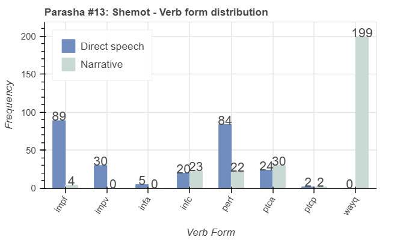
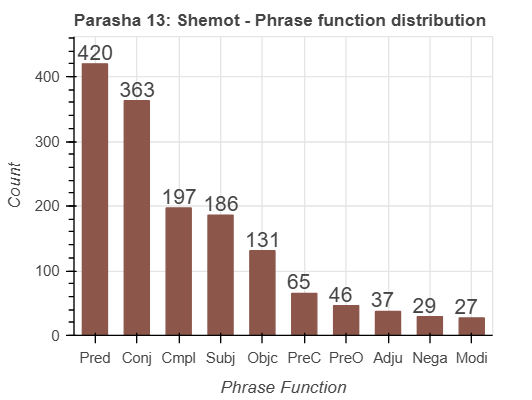
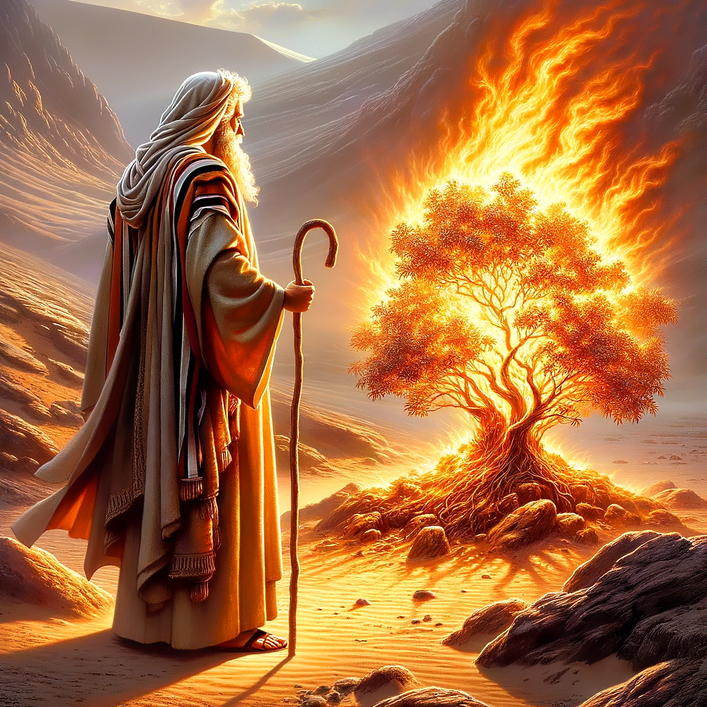

<a href="../12%20-%20Vayechi">Previous parasha (#12): Vayechi</a> &nbsp;&nbsp;<a href="../14%20-%20Va'era">Next parasha (#14): Va'era</a>

# Parasha&nbsp;#13: Shemot (שְׁמוֹת‎) 

## Reading passages

Torah: <a href="https://www.stepbible.org/?q=version=NASB2020|reference=Ex.1:1-6:1&options=HNVUG" target="_blank">Exodus 1:1-6:1</a> &nbsp;&nbsp; <a href="https://tikkun.io/#/p/shemot" target="_blank">(Hebrew: פָּרָשַׁת שְׁמוֹת)</a> 
Haftarah: <a href="https://www.stepbible.org/?q=version=NASB2020|reference=Is.27:6-28:13+Is.29:22-23&options=HNVUG" target="_blank">Isaiah 27:6-28:13; 29:22-23</a> (Ashkenazim) or <a href="https://www.stepbible.org/?q=version=NASB2020|reference=Jer.1:1-2:3&options=HNVUG" target="_blank">Jeremiah 1:1-2:3</a> (Sephardim)

## Summary

In parasha Shemot ("names"), the children of Israel multiply in Egypt, leading Pharaoh to enslave them and order the killing of male babies. Moses is born and, after being placed in a basket on the river, is found by Pharaoh's daughter and raised as her son. As a young man, Moses kills an Egyptian and flees to Midian, where he marries and becomes a shepherd. God appears to Moses at Mount Sinai, instructing him to demand Pharaoh to let the Israelites go. Moses, accompanied by his brother Aaron, faces Pharaoh, but he refuses. Despite hardships, God assures Moses that redemption is imminent.

## Parasha statistics

<a href="../../General/metrics_distribution.html" target="_blank">Interactive statistics for all parashot (# of words, sentences, etc.)</a>

## Parasha Data Sheet

<ul><li><a href="https://tonyjurg.github.io/Parashot/WeeklyParasha/13%20-%20Shemot/hapax_legomena(Shemot).html" target="_blank">Overview unique words in this parasha</a>
</li><li><a href="https://tonyjurg.github.io/Parashot/WeeklyParasha/13%20-%20Shemot/differences_MT_SP(Shemot).html" target="_blank">Differences between MT and SP for this parasha</a>
</li><li><a href="https://tonyjurg.github.io/Parashot/WeeklyParasha/13%20-%20Shemot/levenshtein_differences_MT_SP(Shemot).html" target="_blank">Differences between MT and SP for this parasha (Lenenshtein distance)</a>
</li><li><a href="https://tonyjurg.github.io/Parashot/WeeklyParasha/13%20-%20Shemot/spelling_differences_SP_MT(Shemot).html" target="_blank">Spelling differences in names between MT and SP for this parasha</a>
</li><li><a href="https://tonyjurg.github.io/Parashot/WeeklyParasha/13%20-%20Shemot/lexical_parallels(Shemot).html" target="_blank">Lexical paralels between this parasha and the Tenach</a>
</li></ul>

## Related SHEBANQ queries

Verse | Query | Short description
--- | --- | ---
<a href="https://www.stepbible.org/?q=version=NASB2020\|reference=Ex.1:1&options=HNVUG" target="_blank">Ex. 1:1</a> | <a href="https://shebanq.ancient-data.org/hebrew/text?iid=6284&version=2021&page=1&mr=r&qw=q" target="_blank">These are the names</a> | Find other occurences of the phrase "these are the names".
<a href="https://www.stepbible.org/?q=version=NASB2020\|reference=Ex.1:7&options=HNVUG" target="_blank">Ex. 1:7</a> | <a href="https://shebanq.ancient-data.org/hebrew/text?iid=6286&version=2021&page=1&mr=r&qw=q" target="_blank">Be fertile and be many</a> | The children of Israel became fertile and many. This was fulfilling the command given in Gen. 1:28.
<a href="https://www.stepbible.org/?q=version=NASB2020\|reference=Ex.1:10&options=HNVUG" target="_blank">Ex. 1:10</a> | <a href="https://shebanq.ancient-data.org/hebrew/text?iid=6285&version=2021&page=1&mr=r&qw=q" target="_blank">Let us act wisely</a> | The Pharao wanted the people to 'act wisely'. Where else is this verb used?
<a href="https://www.stepbible.org/?q=version=NASB2020\|reference=Ex.2:2&options=HNVUG" target="_blank">Ex. 2:2</a> | <a href="https://shebanq.ancient-data.org/hebrew/text?iid=6289&version=2021&page=1&mr=r&qw=q" target="_blank">A 'tov' child</a> | The mother of Moses considered the child טֹוב. What else is considered טֹוב ?
<a href="https://www.stepbible.org/?q=version=NASB2020\|reference=Ex.2:14&options=HNVUG" target="_blank">Ex. 2:14</a> | <a href="https://shebanq.ancient-data.org/hebrew/text?iid=6318&version=2021&page=1&mr=r&qw=q" target="_blank">Commander and judge</a> | The phrase שַׂ֤ר וְשֹׁפֵט֙ forms a hendiadys, saying one thing using two likewise words.
<a href="https://www.stepbible.org/?q=version=NASB2020\|reference=Ex.2:19;3:8&options=HNVUG" target="_blank">Ex. 2:19; 3:8</a>|  <a href="https://shebanq.ancient-data.org/hebrew/text?iid=5471&version=2021&page=1&mr=r&qw=q" target="_blank">Deliver from the hand</a>| Locate texts with the words (in any order) "delivered from the hand". (Timothy Baze)
<a href="https://www.stepbible.org/?q=version=NASB2020\|reference=Ex.2:24&options=HNVUG" target="_blank">Ex. 2:24</a> | <a href="https://shebanq.ancient-data.org/hebrew/text?iid=6290&version=2021&page=1&mr=r&qw=q" target="_blank">The groaning of the people</a> | God heard the groaning of the people in Egypt. Where else is groaning found?
<a href="https://www.stepbible.org/?q=version=NASB2020\|reference=Ex.3:16;4:1,5&options=HNVUG" target="_blank">Ex. 3:16;4:1,5 </a> | <a href="https://shebanq.ancient-data.org/hebrew/text?iid=6876&version=2021&page=1&mr=r&qw=q" target="_blank">God appears</a> | God (or something of God) as subject to רָאָה in nifil stem.
<a href="https://www.stepbible.org/?q=version=NASB2020\|reference=Ex.5:5&options=HNVUG" target="_blank">Ex. 5:5</a> | <a href="https://shebanq.ancient-data.org/hebrew/text?iid=6346&page=1&mr=r&qw=q" target="_blank">causative verb shabatizing</a> | Causing to take a rest.
<a href="https://www.stepbible.org/?q=version=NASB2020\|reference=Ex.5:13,14&options=HNVUG" target="_blank">Ex. 5:13,14</a> | <a href="https://shebanq.ancient-data.org/hebrew/text?iid=6306&version=2021&page=1&mr=r&qw=q" target="_blank">Completion</a> | Verb כָּלָה - completing
<a href="https://www.stepbible.org/?q=version=NASB2020\|reference=Ex.6:1&options=HNVUG" target="_blank">Ex. 6:1</a> | <a href="https://shebanq.ancient-data.org/hebrew/text?iid=6888&page=1&mr=r&qw=q" target="_blank">With a strong hand</a> | The strong hand of the LORD forces the Pharao to send out and to drive out.

## Related Text-Fabric Notebooks

GitHub | NBviewer | Short description
---|---|---
[hapax](hapax.ipynb) | <a href="https://nbviewer.org/github/tonyjurg/Parashot/blob/main/WeeklyParasha/13%20-%20Shemot/hapax.ipynb" target="_blank">hapax</a> | find unique words (*hapax legomena*)

<a href="https://github.com/tonyjurg/Parashot/tree/main/WeeklyParasha/13%20-%20Shemot/hapax.ipynb" target="_blank">hapax</a> | <a href="https://nbviewer.org/github/tonyjurg/Parashot/blob/main/WeeklyParasha/13%20-%20Shemot/hapax.ipynb" target="_blank">hapax</a>| Find unique words (*hapax legomena*) in this parasha.
<a href="https://github.com/tonyjurg/Parashot/tree/main/WeeklyParasha/13%20-%20Shemot/lexical_parallels.ipynb" target="_blank">Lexical parallels</a> | <a href="https://nbviewer.org/github/tonyjurg/Parashot/blob/main/WeeklyParasha/13%20-%20Shemot/lexical_parallels.ipynb" target="_blank">Lexical parallels</a>| Find lexical parallels between verses.
<a href="https://github.com/tonyjurg/Parashot/tree/main/WeeklyParasha/13%20-%20Shemot/delta_mt_and_sp.ipynb" target="_blank">Delta SP and MT</a> | <a href="https://nbviewer.org/github/tonyjurg/Parashot/blob/main/WeeklyParasha/13%20-%20Shemot/delta_mt_and_sp.ipynb" target="_blank">Delta SP and MT</a>| Identify differences between the Samaritan Pentateuch (SP) and Masoretic Text (MT).
<a href="https://github.com/tonyjurg/Parashot/tree/main/WeeklyParasha/13%20-%20Shemot/parasha_analysis.ipynb" target="_blank">Parasha statistics</a> | <a href="https://nbviewer.org/github/tonyjurg/Parashot/blob/main/WeeklyParasha/13%20-%20Shemot/parasha_analysis.ipynb" target="_blank">Parasha statistics</a>| Create graphical statistics for this parasha.

## Hebcal

Additional details about Jewish calendar and holiday information, offering users a resource for tracking Hebrew dates, candle lighting times, and other relevant information in the Jewish calendar. <a href="https://www.hebcal.com/sedrot/shemot" target="_blank">Hebcal entry for parasha Shemot</a>.

## AI generated image

Image created by DALL-E: The calling of Moses at the mountain of the LORD. The auto generated promt was: "A powerful biblical scene from the Torah portion Shemot, showing Moses standing barefoot before the burning bush on Mount Horeb. The bush is engulfed in bright, golden flames but is not being consumed. Moses, dressed in ancient desert robes and holding a shepherd’s staff, stands in awe on sacred ground, surrounded by a glowing desert landscape with rocky hills and warm sunlight. The moment is filled with divine mystery and spiritual intensity, capturing the moment when God calls out to Moses from within the fire."
