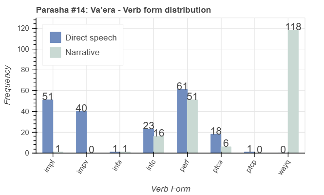

<a href="../13%20-%20Shemot">Previous parasha (#13): Shemot</a> &nbsp;&nbsp;<a href="../15%20-%20Bo">Next parasha (#15): Bo</a>

# Parasha&nbsp;#14: Va'era (וָאֵרָא‎) 

## Reading passages

Torah: <a href="https://www.stepbible.org/?q=version=NASB2020|reference=Ex.6:2-9:35&options=HNVUG" target="_blank">Exodus 6:2-9:35</a> &nbsp;&nbsp; <a href="https://tikkun.io/#/p/vaera" target="_blank">(Hebrew: פָּרָשַׁת וָאֵרָא)</a> 
Haftarah: <a href="https://www.stepbible.org/?q=version=NASB2020|reference=Ez.28:25-29:21&options=HNVUG" target="_blank">Ezekiel 28:25-29:21</a>

## Summary

Parasha Va'era ("I appeared") details God's reaffirmation of His covenant with the Israelites and the beginning of the plagues in Egypt. God reveals Himself to Moses, promising to deliver the Israelites from slavery and demonstrate His power through a series of miraculous signs. The narrative progresses with the first seven plagues—blood, frogs, gnats, flies, livestock disease, boils, and hail—striking Egypt as Pharaoh's heart remains hardened against letting the Israelites go.

## Parasha statistics

<a href="../../General/metrics_distribution.html" target="_blank">Interactive statistics for all parashot (# of words, sentences, etc.)</a>

## Parasha Data Sheet

<ul><li><a href="https://tonyjurg.github.io/Parashot/WeeklyParasha/14%20-%20Va'era/hapax_legomena(Va’era).html" target="_blank">Overview unique words in this parasha</a>
</li><li><a href="https://tonyjurg.github.io/Parashot/WeeklyParasha/14%20-%20Va'era/differences_MT_SP(Va’era).html" target="_blank">Differences between MT and SP for this parasha</a>
</li><li><a href="https://tonyjurg.github.io/Parashot/WeeklyParasha/14%20-%20Va'era/levenshtein_differences_MT_SP(Va’era).html" target="_blank">Differences between MT and SP for this parasha (Lenenshtein distance)</a>
</li><li><a href="https://tonyjurg.github.io/Parashot/WeeklyParasha/14%20-%20Va'era/spelling_differences_SP_MT(Va’era).html" target="_blank">Spelling differences in names between MT and SP for this parasha</a>
</li><li><a href="https://tonyjurg.github.io/Parashot/WeeklyParasha/14%20-%20Va'era/lexical_parallels(Va’era).html" target="_blank">Lexical paralels between this parasha and the Tenach</a>
</li></ul>

## Related SHEBANQ queries

Verse | Query | Description
--- | --- | ---
<a href="https://www.stepbible.org/?q=version=NASB2020\|reference=Ex.6:3&options=HNVUG" target="_blank">Ex. 6:3</a> | <a href="https://shebanq.ancient-data.org/hebrew/text?iid=6886&version=2021&page=1&mr=r&qw=q" target="_blank">Made know to them</a> | God will make His Name know to them.
<a href="https://www.stepbible.org/?q=version=NASB2020\|reference=Ex.6:5&options=HNVUG" target="_blank">Ex. 6:5</a> | <a href="https://shebanq.ancient-data.org/hebrew/text?iid=6290&version=2021&page=1&mr=r&qw=q" target="_blank">The groaning of the people</a> | Where else is groaning found?
<a href="https://www.stepbible.org/?q=version=NASB2020\|reference=Ex.6:16&options=HNVUG" target="_blank">Ex. 6:16</a> | <a href="https://shebanq.ancient-data.org/hebrew/text?iid=6284&version=2021&page=1&mr=r&qw=q" target="_blank">These are the names</a> | Find other occurences of the phrase "these are the names"

## Related Text-Fabric Notebooks

GitHub | NBviewer | Short description
---|---|---
<a href="https://github.com/tonyjurg/Parashot/tree/main/WeeklyParasha/14%20-%20Va'era/hapax.ipynb" target="_blank">hapax</a> | <a href="https://nbviewer.org/github/tonyjurg/Parashot/blob/main/WeeklyParasha/14%20-%20Va'era/hapax.ipynb" target="_blank">hapax</a>| Find unique words (*hapax legomena*) in this parasha.
<a href="https://github.com/tonyjurg/Parashot/tree/main/WeeklyParasha/14%20-%20Va'era/lexical_parallels.ipynb" target="_blank">Lexical parallels</a> | <a href="https://nbviewer.org/github/tonyjurg/Parashot/blob/main/WeeklyParasha/14%20-%20Va'era/lexical_parallels.ipynb" target="_blank">Lexical parallels</a>| Find lexical parallels between verses.
<a href="https://github.com/tonyjurg/Parashot/tree/main/WeeklyParasha/14%20-%20Va'era/delta_mt_and_sp.ipynb" target="_blank">Delta SP and MT</a> | <a href="https://nbviewer.org/github/tonyjurg/Parashot/blob/main/WeeklyParasha/14%20-%20Va'era/delta_mt_and_sp.ipynb" target="_blank">Delta SP and MT</a>| Identify differences between the Samaritan Pentateuch (SP) and Masoretic Text (MT).
<a href="https://github.com/tonyjurg/Parashot/tree/main/WeeklyParasha/14%20-%20Va'era/parasha_analysis.ipynb" target="_blank">Parasha statistics</a> | <a href="https://nbviewer.org/github/tonyjurg/Parashot/blob/main/WeeklyParasha/14%20-%20Va'era/parasha_analysis.ipynb" target="_blank">Parasha statistics</a>| Create graphical statistics for this parasha.

## Hebcal

Additional details about Jewish calendar and holiday information, offering users a resource for tracking Hebrew dates, candle lighting times, and other relevant information in the Jewish calendar. <a href="https://www.hebcal.com/sedrot/vaera" target="_blank">Hebcal entry for parasha Va'era</a>.

## AI generated image

This image was generated by DALL.E based upon the name of this parasha. The following prompt was auto generated: "A biblical scene from the Torah portion Va'era, set in ancient Egypt. Depict Moses and Aaron standing before Pharaoh in a grand Egyptian palace, with Pharaoh seated on a golden throne surrounded by his advisors. Moses is holding a staff, and Aaron is gesturing as he speaks. In the background, one of the early plagues is starting—perhaps the Nile turning into blood, with red water flowing through the palace or riverbanks. The setting should be dramatic and filled with tension, reflecting a historical and spiritual atmosphere with warm desert tones and Egyptian architecture."
