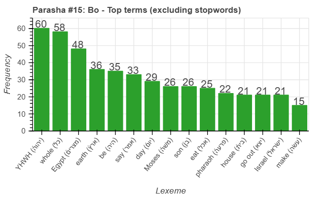
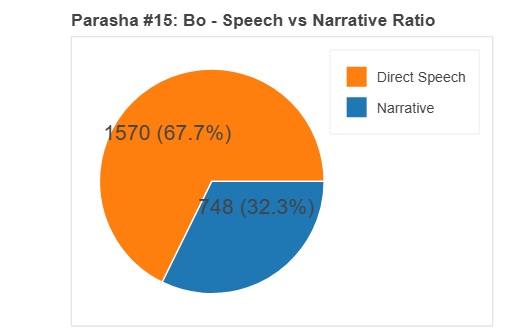
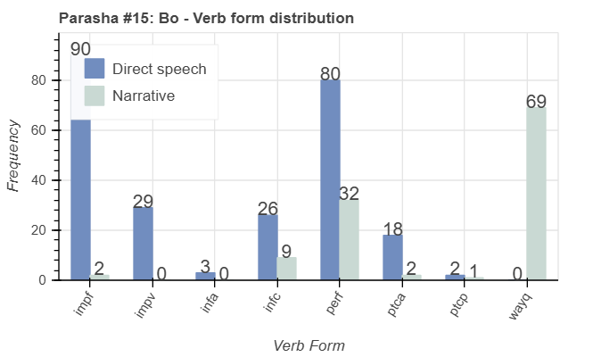
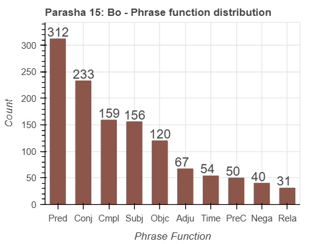
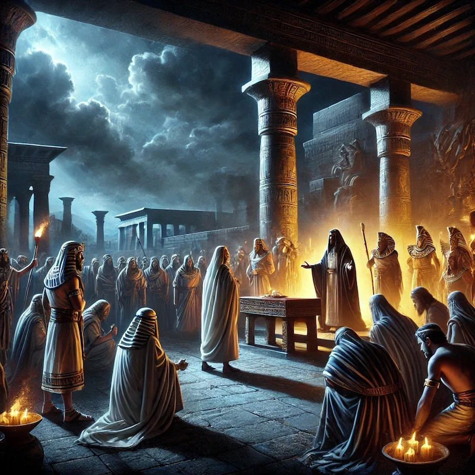

<a href="../14%20-%20Va'era">Previous parasha (#14): Va'era</a> &nbsp;&nbsp;<a href="../16%20-%20Beshalach">Next parasha (#16): Beshalach</a>

# Parasha&nbsp;#15: Bo (בֹּא) 

## Reading passages

Torah: <a href="https://www.stepbible.org/?q=version=NASB2020|reference=Ex.10:1-13:16&options=HNVUG" target="_blank">Exodus 10:1-13:16</a> &nbsp;&nbsp; <a href="https://tikkun.io/#/p/bo" target="_blank">(Hebrew: פָּרָשַׁת בֹּא)</a> 
Haftarah: <a href="https://www.stepbible.org/?q=version=NASB2020|reference=Jer.46:13-28&options=HNVUG" target="_blank">Jeremia 46:13-28</a>

## Summary

Parasha Bo ("Come"), named after a imperative verb meaning 'come' or 'go', details the last three plagues that God inflicted upon Egypt to compel Pharaoh to release the Israelites from bondage. This portion includes the institution of the Passover, with specific instructions for the Israelites on how to protect their households from the final plague, the death of the firstborn. Ultimately, Pharaoh capitulates, leading to the exodus of the Israelites from Egypt, marking a pivotal moment of liberation and divine intervention.

## Parasha statistics

<a href="../../General/metrics_distribution.html" target="_blank">Interactive statistics for all parashot (# of words, sentences, etc.)</a>

## Parasha Data Sheet

<ul><li><a href="https://tonyjurg.github.io/Parashot/WeeklyParasha/15%20-%20Bo/hapax_legomena(Bo).html" target="_blank">Overview unique words in this parasha</a>
</li><li><a href="https://tonyjurg.github.io/Parashot/WeeklyParasha/15%20-%20Bo/differences_MT_SP(Bo).html" target="_blank">Differences between MT and SP for this parasha</a>
</li><li><a href="https://tonyjurg.github.io/Parashot/WeeklyParasha/15%20-%20Bo/levenshtein_differences_MT_SP(Bo).html" target="_blank">Differences between MT and SP for this parasha (Lenenshtein distance)</a>
</li><li><a href="https://tonyjurg.github.io/Parashot/WeeklyParasha/15%20-%20Bo/spelling_differences_SP_MT(Bo).html" target="_blank">Spelling differences in names between MT and SP for this parasha</a>
</li><li><a href="https://tonyjurg.github.io/Parashot/WeeklyParasha/15%20-%20Bo/lexical_parallels(Bo).html" target="_blank">Lexical paralels between this parasha and the Tenach</a>
</li></ul>

## Related SHEBANQ queries

Verse | Query | Description
--- | --- | ---
<a href="https://www.stepbible.org/?q=version=NASB2020\|reference=Ex.10:13&options=HNVUG" target="_blank">Ex. 10:13</a> | <a href="https://shebanq.ancient-data.org/hebrew/text?iid=6312&version=2021&page=1&mr=r&qw=q" target="_blank">Ruach as subject</a> | The use of רוּחַ as subject in a phrase
<a href="https://www.stepbible.org/?q=version=NASB2020\|reference=Ex.10:17,18&options=HNVUG" target="_blank">Ex. 10:17,18</a> | <a href="https://shebanq.ancient-data.org/hebrew/text?iid=7181&version=2021&page=1&mr=r&qw=q" target="_blank">Pleadings</a> | Who is involved in act of pleading/prayer (verb עתר)?
<a href="https://www.stepbible.org/?q=version=NASB2020\|reference=Ex.12:14,17&options=HNVUG" target="_blank">Ex. 12:14&17</a> | <a href="https://shebanq.ancient-data.org/hebrew/text?iid=6558&version=2021&page=1&mr=r&qw=q" target="_blank">'on the same day'</a> | on this fvery day I brought your multitudes out of the land of Egypt;
<a href="https://www.stepbible.org/?q=version=NASB2020\|reference=Ex.12:15&options=HNVUG" target="_blank">Ex. 12:15</a> | <a href="https://shebanq.ancient-data.org/hebrew/text?iid=6346&version=2021&page=1&mr=r&qw=q" target="_blank">causative verb shabatizing</a> | Causing to take a rest.
<a href="https://www.stepbible.org/?q=version=NASB2020\|reference=Ex.12:41&options=HNVUG" target="_blank">Ex. 12:41</a> | <a href="https://shebanq.ancient-data.org/hebrew/text?iid=6307&version=2021&page=1&mr=r&qw=q" target="_blank">All its hosts - צָבָא</a> | all the multitudes of the Lord departed from the land of Egypt.

## Related Text-Fabric Notebooks

GitHub | NBviewer | Short description
---|---|---
[hapax](hapax.ipynb) | <a href="https://nbviewer.org/github/tonyjurg/Parashot/blob/main/WeeklyParasha/15%20-%20Bo/hapax.ipynb" target="_blank">hapax</a> | find unique words (*hapax legomena*)

<a href="https://github.com/tonyjurg/Parashot/tree/main/WeeklyParasha/15%20-%20Bo/hapax.ipynb" target="_blank">hapax</a> | <a href="https://nbviewer.org/github/tonyjurg/Parashot/blob/main/WeeklyParasha/15%20-%20Bo/hapax.ipynb" target="_blank">hapax</a>| Find unique words (*hapax legomena*) in this parasha.
<a href="https://github.com/tonyjurg/Parashot/tree/main/WeeklyParasha/15%20-%20Bo/lexical_parallels.ipynb" target="_blank">Lexical parallels</a> | <a href="https://nbviewer.org/github/tonyjurg/Parashot/blob/main/WeeklyParasha/15%20-%20Bo/lexical_parallels.ipynb" target="_blank">Lexical parallels</a>| Find lexical parallels between verses.
<a href="https://github.com/tonyjurg/Parashot/tree/main/WeeklyParasha/15%20-%20Bo/delta_mt_and_sp.ipynb" target="_blank">Delta SP and MT</a> | <a href="https://nbviewer.org/github/tonyjurg/Parashot/blob/main/WeeklyParasha/15%20-%20Bo/delta_mt_and_sp.ipynb" target="_blank">Delta SP and MT</a>| Identify differences between the Samaritan Pentateuch (SP) and Masoretic Text (MT).
<a href="https://github.com/tonyjurg/Parashot/tree/main/WeeklyParasha/15%20-%20Bo/parasha_analysis.ipynb" target="_blank">Parasha statistics</a> | <a href="https://nbviewer.org/github/tonyjurg/Parashot/blob/main/WeeklyParasha/15%20-%20Bo/parasha_analysis.ipynb" target="_blank">Parasha statistics</a>| Create graphical statistics for this parasha.

## Hebcal

Additional details about Jewish calendar and holiday information, offering users a resource for tracking Hebrew dates, candle lighting times, and other relevant information in the Jewish calendar. <a href="https://www.hebcal.com/sedrot/bo" target="_blank">Hebcal entry for parasha Bo</a>.

## AI generated image

This image was generated by DALL.E based upon the name of this parasha. The following prompt was auto generated: "A dramatic biblical scene from the Torah portion Bo, set in ancient Egypt. Depict the moment just before the final plague—the Death of the Firstborn. The setting is nighttime, with a dark sky and an ominous atmosphere. Moses is shown standing solemnly before Pharaoh, who is grieving and angry, surrounded by his stunned court. In the background, Israelites are seen preparing for the Exodus, marking their doorposts with lamb's blood. Egyptian architecture, torches, and shadows add depth and intensity to the scene, conveying both the sorrow of Egypt and the hope of Israel’s imminent liberation."
