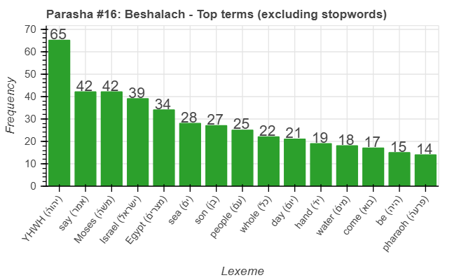
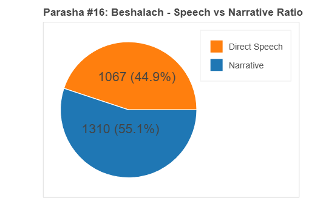
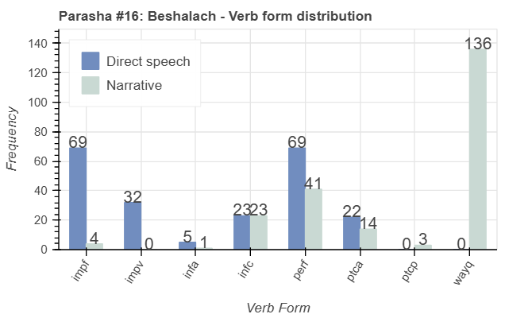
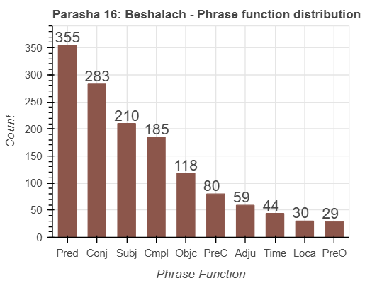

<a href="../15%20-%20Bo">Previous parasha (#15): Bo</a> &nbsp;&nbsp;<a href="../17%20-%20Yitro">Next parasha (#17): Yitro</a>

# Parasha&nbsp;#16: Beshalach (בְּשַׁלַּח)

## Reading passages

Torah: <a href="https://www.stepbible.org/?q=version=NASB2020|reference=Ex.13:17-17:16&options=HNVUG" target="_blank">Exodus 13:17-17:16</a> &nbsp;&nbsp; <a href="https://tikkun.io/#/p/beshalach" target="_blank">(Hebrew: פָּרָשַׁת בְּשַׁלַּח)</a> 
Haftarah: <a href="https://www.stepbible.org/?q=version=NASB2020|reference=Judg.4:4-5:31&options=HNVUG" target="_blank">Judges 4:4-5:31</a>.

## Parasha statistics

<a href="../../General/metrics_distribution.html" target="_blank">Interactive statistics for all parashot (# of words, sentences, etc.)</a>

## Summary

Parasha Beshalach ("when he let go") narrates the dramatic events following the Israelites' departure from Egypt, including the miraculous crossing of the Red Sea. The portion highlights the song of the sea (Shirat HaYam; Ex. 15:1-19) sung by Moses and the Israelites after their deliverance from Pharaoh's army. It also recounts the Israelites' initial challenges in the wilderness, such as the provision of manna and water from the rock, demonstrating God's ongoing provision and protection.

## Parasha Data Sheet

<ul><li><a href="https://tonyjurg.github.io/Parashot/WeeklyParasha/16%20-%20Beshalach/hapax_legomena(Beshalach).html" target="_blank">Overview unique words in this parasha</a>
</li><li><a href="https://tonyjurg.github.io/Parashot/WeeklyParasha/16%20-%20Beshalach/differences_MT_SP(Beshalach).html" target="_blank">Differences between MT and SP for this parasha</a>
</li><li><a href="https://tonyjurg.github.io/Parashot/WeeklyParasha/16%20-%20Beshalach/levenshtein_differences_MT_SP(Beshalach).html" target="_blank">Differences between MT and SP for this parasha (Lenenshtein distance)</a>
</li><li><a href="https://tonyjurg.github.io/Parashot/WeeklyParasha/16%20-%20Beshalach/spelling_differences_SP_MT(Beshalach).html" target="_blank">Spelling differences in names between MT and SP for this parasha</a>
</li><li><a href="https://tonyjurg.github.io/Parashot/WeeklyParasha/16%20-%20Beshalach/lexical_parallels(Beshalach).html" target="_blank">Lexical paralels between this parasha and the Tenach</a>
</li></ul>

## Related SHEBANQ queries

Verse | Query | Short description
--- | --- | ---
<a href="https://www.stepbible.org/?q=version=NASB2020\|reference=Ex.15:2&options=HNVUG" target="_blank">Ex. 15:2</a> | <a href="https://shebanq.ancient-data.org/hebrew/text?iid=5685&version=2021&page=1&mr=r&qw=q" target="_blank">'some one/thing' did 'became' somebody's rescue</a> | This is to query for sentences like  (וַֽיְהִי־לִ֖י לִֽישׁוּעָ֑ה) where someone (or something) 'became' the rescue to another someone.
<a href="https://www.stepbible.org/?q=version=NASB2020\|reference=Ex.16:31&options=HNVUG" target="_blank">Ex. 16:31</a>| <a href="https://shebanq.ancient-data.org/hebrew/text?iid=6527&version=2021&page=1&mr=r&qw=q" target="_blank">The house of Israel</a> | Where else is the construct בֵּֽית־יִשְׂרָאֵ֖ל?

## Related Text-Fabric Notebooks

GitHub | NBviewer | Short description
---|---|---
<a href="https://github.com/tonyjurg/Parashot/tree/main/WeeklyParasha/16%20-%20Beshalach/hapax.ipynb" target="_blank">hapax</a> | <a href="https://nbviewer.org/github/tonyjurg/Parashot/blob/main/WeeklyParasha/16%20-%20Beshalach/hapax.ipynb" target="_blank">hapax</a>| Find unique words (*hapax legomena*) in this parasha.
<a href="https://github.com/tonyjurg/Parashot/tree/main/WeeklyParasha/16%20-%20Beshalach/lexical_parallels.ipynb" target="_blank">Lexical parallels</a> | <a href="https://nbviewer.org/github/tonyjurg/Parashot/blob/main/WeeklyParasha/16%20-%20Beshalach/lexical_parallels.ipynb" target="_blank">Lexical parallels</a>| Find lexical parallels between verses.
<a href="https://github.com/tonyjurg/Parashot/tree/main/WeeklyParasha/16%20-%20Beshalach/delta_mt_and_sp.ipynb" target="_blank">Delta SP and MT</a> | <a href="https://nbviewer.org/github/tonyjurg/Parashot/blob/main/WeeklyParasha/16%20-%20Beshalach/delta_mt_and_sp.ipynb" target="_blank">Delta SP and MT</a>| Identify differences between the Samaritan Pentateuch (SP) and Masoretic Text (MT).
<a href="https://github.com/tonyjurg/Parashot/tree/main/WeeklyParasha/16%20-%20Beshalach/parasha_analysis.ipynb" target="_blank">Parasha statistics</a> | <a href="https://nbviewer.org/github/tonyjurg/Parashot/blob/main/WeeklyParasha/16%20-%20Beshalach/parasha_analysis.ipynb" target="_blank">Parasha statistics</a>| Create graphical statistics for this parasha.

## Hebcal

Additional details about Jewish calendar and holiday information, offering users a resource for tracking Hebrew dates, candle lighting times, and other relevant information in the Jewish calendar. <a href="https://www.hebcal.com/sedrot/beshalach" target="_blank">Hebcal entry for parasha Beshalach</a>.
