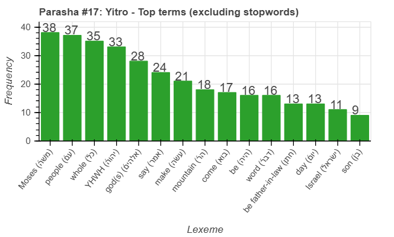
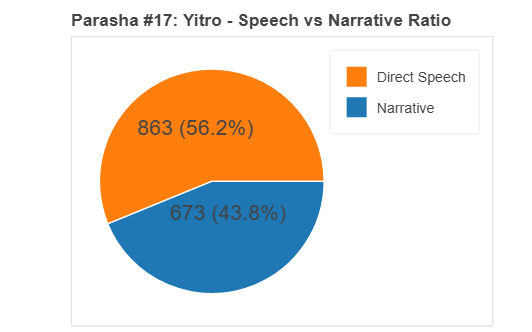
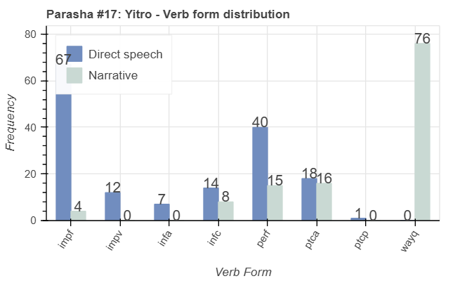

<a href="../16%20-%20Beshalach">Previous parasha (#16): Beshalach</a> &nbsp;&nbsp;<a href="../18%20-%20Mishpatim">Next parasha (#18): Mishpatim</a>

# Parasha&nbsp;#17: Yitro (יִתְרוֹ)

## Reading passages

Torah: <a href="https://www.stepbible.org/?q=version=NASB2020|reference=Ex.18:1-20:23&options=HNVUG" target="_blank">Exodus 18:1-20:23</a> &nbsp;&nbsp; <a href="https://tikkun.io/#/p/yitro" target="_blank">(Hebrew: פָּרָשַׁת יִתְרוֹ)</a> 
Haftarah : <a href="https://www.stepbible.org/?q=version=NASB2020|reference=Is.6:1-7;9:5-6&options=HNVUG" target="_blank">Isaiah 6:1-7:6, 9:5-6</a> (Ashkenazim) or <a href="https://www.stepbible.org/?q=version=NASB2020|reference=Is.6:1-13&options=HNVUG" target="_blank">Isaiah 6:1-13</a> (Sephardim)

## Summary

Parasha Yitro ("Jethro") describes the arrival of Yitro, Moses' father-in-law, who advises Moses to delegate judicial responsibilities to capable leaders to ease his burden. The portion culminates in the Israelites' encounter with God at Mount Sinai, where they receive the Ten Commandments, establishing the foundational laws for their covenant with God. This significant event emphasizes the importance of leadership, community, and divine law in the life of Israel.

## Parasha statistics

<a href="../../General/metrics_distribution.html" target="_blank">Interactive statistics for all parashot (# of words, sentences, etc.)</a>

## Parasha Data Sheet

<ul><li><a href="https://tonyjurg.github.io/Parashot/WeeklyParasha/17%20-%20Yitro/hapax_legomena(Yitro).html" target="_blank">Overview unique words in this parasha</a>
</li><li><a href="https://tonyjurg.github.io/Parashot/WeeklyParasha/17%20-%20Yitro/differences_MT_SP(Yitro).html" target="_blank">Differences between MT and SP for this parasha</a>
</li><li><a href="https://tonyjurg.github.io/Parashot/WeeklyParasha/17%20-%20Yitro/levenshtein_differences_MT_SP(Yitro).html" target="_blank">Differences between MT and SP for this parasha (Lenenshtein distance)</a>
</li><li><a href="https://tonyjurg.github.io/Parashot/WeeklyParasha/17%20-%20Yitro/spelling_differences_SP_MT(Yitro).html" target="_blank">Spelling differences in names between MT and SP for this parasha</a>
</li><li><a href="https://tonyjurg.github.io/Parashot/WeeklyParasha/17%20-%20Yitro/lexical_parallels(Yitro).html" target="_blank">Lexical paralels between this parasha and the Tenach</a>
</li></ul>

## Related SHEBANQ queries

Verse | Query | Description
--- | --- | ---
<a href="https://www.stepbible.org/?q=version=NASB2020\|reference=Ex. 18:9,10&options=HNVUG" target="_blank">Ex. 18:9,10</a>|  <a href="https://shebanq.ancient-data.org/hebrew/text?iid=5471&version=2021&page=1&mr=r&qw=q" target="_blank">Deliver from the hand</a>| Locate texts with the words (in any order) "delivered from the hand". (Timothy Baze)

## Related Text-Fabric Notebooks

GitHub | NBviewer | Short description
---|---|---
[hapax](hapax.ipynb) | <a href="https://nbviewer.org/github/tonyjurg/Parashot/blob/main/WeeklyParasha/17%20-%20Yitro/hapax.ipynb" target="_blank">hapax</a> | find unique words (*hapax legomena*)

<a href="https://github.com/tonyjurg/Parashot/tree/main/WeeklyParasha/17%20-%20Yitro/hapax.ipynb" target="_blank">hapax</a> | <a href="https://nbviewer.org/github/tonyjurg/Parashot/blob/main/WeeklyParasha/17%20-%20Yitro/hapax.ipynb" target="_blank">hapax</a>| Find unique words (*hapax legomena*) in this parasha.
<a href="https://github.com/tonyjurg/Parashot/tree/main/WeeklyParasha/17%20-%20Yitro/lexical_parallels.ipynb" target="_blank">Lexical parallels</a> | <a href="https://nbviewer.org/github/tonyjurg/Parashot/blob/main/WeeklyParasha/17%20-%20Yitro/lexical_parallels.ipynb" target="_blank">Lexical parallels</a>| Find lexical parallels between verses.
<a href="https://github.com/tonyjurg/Parashot/tree/main/WeeklyParasha/17%20-%20Yitro/delta_mt_and_sp.ipynb" target="_blank">Delta SP and MT</a> | <a href="https://nbviewer.org/github/tonyjurg/Parashot/blob/main/WeeklyParasha/17%20-%20Yitro/delta_mt_and_sp.ipynb" target="_blank">Delta SP and MT</a>| Identify differences between the Samaritan Pentateuch (SP) and Masoretic Text (MT).
<a href="https://github.com/tonyjurg/Parashot/tree/main/WeeklyParasha/17%20-%20Yitro/parasha_analysis.ipynb" target="_blank">Parasha statistics</a> | <a href="https://nbviewer.org/github/tonyjurg/Parashot/blob/main/WeeklyParasha/17%20-%20Yitro/parasha_analysis.ipynb" target="_blank">Parasha statistics</a>| Create graphical statistics for this parasha.

## Hebcal

Additional details about Jewish calendar and holiday information, offering users a resource for tracking Hebrew dates, candle lighting times, and other relevant information in the Jewish calendar. <a href="https://www.hebcal.com/sedrot/yitro" target="_blank">Hebcal entry for parasha Yitro</a>.
