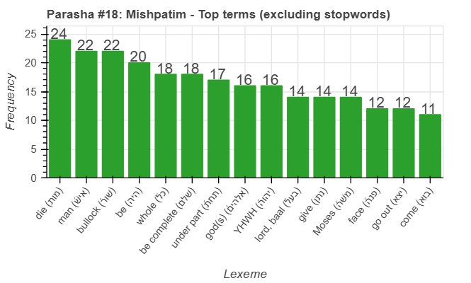
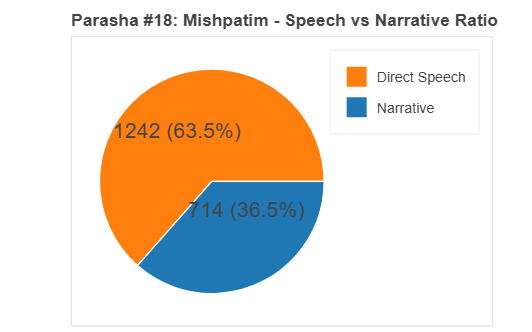
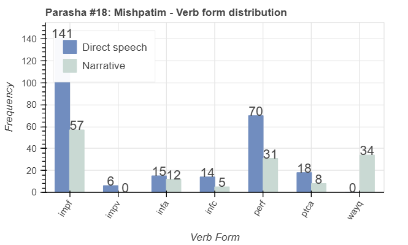
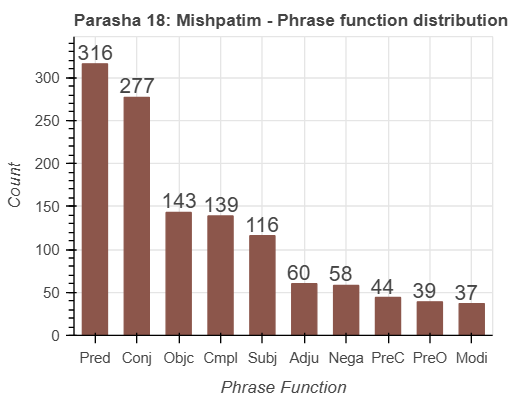

<a href="../17%20-%20Yitro">Previous parasha (#17): Yitro</a> &nbsp;&nbsp;<a href="../19%20-%20Terumah">Next parasha (#19): Terumah</a>

# Parasha&nbsp;#18: Mishpatim (מִּשְׁפָּטִים)

## Reading passages

Torah: <a href="https://www.stepbible.org/?q=version=NASB2020|reference=Ex.21:1-24:18&options=HNVUG" target="_blank">Exodus 21:1-24:18</a> &nbsp;&nbsp; <a href="https://tikkun.io/#/p/mishpatim" target="_blank">(Hebrew: פָּרָשַׁת מִּשְׁפָּטִים)</a> 
Haftarah: <a href="https://www.stepbible.org/?q=version=NASB2020|reference=Jer.34:8-22;33:25-26&options=HNVUG" target="_blank">Jeremiah 34:8-22, 33:25-26</a>

## Summary

Parasha Mishpatim details a comprehensive set of laws covering various aspects of daily life, including civil, criminal, and ritual matters. These laws provide instructions on topics such as slavery, personal injury, property damage, social justice, and religious observances, forming the foundation for the Israelite legal system. The portion concludes with the covenant ceremony at Mount Sinai, where the Israelites affirm their commitment to follow God's commandments.

## Parasha statistics

<a href="../../General/metrics_distribution.html" target="_blank">Interactive statistics for all parashot (# of words, sentences, etc.)</a>

## Parasha Data Sheet

<ul><li><a href="https://tonyjurg.github.io/Parashot/WeeklyParasha/18%20-%20Mishpatim/hapax_legomena(Mishpatim).html" target="_blank">Overview unique words in this parasha</a>
</li><li><a href="https://tonyjurg.github.io/Parashot/WeeklyParasha/18%20-%20Mishpatim/differences_MT_SP(Mishpatim).html" target="_blank">Differences between MT and SP for this parasha</a>
</li><li><a href="https://tonyjurg.github.io/Parashot/WeeklyParasha/18%20-%20Mishpatim/levenshtein_differences_MT_SP(Mishpatim).html" target="_blank">Differences between MT and SP for this parasha (Lenenshtein distance)</a>
</li><li><a href="https://tonyjurg.github.io/Parashot/WeeklyParasha/18%20-%20Mishpatim/spelling_differences_SP_MT(Mishpatim).html" target="_blank">Spelling differences in names between MT and SP for this parasha</a>
</li><li><a href="https://tonyjurg.github.io/Parashot/WeeklyParasha/18%20-%20Mishpatim/lexical_parallels(Mishpatim).html" target="_blank">Lexical paralels between this parasha and the Tenach</a>
</li></ul>

## Related SHEBANQ queries

Verse | Query | Short description
--- | --- | --- 
<a href="https://www.stepbible.org/?q=version=NASB2020\|reference=Ex.21:1&options=HNVUG" target="_blank">Ex. 21:1</a> | <a href="https://shebanq.ancient-data.org/hebrew/text?iid=6342&page=1&mr=r&qw=q" target="_blank">Put before them</a> | How is the תָּשִׂ֖ים לִפְנֵיהֶֽם used elsewhere?
<a href="https://www.stepbible.org/?q=version=NASB2020\|reference=Ex.23:4&options=HNVUG" target="_blank">Ex. 23:4</a> | <a href="https://shebanq.ancient-data.org/hebrew/text?iid=6641&page=1&mr=r&qw=q" target="_blank">'certain return' in Torah</a> | making certain the lost donkey is brought back to its proper owner

## Related Text-Fabric Notebooks

GitHub | NBviewer | Short description
---|---|---
[hapax](hapax.ipynb) | <a href="https://nbviewer.org/github/tonyjurg/Parashot/blob/main/WeeklyParasha/18%20-%20Mishpatim/hapax.ipynb" target="_blank">hapax</a> | find unique words (*hapax legomena*)

<a href="https://github.com/tonyjurg/Parashot/tree/main/WeeklyParasha/18%20-%20Mishpatim/hapax.ipynb" target="_blank">hapax</a> | <a href="https://nbviewer.org/github/tonyjurg/Parashot/blob/main/WeeklyParasha/18%20-%20Mishpatim/hapax.ipynb" target="_blank">hapax</a>| Find unique words (*hapax legomena*) in this parasha.
<a href="https://github.com/tonyjurg/Parashot/tree/main/WeeklyParasha/18%20-%20Mishpatim/lexical_parallels.ipynb" target="_blank">Lexical parallels</a> | <a href="https://nbviewer.org/github/tonyjurg/Parashot/blob/main/WeeklyParasha/18%20-%20Mishpatim/lexical_parallels.ipynb" target="_blank">Lexical parallels</a>| Find lexical parallels between verses.
<a href="https://github.com/tonyjurg/Parashot/tree/main/WeeklyParasha/18%20-%20Mishpatim/delta_mt_and_sp.ipynb" target="_blank">Delta SP and MT</a> | <a href="https://nbviewer.org/github/tonyjurg/Parashot/blob/main/WeeklyParasha/18%20-%20Mishpatim/delta_mt_and_sp.ipynb" target="_blank">Delta SP and MT</a>| Identify differences between the Samaritan Pentateuch (SP) and Masoretic Text (MT).
<a href="https://github.com/tonyjurg/Parashot/tree/main/WeeklyParasha/18%20-%20Mishpatim/parasha_analysis.ipynb" target="_blank">Parasha statistics</a> | <a href="https://nbviewer.org/github/tonyjurg/Parashot/blob/main/WeeklyParasha/18%20-%20Mishpatim/parasha_analysis.ipynb" target="_blank">Parasha statistics</a>| Create graphical statistics for this parasha.

## Hebcal

Additional details about Jewish calendar and holiday information, offering users a resource for tracking Hebrew dates, candle lighting times, and other relevant information in the Jewish calendar. <a href="https://www.hebcal.com/sedrot/mispatim" target="_blank">Hebcal entry for parasha Mishpatim</a>.

## AI generated image

This image was generated by ChatGPT 4o based upon the name of this parasha.

