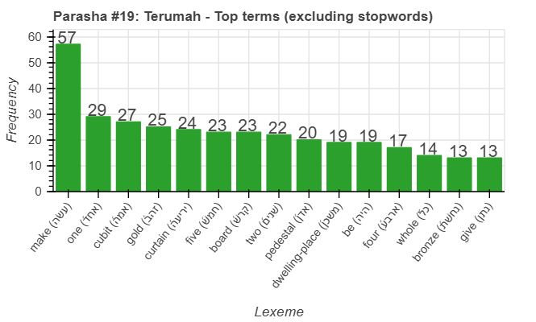
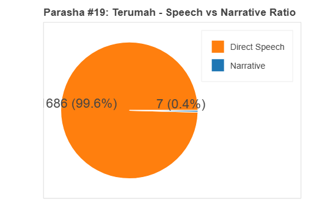
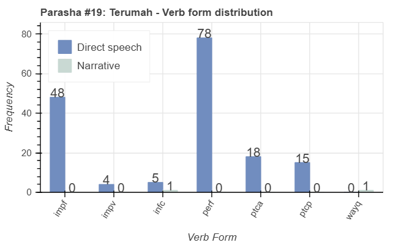
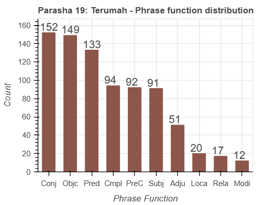

<a href="../17%20-%20Yitro">Previous parasha (#18): Yitro</a> &nbsp;&nbsp;<a href="../20%20-%20Tetzaveh">Next parasha (#20): Tetzaveh</a>

# Parasha&nbsp;#19: Terumah (תְּרוּמָה)

## Reading passages

Torah: <a href="https://www.stepbible.org/?q=version=NASB2020|reference=Ex.25:1-27:19&options=HNVUG" target="_blank">Exodus 25:1-27:19</a> &nbsp;&nbsp; <a href="https://tikkun.io/#/p/terumah" target="_blank">(Hebrew: פָּרָשַׁת תְּרוּמָה)</a> 
Haftarah: <a href="https://www.stepbible.org/?q=version=NASB2020|reference=1Kgs.5:26-6:13&options=HNVUG" target="_blank">I Kings 5:26-6:13</a> (or <a href="https://www.stepbible.org/?q=version=NASB2020|reference=2Kgs.12:3-17&options=HNVUG" target="_blank">II Kings 12:1-17</a> when on Rosh Chodesh)

## Summary

Parasha Terumah details God's instructions to Moses for the construction of the Mishkan (Tabernacle), a portable sanctuary for the Israelites. It describes the specific offerings (terumah) requested from the people, including gold, silver, and fine fabrics, and provides detailed plans for the Ark of the Covenant, the Table of Showbread, the Menorah, and the structure of the Tabernacle itself. The portion emphasizes the importance of following God's precise instructions to create a dwelling place for His presence among the Israelites.

## Parasha statistics

<a href="../../General/metrics_distribution.html" target="_blank">Interactive statistics for all parashot (# of words, sentences, etc.)</a>

## Parasha Data Sheet

<ul><li><a href="https://tonyjurg.github.io/Parashot/WeeklyParasha/19%20-%20Terumah/hapax_legomena(Terumah).html" target="_blank">Overview unique words in this parasha</a>
</li><li><a href="https://tonyjurg.github.io/Parashot/WeeklyParasha/19%20-%20Terumah/differences_MT_SP(Terumah).html" target="_blank">Differences between MT and SP for this parasha</a>
</li><li><a href="https://tonyjurg.github.io/Parashot/WeeklyParasha/19%20-%20Terumah/levenshtein_differences_MT_SP(Terumah).html" target="_blank">Differences between MT and SP for this parasha (Lenenshtein distance)</a>
</li><li><a href="https://tonyjurg.github.io/Parashot/WeeklyParasha/19%20-%20Terumah/spelling_differences_SP_MT(Terumah).html" target="_blank">Spelling differences in names between MT and SP for this parasha</a>
</li><li><a href="https://tonyjurg.github.io/Parashot/WeeklyParasha/13%20-%20Shemot/lexical_parallels(Terumah).html" target="_blank">Lexical paralels between this parasha and the Tenach</a>
</li></ul>

## Related SHEBANQ queries

Verse | Query | Description
--- | --- | --- 
<a href="https://www.stepbible.org/?q=version=NASB2020\|reference=Ex.25:33,34&options=HNVUG" target="_blank">Ex. 25:33,34</a> | <a href="https://shebanq.ancient-data.org/hebrew/text?iid=6982	&version=2021&page=1&mr=r&qw=q" target="_blank">Almond and almond blossem</a> | The various use of almond in symbolic and practical contexts
<a href="https://www.stepbible.org/?q=version=NASB2020\|reference=Ex.26:3,5,6,17&options=HNVUG" target="_blank">Ex. 26:3,5,6,17</a> | <a href="https://shebanq.ancient-data.org/hebrew/text?iid=6980&version=2021&page=1&mr=r&qw=q" target="_blank">woman next to her sister</a> | Exploring the idiomatic expression אִשָּׁה אֶל־אֲחֹתָהּ.
<a href="https://www.stepbible.org/?q=version=NASB2020\|reference=Ex.26:33&options=HNVUG" target="_blank">Ex. 26:33</a> | <a href="https://shebanq.ancient-data.org/hebrew/text?iid=6299&version=2021&page=1&mr=r&qw=q" target="_blank">Making separation - בדל hiphil</a> | Act of seperating. What is separated?

## Related Text-Fabric Notebooks

GitHub | NBviewer | Short description
---|---|---
<a href="https://github.com/tonyjurg/Parashot/tree/main/WeeklyParasha/19%20-%20Terumah/hapax.ipynb" target="_blank">hapax</a> | <a href="https://nbviewer.org/github/tonyjurg/Parashot/blob/main/WeeklyParasha/19%20-%20Terumah/hapax.ipynb" target="_blank">hapax</a>| Find unique words (*hapax legomena*) in this parasha.
<a href="https://github.com/tonyjurg/Parashot/tree/main/WeeklyParasha/19%20-%20Terumah/lexical_parallels.ipynb" target="_blank">Lexical parallels</a> | <a href="https://nbviewer.org/github/tonyjurg/Parashot/blob/main/WeeklyParasha/19%20-%20Terumah/lexical_parallels.ipynb" target="_blank">Lexical parallels</a>| Find lexical parallels between verses.
<a href="https://github.com/tonyjurg/Parashot/tree/main/WeeklyParasha/19%20-%20Terumah/delta_mt_and_sp.ipynb" target="_blank">Delta SP and MT</a> | <a href="https://nbviewer.org/github/tonyjurg/Parashot/blob/main/WeeklyParasha/19%20-%20Terumah/delta_mt_and_sp.ipynb" target="_blank">Delta SP and MT</a>| Identify differences between the Samaritan Pentateuch (SP) and Masoretic Text (MT).
<a href="https://github.com/tonyjurg/Parashot/tree/main/WeeklyParasha/19%20-%20Terumah/parasha_analysis.ipynb" target="_blank">Parasha statistics</a> | <a href="https://nbviewer.org/github/tonyjurg/Parashot/blob/main/WeeklyParasha/19%20-%20Terumah/parasha_analysis.ipynb" target="_blank">Parasha statistics</a>| Create graphical statistics for this parasha.

## Hebcal

Additional details about Jewish calendar and holiday information, offering users a resource for tracking Hebrew dates, candle lighting times, and other relevant information in the Jewish calendar. <a href="https://www.hebcal.com/sedrot/terumah" target="_blank">Hebcal entry for parasha Terumah</a>.
