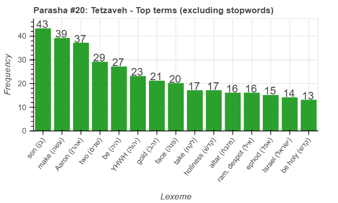
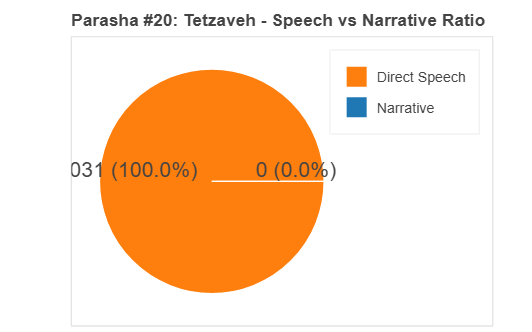
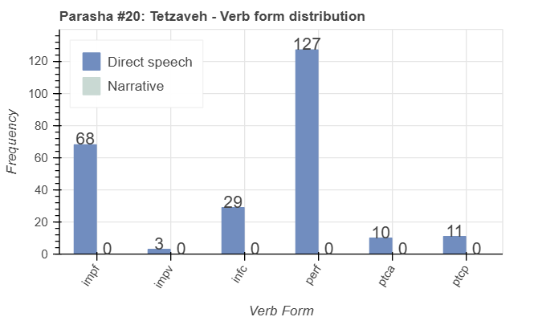
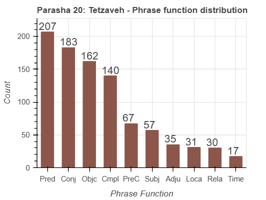

<a href="../19%20-%20Terumah">Previous parasha (#19): Terumah</a> &nbsp;&nbsp;<a href="../21%20-%20Ki%20Tisa">Next parasha (#21): Ki Tisa</a>

# Parasha&nbsp;#20: Tetzaveh (תְּצַוֶּה)

## Reading passages

Torah: <a href="https://www.stepbible.org/?q=version=NASB2020|reference=Ex.27:20-30:10&options=HNVUG" target="_blank">Exodus 27:20-30:10</a> &nbsp;&nbsp; <a href="https://tikkun.io/#/p/tetzaveh" target="_blank">(Hebrew: פָּרָשַׁת תְּצַוֶּה)</a> 
Haftarah: <a href="https://www.stepbible.org/?q=version=NASB2020|reference=Ezek.43:10-27&options=HNVUG" target="_blank">Ezekiel 43:10-27</a>

## Summary

Parasha Tetzaveh continues the instructions for the Mishkan, focusing on the garments and consecration of the priests. It details the design and materials for the priestly garments, including the ephod, breastplate, robe, tunic, turban, and sash, and describes the ordination ceremony for Aaron and his sons. The portion also covers the preparation of the altar of incense, emphasizing the need for purity and holiness in serving God.

## Parasha statistics

<a href="../../General/metrics_distribution.html" target="_blank">Interactive statistics for all parashot (# of words, sentences, etc.)</a>

## Parasha Data Sheet

<ul><li><a href="https://tonyjurg.github.io/Parashot/WeeklyParasha/20%20-%20Tetzaveh/hapax_legomena(Tetzaveh).html" target="_blank">Overview unique words in this parasha</a>
</li><li><a href="https://tonyjurg.github.io/Parashot/WeeklyParasha/20%20-%20Tetzaveh/lexical_parallels(Tetzaveh).html" target="_blank">Lexical paralels between this parasha and the Tenach</a>
</li></ul>

## Related SHEBANQ queries

Verse | Query | Short description
--- | --- | --- 

## Related Text-Fabric Notebooks

GitHub | NBviewer | Short description
---|---|---
<a href="https://github.com/tonyjurg/Parashot/tree/main/WeeklyParasha/20%20-%20Tetzaveh/hapax.ipynb" target="_blank">hapax</a> | <a href="https://nbviewer.org/github/tonyjurg/Parashot/blob/main/WeeklyParasha/20%20-%20Tetzaveh/hapax.ipynb" target="_blank">hapax</a>| Find unique words (*hapax legomena*) in this parasha.
<a href="https://github.com/tonyjurg/Parashot/tree/main/WeeklyParasha/20%20-%20Tetzaveh/lexical_parallels.ipynb" target="_blank">Lexical parallels</a> | <a href="https://nbviewer.org/github/tonyjurg/Parashot/blob/main/WeeklyParasha/20%20-%20Tetzaveh/lexical_parallels.ipynb" target="_blank">Lexical parallels</a>| Find lexical parallels between verses.
<a href="https://github.com/tonyjurg/Parashot/tree/main/WeeklyParasha/20%20-%20Tetzaveh/delta_mt_and_sp.ipynb" target="_blank">Delta SP and MT</a> | <a href="https://nbviewer.org/github/tonyjurg/Parashot/blob/main/WeeklyParasha/20%20-%20Tetzaveh/delta_mt_and_sp.ipynb" target="_blank">Delta SP and MT</a>| Identify differences between the Samaritan Pentateuch (SP) and Masoretic Text (MT).
<a href="https://github.com/tonyjurg/Parashot/tree/main/WeeklyParasha/20%20-%20Tetzaveh/parasha_analysis.ipynb" target="_blank">Parasha statistics</a> | <a href="https://nbviewer.org/github/tonyjurg/Parashot/blob/main/WeeklyParasha/20%20-%20Tetzaveh/parasha_analysis.ipynb" target="_blank">Parasha statistics</a>| Create graphical statistics for this parasha.

## Hebcal

Additional details about Jewish calendar and holiday information, offering users a resource for tracking Hebrew dates, candle lighting times, and other relevant information in the Jewish calendar. <a href="https://www.hebcal.com/sedrot/tetzaveh" target="_blank">Hebcal entry for parasha Tetzaveh</a>.
