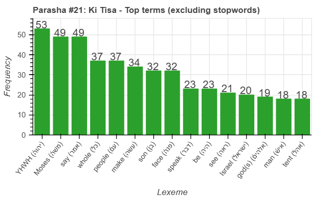
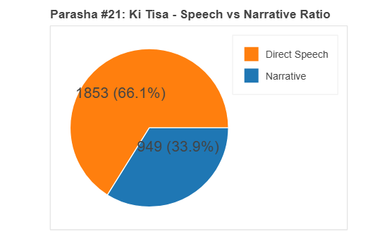
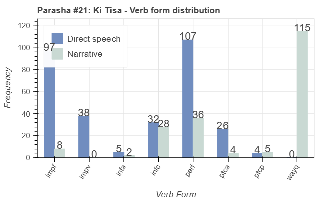
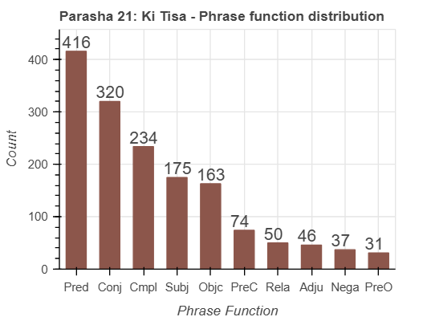

<a href="../20%20-%20Tetzaveh">Previous parasha (#20): Tetzaveh</a> &nbsp;&nbsp;<a href="../22%20-%20Vayakhel">Next parasha (#22): Vayakhel</a>

# Parasha #21: Ki Tisa (כִּי תִשָּׂא)

## Reading passages

Torah: <a href="https://www.stepbible.org/?q=version=NASB2020|reference=Ex.34:35-34:35&options=HNVUG" target="_blank">Exodus 30:11-34:35</a> &nbsp;&nbsp; <a href="https://tikkun.io/#/p/tetzaveh" target="_blank">(Hebrew: פָּרָשַׁת כִּי תִשָּׂא)</a> 
Haftarah: 
<a href="https://www.stepbible.org/?q=version=NASB2020|reference=1Kgs.18:1-39&options=HNVUG" target="_blank">1 Kings 18:1-39</a>

## Summary

Parasha Ki Tisa includes instructions for a census, the making of sacred items like the bronze laver, and the formula for anointing oil and incense for the Tabernacle. The narrative also describes the sin of the Golden Calf, where the Israelites, in Moses' absence, build an idol, leading to God's anger and Moses' intercession on their behalf. The portion concludes with Moses receiving a second set of tablets, renewed covenant terms, and his radiant face reflecting the glory of God after encountering Him on Mount Sinai.

## Parasha statistics

<a href="../../General/metrics_distribution.html" target="_blank">Interactive statistics for all parashot (# of words, sentences, etc.)</a>

## Parasha Data Sheet

<ul><li><a href="https://tonyjurg.github.io/Parashot/WeeklyParasha/21%20-%20Ki%20Tisa/hapax_legomena(Ki%2520Tisa).html" target="_blank">Overview unique words in this parasha</a>
</li><li><a href="https://tonyjurg.github.io/Parashot/WeeklyParasha/21%20-%20Ki%20Tisa/differences_MT_SP(Ki%2520Tisa).html" target="_blank">Differences between MT and SP for this parasha</a>
</li><li><a href="https://tonyjurg.github.io/Parashot/WeeklyParasha/21%20-%20Ki%20Tisa/levenshtein_differences_MT_SP(Ki%2520Tisa).html" target="_blank">Differences between MT and SP for this parasha (Lenenshtein distance)</a>
</li><li><a href="https://tonyjurg.github.io/Parashot/WeeklyParasha/21%20-%20Ki%20Tisa/spelling_differences_SP_MT(Ki%2520Tisa).html" target="_blank">Spelling differences in names between MT and SP for this parasha</a>
</li><li><a href="https://tonyjurg.github.io/Parashot/WeeklyParasha/21%20-%20Ki%20Tisa/lexical_parallels(Ki%2520Tisa).html" target="_blank">Lexical paralels between this parasha and the Tenach</a>
</li></ul>

## Related SHEBANQ queries

Verse | Query | Short description
--- | --- | --- 
<a href="https://www.stepbible.org/?q=version=NASB2020\|reference=Ex.31:18;32:10,5;33:10,12;33:3,5;34:33&options=HNVUG" target="_blank">Ex. 31:18; 32:10,12; 33:3,5; 34:33</a> | <a href="https://shebanq.ancient-data.org/hebrew/text?iid=6306&version=2021&page=1&mr=r&qw=q" target="_blank">Completion</a> | Verb כָּלָה - completing

## Related Text-Fabric Notebooks

GitHub | NBviewer | Short description
---|---|---
<a href="https://github.com/tonyjurg/Parashot/tree/main/WeeklyParasha/21%20-%20Ki%20Tisa/hapax.ipynb" target="_blank">hapax</a> | <a href="https://nbviewer.org/github/tonyjurg/Parashot/blob/main/WeeklyParasha/21%20-%20Ki%20Tisa/hapax.ipynb" target="_blank">hapax</a>| Find unique words (*hapax legomena*) in this parasha.
<a href="https://github.com/tonyjurg/Parashot/tree/main/WeeklyParasha/21%20-%20Ki%20Tisa/lexical_parallels.ipynb" target="_blank">Lexical parallels</a> | <a href="https://nbviewer.org/github/tonyjurg/Parashot/blob/main/WeeklyParasha/21%20-%20Ki%20Tisa/lexical_parallels.ipynb" target="_blank">Lexical parallels</a>| Find lexical parallels between verses.
<a href="https://github.com/tonyjurg/Parashot/tree/main/WeeklyParasha/21%20-%20Ki%20Tisa/delta_mt_and_sp.ipynb" target="_blank">Delta SP and MT</a> | <a href="https://nbviewer.org/github/tonyjurg/Parashot/blob/main/WeeklyParasha/21%20-%20Ki%20Tisa/delta_mt_and_sp.ipynb" target="_blank">Delta SP and MT</a>| Identify differences between the Samaritan Pentateuch (SP) and Masoretic Text (MT).
<a href="https://github.com/tonyjurg/Parashot/tree/main/WeeklyParasha/21%20-%20Ki%20Tisa/parasha_analysis.ipynb" target="_blank">Parasha statistics</a> | <a href="https://nbviewer.org/github/tonyjurg/Parashot/blob/main/WeeklyParasha/21%20-%20Ki%20Tisa/parasha_analysis.ipynb" target="_blank">Parasha statistics</a>| Create graphical statistics for this parasha.

## Hebcal

Additional details about Jewish calendar and holiday information, offering users a resource for tracking Hebrew dates, candle lighting times, and other relevant information in the Jewish calendar. <a href="https://www.hebcal.com/sedrot/ki-tisa" target="_blank">Hebcal entry for parasha Ki Tisa</a>.
