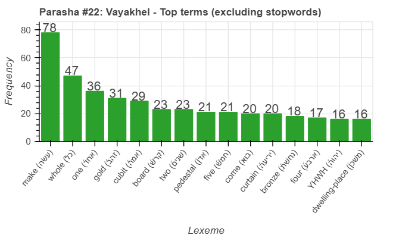
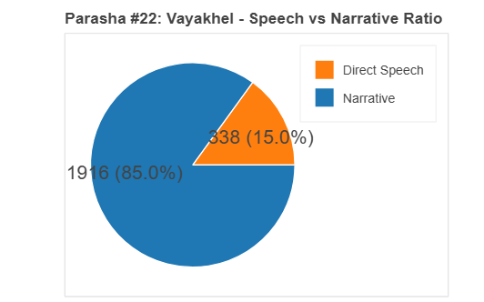
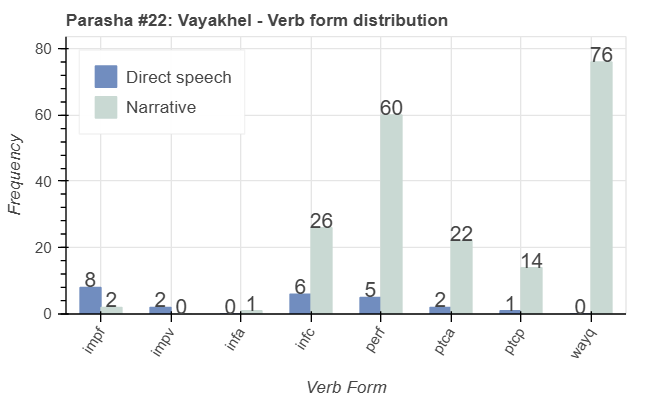
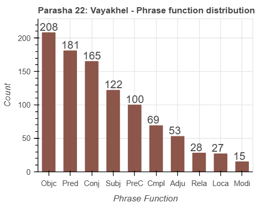

<a href="../21%20-%20Ki%20Tisa">Previous parasha (#21): Ki Tisa</a> &nbsp;&nbsp;<a href="../23%20-%20Pekudei">Next parasha (#23): Pekudei</a>

# Parasha #22:  Vayakhel (וַיַּקְהֵ֣ל)

## Reading passages

Torah: <a href="https://www.stepbible.org/?q=version=NASB2020|reference=Ex.35:1-38:20&options=HNVUG" target="_blank">Ex. 35:1-38:20</a> &nbsp;&nbsp; <a href="https://tikkun.io/#/p/vayakhel" target="_blank">(Hebrew: פָּרָשַׁת וַיַּקְהֵ֣ל)</a> 
Haftarah: <a href="https://www.stepbible.org/?q=version=NASB2020|reference=1Kgs.7:40-50&options=HNVUG" target="_blank">I Kings 7:40-50</a> (Ashkenazim) or <a href="https://www.stepbible.org/?q=version=NASB2020|reference=1Kgs.7:13-26&options=HNVUG" target="_blank">I Kings 7:13-26</a> (Sephardim)

## Summary

Parasha Vayakhel details Moses gathering the Israelites to instruct them on the construction of the Tabernacle, emphasizing the importance of observing the Sabbath even during this holy work. The portion highlights the voluntary contributions of materials, skills, and labor from the people, as they enthusiastically donate gold, silver, fabrics, and their craftsmanship to build the sacred space. It also describes the actual construction of key elements of the Tabernacle, including the Ark, the Table, the Menorah, and the Altar, as well as the courtyard that surrounds them.

## Parasha statistics

<a href="../../General/metrics_distribution.html" target="_blank">Interactive statistics for all parashot (# of words, sentences, etc.)</a>

## Related SHEBANQ queries

Verse | Query | Short description
--- | --- | --- 
<a href="https://www.stepbible.org/?q=version=NASB2020\|reference=Ex.35:21&options=HNVUG" target="_blank">Ex. 35:21</a> | <a href="https://shebanq.ancient-data.org/hebrew/text?iid=6312	&version=2021&page=1&mr=r&qw=q" target="_blank">Ruach as subject</a> | The use of רוּחַ as subject in a phrase
<a href="https://www.stepbible.org/?q=version=NASB2020\|reference=Ex.37:19,20&options=HNVUG" target="_blank">Ex. 37:19,20</a> | <a href="https://shebanq.ancient-data.org/hebrew/text?iid=6982	&version=2021&page=1&mr=r&qw=q" target="_blank">Almond and almond blossem</a> | The various use of almond in symbolic and practical contexts

## Related Text-Fabric Notebooks

GitHub | NBviewer | Short description
---|---|---
<a href="https://github.com/tonyjurg/Parashot/tree/main/WeeklyParasha/22%20-%20Vayakhel/hapax.ipynb" target="_blank">hapax</a> | <a href="https://nbviewer.org/github/tonyjurg/Parashot/blob/main/WeeklyParasha/22%20-%20Vayakhel/hapax.ipynb" target="_blank">hapax</a>| Find unique words (*hapax legomena*) in this parasha.
<a href="https://github.com/tonyjurg/Parashot/tree/main/WeeklyParasha/22%20-%20Vayakhel/parasha_analysis.ipynb" target="_blank">Parasha statistics</a> | <a href="https://nbviewer.org/github/tonyjurg/Parashot/blob/main/WeeklyParasha/22%20-%20Vayakhel/parasha_analysis.ipynb" target="_blank">Parasha statistics</a>| Create graphical statistics for this parasha.

## Hebcal

Additional details about Jewish calendar and holiday information, offering users a resource for tracking Hebrew dates, candle lighting times, and other relevant information in the Jewish calendar. <a href="https://www.hebcal.com/sedrot/vayakhel" target="_blank">Hebcal entry for parasha Vayakhel</a>.
