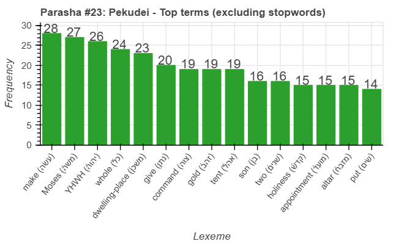
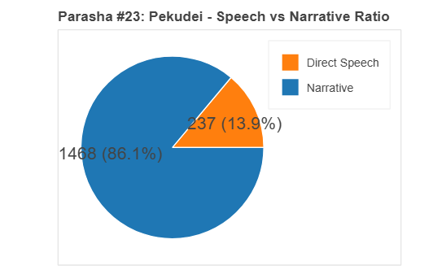
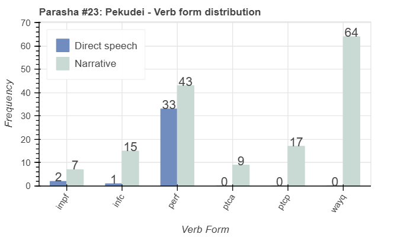
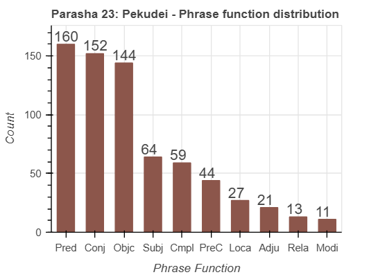

<a href="../22%20-%20Vayakhel">Previous parasha (#22): Vayakhel</a> &nbsp;&nbsp;<a href="../24%20-%20Vayikra">Next parasha (#24): Vayikra</a>

# Parasha #23: Pekudei (פְקוּדֵי)

## Reading passages

Torah: <a href="https://www.stepbible.org/?q=version=NASB2020|reference=Ex.38:21-40:38&options=HNVUG" target="_blank">Ex. 38:21-40:38</a> &nbsp;&nbsp; <a href="https://tikkun.io/#/p/pekudei" target="_blank">(Hebrew: פָּרָשַׁת פְקוּדֵי)</a> 
Haftarah: <a href="https://www.stepbible.org/?q=version=NASB2020|reference=1Kgs.7:51-8:21&options=HNVUG" target="_blank">I Kings 7:51-8:21</a> (Ashkenazim) or <a href="https://www.stepbible.org/?q=version=NASB2020|reference=1Kgs.7:40-50&options=HNVUG" target="_blank">I Kings 7:40-50</a>  (Sephardim)

## Summary

Parasha Pekudei provides an account of the materials used for the construction of the Tabernacle and its furnishings, emphasizing the meticulous recording and completion of the work. Moses inspects the finished Tabernacle, and after confirming that everything was done according to God's instructions, he blesses the people. The portion concludes with God's glory filling the completed Tabernacle, signifying His divine presence among the Israelites as they journey through the wilderness.

## Parasha statistics

<a href="../../General/metrics_distribution.html" target="_blank">Interactive statistics for all parashot (# of words, sentences, etc.)</a>

## Related SHEBANQ queries

Verse | Query | Short description
--- | --- | --- 

## Related Text-Fabric Notebooks

GitHub | NBviewer | Short description
---|---|---
<a href="https://github.com/tonyjurg/Parashot/tree/main/WeeklyParasha/23%20-%20Pekudei/hapax.ipynb" target="_blank">hapax</a> | <a href="https://nbviewer.org/github/tonyjurg/Parashot/blob/main/WeeklyParasha/23%20-%20Pekudei/hapax.ipynb" target="_blank">hapax</a>| Find unique words (*hapax legomena*) in this parasha.
<a href="https://github.com/tonyjurg/Parashot/tree/main/WeeklyParasha/23%20-%20Pekudei/parasha_analysis.ipynb" target="_blank">Parasha statistics</a> | <a href="https://nbviewer.org/github/tonyjurg/Parashot/blob/main/WeeklyParasha/23%20-%20Pekudei/parasha_analysis.ipynb" target="_blank">Parasha statistics</a>| Create graphical statistics for this parasha.

## Hebcal

Additional details about Jewish calendar and holiday information, offering users a resource for tracking Hebrew dates, candle lighting times, and other relevant information in the Jewish calendar. <a href="https://www.hebcal.com/sedrot/pekudei" target="_blank">Hebcal entry for parasha Pekudei</a>.
