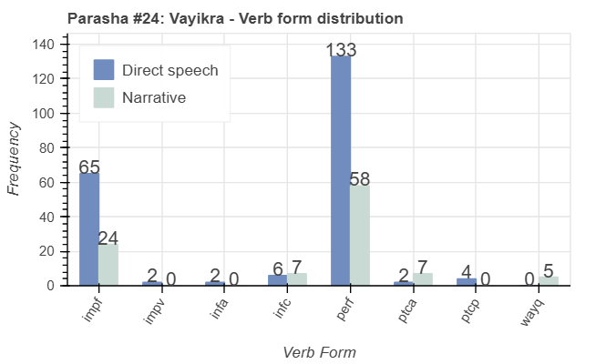
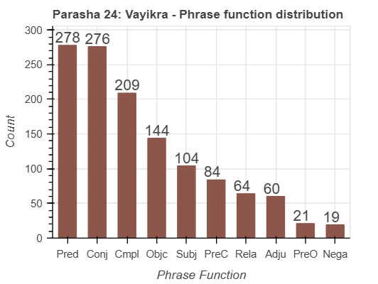

<a href="../23%20-%20Pekudei">Previous parasha (#23): Pekudei</a> &nbsp;&nbsp;<a href="../25%20-%20Tzav">Next parasha (#25): Tzav</a>

# Parasha #24: Vayikra (וַיִּקְרָא)

## Reading passages

Torah: <a href="https://www.stepbible.org/?q=version=NASB2020|reference=Lev.1:1-5:26&options=HNVUG" target="_blank">Lev. 1:1-5:26</a> &nbsp;&nbsp; <a href="https://tikkun.io/#/p/vayikra" target="_blank">(Hebrew: פָּרָשַׁת וַיִּקְרָא)</a> 
Haftarah: <a href="https://www.stepbible.org/?q=version=NASB2020|reference=Is.43:21-44:23&options=HNVUG" target="_blank">Isaiah 43:21-44:23</a>

## Summary

Parasha Vayikra introduces the sacrificial system of ancient Israel, detailing various offerings such as burnt offerings, grain offerings, peace offerings, sin offerings, and guilt offerings. It provides specific instructions on how each type of offering should be conducted, emphasizing the role of sacrifices in atonement and maintaining a relationship with God. The portion underscores the importance of obedience to God's commandments and the need for atonement for sins.

## Parasha statistics

<a href="../../General/metrics_distribution.html" target="_blank">Interactive statistics for all parashot (# of words, sentences, etc.)</a>

## Parasha Data Sheet

<ul><li><a href="https://tonyjurg.github.io/Parashot/WeeklyParasha/24%20-%20Vayikra/hapax_legomena(Vayikra).html" target="_blank">Overview unique words in this parasha</a>
</li><li><a href="https://tonyjurg.github.io/Parashot/WeeklyParasha/24%20-%20Vayikra/differences_MT_SP(Vayikra).html" target="_blank">Differences between MT and SP for this parasha</a>
</li><li><a href="https://tonyjurg.github.io/Parashot/WeeklyParasha/24%20-%20Vayikra/levenshtein_differences_MT_SP(Vayikra).html" target="_blank">Differences between MT and SP for this parasha (Lenenshtein distance)</a>
</li><li><a href="https://tonyjurg.github.io/Parashot/WeeklyParasha/24%20-%20Vayikra/spelling_differences_SP_MT(Vayikra).html" target="_blank">Spelling differences in names between MT and SP for this parasha</a>
</li><li><a href="https://tonyjurg.github.io/Parashot/WeeklyParasha/24%20-%20Vayikra/lexical_parallels(Vayikra).html" target="_blank">Lexical paralels between this parasha and the Tenach</a>
</li></ul>

## Related SHEBANQ queries

Verse | Query | Short description
--- | --- | --- 
<a href="https://www.stepbible.org/?q=version=NASB2020\|reference=Lev.1:13&options=HNVUG" target="_blank">Lev. 2:13</a> | <a href="https://shebanq.ancient-data.org/hebrew/text?iid=6346&page=1&mr=r&qw=q" target="_blank">causative verb shabatizing</a> | Causing to take a rest.

## Related Text-Fabric Notebooks

GitHub | NBviewer | Short description
---|---|---
<a href="https://github.com/tonyjurg/Parashot/tree/main/WeeklyParasha/24%20-%20Vayikra/hapax.ipynb" target="_blank">hapax</a> | <a href="https://nbviewer.org/github/tonyjurg/Parashot/blob/main/WeeklyParasha/24%20-%20Vayikra/hapax.ipynb" target="_blank">hapax</a>| Find unique words (*hapax legomena*) in this parasha.
<a href="https://github.com/tonyjurg/Parashot/tree/main/WeeklyParasha/24%20-%20Vayikra/lexical_parallels.ipynb" target="_blank">Lexical parallels</a> | <a href="https://nbviewer.org/github/tonyjurg/Parashot/blob/main/WeeklyParasha/24%20-%20Pekudei/lexical_parallels.ipynb" target="_blank">Lexical parallels</a>| Find lexical parallels between verses.
<a href="https://github.com/tonyjurg/Parashot/tree/main/WeeklyParasha/24%20-%20Vayikra/delta_mt_and_sp.ipynb" target="_blank">Delta SP and MT</a> | <a href="https://nbviewer.org/github/tonyjurg/Parashot/blob/main/WeeklyParasha/24%20-%20Vayikra/delta_mt_and_sp.ipynb" target="_blank">Delta SP and MT</a>| Identify differences between the Samaritan Pentateuch (SP) and Masoretic Text (MT).
<a href="https://github.com/tonyjurg/Parashot/tree/main/WeeklyParasha/24%20-%20Vayikra/parasha_analysis.ipynb" target="_blank">Parasha statistics</a> | <a href="https://nbviewer.org/github/tonyjurg/Parashot/blob/main/WeeklyParasha/24%20-%20Vayikra/parasha_analysis.ipynb" target="_blank">Parasha statistics</a>| Create graphical statistics for this parasha.

## Hebcal

Additional details about Jewish calendar and holiday information, offering users a resource for tracking Hebrew dates, candle lighting times, and other relevant information in the Jewish calendar. <a href="https://www.hebcal.com/sedrot/vayikra" target="_blank">Hebcal entry for parasha Vayikra</a>.

## AI generated image

The following image was created by Sora as illustration for this parasha using the prompt 'generate an image related to parasha vayikra.'

