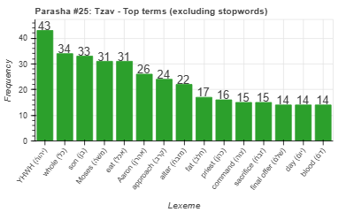
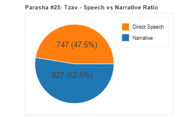
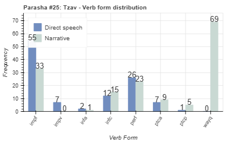
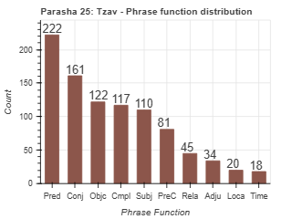

<a href="../24%20-%20Vayikra">Previous parasha (#24): Vayikra</a> &nbsp;&nbsp;<a href="../26%20-%20Shemini">Next parasha (#26): Shemini</a>

# Parasha #25: Tzav (צַו)

## Reading passages

Torah: <a href="https://www.stepbible.org/?q=version=NASB2020|reference=Lev.6:1-8:36&options=HNVUG" target="_blank">Lev. 6:1-8:36</a> &nbsp;&nbsp; <a href="https://tikkun.io/#/p/tzav" target="_blank">(Hebrew: פָּרָשַׁת צַו)</a> 
Haftarah: <a href="https://www.stepbible.org/?q=version=NASB2020|reference=Jer.7:21-8:3+9:22-23&options=HNVUG" target="_blank">Jeremiah 7:21-8:3, 9:22-23</a>

## Summary

Parasha Tzav continues the discussion of the sacrificial system, providing additional details and regulations for the priests regarding the burnt offering, grain offering, sin offering, guilt offering, and peace offering. It emphasizes the procedures for maintaining the altar fire, the handling of sacrificial parts, and the consumption of offerings by the priests. The portion also describes the seven-day ordination ceremony of Aaron and his sons, highlighting the consecration of the priests and their responsibilities in the Mishkan.

## Parasha statistics

<a href="../../General/metrics_distribution.html" target="_blank">Interactive statistics for all parashot (# of words, sentences, etc.)</a>

## Parasha Data Sheet

<ul><li><a href="https://tonyjurg.github.io/Parashot/WeeklyParasha/25%20-%20Tzav/hapax_legomena(Tzav).html" target="_blank">Overview unique words in this parasha</a>
</li><li><a href="https://tonyjurg.github.io/Parashot/WeeklyParasha/25%20-%20Tzav/differences_MT_SP(Tzav).html" target="_blank">Differences between MT and SP for this parasha</a>
</li><li><a href="https://tonyjurg.github.io/Parashot/WeeklyParasha/25%20-%20Tzav/levenshtein_differences_MT_SP(Tzav).html" target="_blank">Differences between MT and SP for this parasha (Lenenshtein distance)</a>
</li><li><a href="https://tonyjurg.github.io/Parashot/WeeklyParasha/25%20-%20Tzav/spelling_differences_SP_MT(Tzav).html" target="_blank">Spelling differences in names between MT and SP for this parasha</a>
</li><li><a href="https://tonyjurg.github.io/Parashot/WeeklyParasha/25%20-%20Tzav/lexical_parallels(Tzav).html" target="_blank">Lexical paralels between this parasha and the Tenach</a>
</li></ul>

## Related SHEBANQ queries

Verse | Query | Short description
--- | --- | --- 

## Related Text-Fabric Notebooks

GitHub | NBviewer | Short description
---|---|---
<a href="https://github.com/tonyjurg/Parashot/tree/main/WeeklyParasha/25%20-%20Tzav/hapax.ipynb" target="_blank">hapax</a> | <a href="https://nbviewer.org/github/tonyjurg/Parashot/blob/main/WeeklyParasha/25%20-%20Tzav/hapax.ipynb" target="_blank">hapax</a>| Find unique words (*hapax legomena*) in this parasha.
<a href="https://github.com/tonyjurg/Parashot/tree/main/WeeklyParasha/25%20-%20Tzav/lexical_parallels.ipynb" target="_blank">Lexical parallels</a> | <a href="https://nbviewer.org/github/tonyjurg/Parashot/blob/main/WeeklyParasha/25%20-%20Tzav/lexical_parallels.ipynb" target="_blank">Lexical parallels</a>| Find lexical parallels between verses.
<a href="https://github.com/tonyjurg/Parashot/tree/main/WeeklyParasha/25%20-%20Tzav/delta_mt_and_sp.ipynb" target="_blank">Delta SP and MT</a> | <a href="https://nbviewer.org/github/tonyjurg/Parashot/blob/main/WeeklyParasha/25%20-%20Tzav/delta_mt_and_sp.ipynb" target="_blank">Delta SP and MT</a>| Identify differences between the Samaritan Pentateuch (SP) and Masoretic Text (MT).
<a href="https://github.com/tonyjurg/Parashot/tree/main/WeeklyParasha/25%20-%20Tzav/parasha_analysis.ipynb" target="_blank">Parasha statistics</a> | <a href="https://nbviewer.org/github/tonyjurg/Parashot/blob/main/WeeklyParasha/25%20-%20Tzav/parasha_analysis.ipynb" target="_blank">Parasha statistics</a>| Create graphical statistics for this parasha.

## Hebcal

Additional details about Jewish calendar and holiday information, offering users a resource for tracking Hebrew dates, candle lighting times, and other relevant information in the Jewish calendar. <a href="https://www.hebcal.com/sedrot/tzav" target="_blank">Hebcal entry for parasha Tzav</a>.

