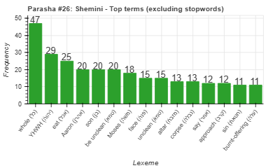
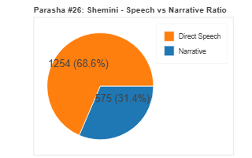
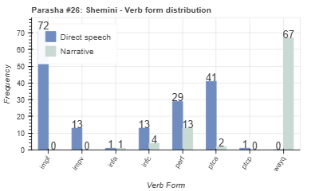
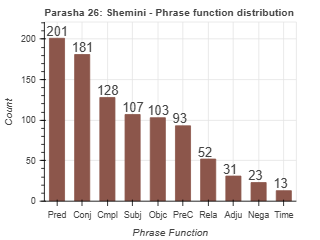

<a href="../25%20-%20Tzav">Previous parasha (#25): Tzav</a> &nbsp;&nbsp;<a href="../27%20-%20Tazria">Next parasha (#27): Tazria</a>

# Parasha #26: Shemini (שְּׁמִינִי)

## Reading passages

Torah: <a href="https://www.stepbible.org/?q=version=NASB2020|reference=Lev.9:1-11:47&options=HNVUG" target="_blank">Lev. 9:1-11:47</a> &nbsp;&nbsp; <a href="https://tikkun.io/#/p/shemini" target="_blank">(Hebrew: פָּרָשַׁת שְּׁמִינִי)</a> 
Haftarah: <a href="https://www.stepbible.org/?q=version=NASB2020|reference=Jer.7:21-8:3+9:22-23&options=HNVUG" target="_blank">II Samuel 6:1-7:17</a> (Ashkenazim)
<a href="https://www.stepbible.org/?q=version=NASB2020|reference=Jer.7:21-8:3+9:22-23&options=HNVUG" target="_blank">II Samuel 6:1-19</a> (Sephardim)

## Summary

Parasha Shemini ('eighth') describes the inauguration of the Tabernacle and the initiation of Aaron and his sons into the priesthood. It recounts the tragic deaths of Aaron's sons, Nadab and Abihu, for offering unauthorized fire before the Lord. The portion concludes with dietary laws, distinguishing between clean and unclean animals, and emphasizes the need for holiness and purity among the Israelites​​.

## Parasha statistics

<a href="../../General/metrics_distribution.html" target="_blank">Interactive statistics for all parashot (# of words, sentences, etc.)</a>

## Parasha Data Sheet

<ul><li><a href="https://tonyjurg.github.io/Parashot/WeeklyParasha/26%20-%20Shemini/hapax_legomena(Shemini).html" target="_blank">Overview unique words in this parasha</a>
</li><li><a href="https://tonyjurg.github.io/Parashot/WeeklyParasha/26%20-%20Shemini/differences_MT_SP(Shemini).html" target="_blank">Differences between MT and SP for this parasha</a>
</li><li><a href="https://tonyjurg.github.io/Parashot/WeeklyParasha/26%20-%20Shemini/levenshtein_differences_MT_SP(Shemini).html" target="_blank">Differences between MT and SP for this parasha (Lenenshtein distance)</a>
</li><li><a href="https://tonyjurg.github.io/Parashot/WeeklyParasha/26%20-%20Shemini/spelling_differences_SP_MT(Shemini).html" target="_blank">Spelling differences in names between MT and SP for this parasha</a>
</li><li><a href="https://tonyjurg.github.io/Parashot/WeeklyParasha/26%20-%20Shemini/lexical_parallels(Shemini).html" target="_blank">Lexical paralels between this parasha and the Tenach</a>
</li></ul>

## Related SHEBANQ queries

Verse | Query | Short description
--- | --- | --- 
<a href="https://www.stepbible.org/?q=version=NASB2020\|reference=Lev.9:4,6,23&options=HNVUG" target="_blank">Lev. 9:4,6,23 </a> | <a href="https://shebanq.ancient-data.org/hebrew/text?iid=6876&version=2021&page=1&mr=r&qw=q" target="_blank">God appears</a> | God (or something of God) as subject to רָאָה in nifil stem.

## Related Text-Fabric Notebooks

GitHub | NBviewer | Short description
---|---|---
<a href="https://github.com/tonyjurg/Parashot/tree/main/WeeklyParasha/26%20-%20Shemini/hapax.ipynb" target="_blank">hapax</a> | <a href="https://nbviewer.org/github/tonyjurg/Parashot/blob/main/WeeklyParasha/26%20-%20Shemini/hapax.ipynb" target="_blank">hapax</a>| Find unique words (*hapax legomena*) in this parasha.
<a href="https://github.com/tonyjurg/Parashot/tree/main/WeeklyParasha/26%20-%20Shemini/lexical_parallels.ipynb" target="_blank">Lexical parallels</a> | <a href="https://nbviewer.org/github/tonyjurg/Parashot/blob/main/WeeklyParasha/26%20-%20Shemini/lexical_parallels.ipynb" target="_blank">Lexical parallels</a>| Find lexical parallels between verses.
<a href="https://github.com/tonyjurg/Parashot/tree/main/WeeklyParasha/26%20-%20Shemini/delta_mt_and_sp.ipynb" target="_blank">Delta SP and MT</a> | <a href="https://nbviewer.org/github/tonyjurg/Parashot/blob/main/WeeklyParasha/26%20-%20Shemini/delta_mt_and_sp.ipynb" target="_blank">Delta SP and MT</a>| Identify differences between the Samaritan Pentateuch (SP) and Masoretic Text (MT).
<a href="https://github.com/tonyjurg/Parashot/tree/main/WeeklyParasha/26%20-%20Shemini/parasha_analysis.ipynb" target="_blank">Parasha statistics</a> | <a href="https://nbviewer.org/github/tonyjurg/Parashot/blob/main/WeeklyParasha/26%20-%20Shemini/parasha_analysis.ipynb" target="_blank">Parasha statistics</a>| Create graphical statistics for this parasha.

## Hebcal

Additional details about Jewish calendar and holiday information, offering users a resource for tracking Hebrew dates, candle lighting times, and other relevant information in the Jewish calendar. <a href="https://www.hebcal.com/sedrot/shemini" target="_blank">Hebcal entry for parasha Shemeni</a>.

