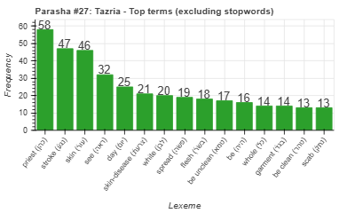
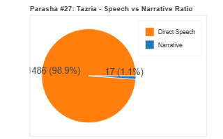
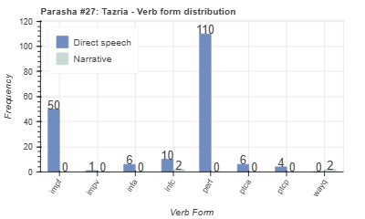
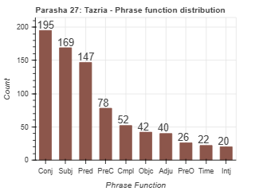

<a href="../26%20-%20Shemini">Previous parasha (#26): Shemini</a> &nbsp;&nbsp;<a href="../28%20-%20Metzora">Next parasha (#28): Metzora</a>

# Parasha #27: Tazria (תַזְרִיעַ)

## Reading passages

Torah: [Lev. 12:1-13:59](https://www.stepbible.org/?q=version=NASB2020|reference=Lev.12:1-13:59&options=HNVUG) &nbsp;&nbsp; [(Hebrew: פָּרָשַׁת תַזְרִיעַ)](https://tikkun.io/#/p/tazria) 
Haftarah: 
[II Kings 4:42-5:19](https://www.stepbible.org/?q=version=NASB2020|reference=2Kgs.4:42-5:19&options=HNVUG)

## Summary

Parasha Tazria discusses the laws of ritual purity related to childbirth and skin diseases. It outlines the purification process for women after giving birth and provides detailed descriptions for diagnosing and handling tzara'at (a skin disease). The portion emphasizes the importance of maintaining purity and following God's instructions to ensure the community's holiness​​.

## Parasha statistics

<a href="../../General/metrics_distribution.html" target="_blank">Interactive statistics for all parashot (# of words, sentences, etc.)</a>

## Parasha Data Sheet

<ul><li><a href="https://tonyjurg.github.io/Parashot/WeeklyParasha/27%20-%20Tazria/hapax_legomena(Tazria).html" target="_blank">Overview unique words in this parasha</a>
</li><li><a href="https://tonyjurg.github.io/Parashot/WeeklyParasha/27%20-%20Tazria/differences_MT_SP(Tazria).html" target="_blank">Differences between MT and SP for this parasha</a>
</li><li><a href="https://tonyjurg.github.io/Parashot/WeeklyParasha/27%20-%20Tazria/levenshtein_differences_MT_SP(Tazria).html" target="_blank">Differences between MT and SP for this parasha (Lenenshtein distance)</a>
</li><li><a href="https://tonyjurg.github.io/Parashot/WeeklyParasha/27%20-%20Tazria/spelling_differences_SP_MT(Tazria).html" target="_blank">Spelling differences in names between MT and SP for this parasha</a>
</li><li><a href="https://tonyjurg.github.io/Parashot/WeeklyParasha/27%20-%20Tazria/lexical_parallels(Tazria).html" target="_blank">Lexical paralels between this parasha and the Tenach</a>
</li></ul>

## Related SHEBANQ queries

Verse | Query | Short description
--- | --- | --- 
<a href="https://www.stepbible.org/?q=version=NASB2020\|reference=Lev.13:17,51&options=HNVUG" target="_blank">Lev. 13:17,51</a> | <a href="https://shebanq.ancient-data.org/hebrew/text?iid=5535&version=2021&page=1&mr=r&qw=q" target="_blank">a blow to 'someone'</a> | Search for "a blow to 'someone' " (~Isaiah 53:8)

## Related Text-Fabric Notebooks

GitHub | NBviewer | Short description
---|---|---
<a href="https://github.com/tonyjurg/Parashot/tree/main/WeeklyParasha/27%20-%20Tazria/hapax.ipynb" target="_blank">hapax</a> | <a href="https://nbviewer.org/github/tonyjurg/Parashot/blob/main/WeeklyParasha/27%20-%20Tazria/hapax.ipynb" target="_blank">hapax</a>| Find unique words (*hapax legomena*) in this parasha.
<a href="https://github.com/tonyjurg/Parashot/tree/main/WeeklyParasha/27%20-%20Tazria/lexical_parallels.ipynb" target="_blank">Lexical parallels</a> | <a href="https://nbviewer.org/github/tonyjurg/Parashot/blob/main/WeeklyParasha/27%20-%20Tazria/lexical_parallels.ipynb" target="_blank">Lexical parallels</a>| Find lexical parallels between verses.
<a href="https://github.com/tonyjurg/Parashot/tree/main/WeeklyParasha/27%20-%20Tazria/delta_mt_and_sp.ipynb" target="_blank">Delta SP and MT</a> | <a href="https://nbviewer.org/github/tonyjurg/Parashot/blob/main/WeeklyParasha/23%20-%20Pekudei/delta_mt_and_sp.ipynb" target="_blank">Delta SP and MT</a>| Identify differences between the Samaritan Pentateuch (SP) and Masoretic Text (MT).
<a href="https://github.com/tonyjurg/Parashot/tree/main/WeeklyParasha/27%20-%20Tazria/parasha_analysis.ipynb" target="_blank">Parasha statistics</a> | <a href="https://nbviewer.org/github/tonyjurg/Parashot/blob/main/WeeklyParasha/27%20-%20Tazria/parasha_analysis.ipynb" target="_blank">Parasha statistics</a>| Create graphical statistics for this parasha.

## Hebcal

Additional details about Jewish calendar and holiday information, offering users a resource for tracking Hebrew dates, candle lighting times, and other relevant information in the Jewish calendar. [Hebcal entry for parasha Tazria](https://www.hebcal.com/sedrot/tazria).

