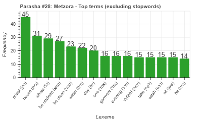
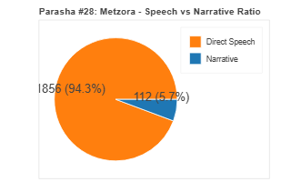
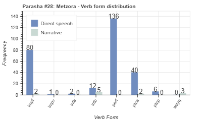
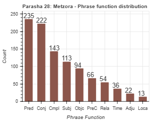

<a href="../27%20-%20Tazria">Previous parasha (#27): Tazria</a> &nbsp;&nbsp;<a href="../29%20-%20Achrei%20Mot">Next parasha (#29): Achrei Mot</a>

# Parasha #28: Metzora (מְּצֹרָע)

## Reading passages

Torah: [Lev. 14:1-15:33](https://www.stepbible.org/?q=version=NASB2020|reference=Lev.14:1-15:33&options=HNVUG) &nbsp;&nbsp; [(Hebrew: פָּרָשַׁת מְּצֹרָע)](https://tikkun.io/#/p/metzora) 
Haftarah: 
[II Kings 7:3-20](https://www.stepbible.org/?q=version=NASB2020|reference=2Kgs.7:3-20&options=HNVUG)

## Summary

Parasha Metzora details the purification process for those afflicted with tzara'at (a skin disease often translated as leprosy), including the ritual involving two birds, cedarwood, scarlet yarn, and hyssop. It outlines the procedures for cleansing houses contaminated by tzara'at and the laws regarding bodily discharges, emphasizing the importance of ritual purity. The portion underscores the need for both physical and spiritual cleanliness in maintaining the holiness of the community​​.

## Parasha statistics

<a href="../../General/metrics_distribution.html" target="_blank">Interactive statistics for all parashot (# of words, sentences, etc.)</a>

## Parasha Data Sheet

<ul><li><a href="https://tonyjurg.github.io/Parashot/WeeklyParasha/28%20-%20Metzora/hapax_legomena(Metzora).html" target="_blank">Overview unique words in this parasha</a>
</li><li><a href="https://tonyjurg.github.io/Parashot/WeeklyParasha/28%20-%20Metzora/differences_MT_SP(Metzora).html" target="_blank">Differences between MT and SP for this parasha</a>
</li><li><a href="https://tonyjurg.github.io/Parashot/WeeklyParasha/28%20-%20Metzora/levenshtein_differences_MT_SP(Metzora).html" target="_blank">Differences between MT and SP for this parasha (Lenenshtein distance)</a>
</li><li><a href="https://tonyjurg.github.io/Parashot/WeeklyParasha/28%20-%20Metzora/spelling_differences_SP_MT(Metzora).html" target="_blank">Spelling differences in names between MT and SP for this parasha</a>
</li><li><a href="https://tonyjurg.github.io/Parashot/WeeklyParasha/28%20-%20Metzora/lexical_parallels(Metzora).html" target="_blank">Lexical paralels between this parasha and the Tenach</a>
</li></ul>

## Related SHEBANQ queries

Verse | Query | Short description
--- | --- | --- 

## Related Text-Fabric Notebooks

GitHub | NBviewer | Short description
---|---|---
<a href="https://github.com/tonyjurg/Parashot/tree/main/WeeklyParasha/28%20-%20Metzora/hapax.ipynb" target="_blank">hapax</a> | <a href="https://nbviewer.org/github/tonyjurg/Parashot/blob/main/WeeklyParasha/28%20-%20Metzora/hapax.ipynb" target="_blank">hapax</a>| Find unique words (*hapax legomena*) in this parasha.
<a href="https://github.com/tonyjurg/Parashot/tree/main/WeeklyParasha/28%20-%20Metzora/lexical_parallels.ipynb" target="_blank">Lexical parallels</a> | <a href="https://nbviewer.org/github/tonyjurg/Parashot/blob/main/WeeklyParasha/28%20-%20Metzora/lexical_parallels.ipynb" target="_blank">Lexical parallels</a>| Find lexical parallels between verses.
<a href="https://github.com/tonyjurg/Parashot/tree/main/WeeklyParasha/28%20-%20Metzora/delta_mt_and_sp.ipynb" target="_blank">Delta SP and MT</a> | <a href="https://nbviewer.org/github/tonyjurg/Parashot/blob/main/WeeklyParasha/28%20-%20Metzora/delta_mt_and_sp.ipynb" target="_blank">Delta SP and MT</a>| Identify differences between the Samaritan Pentateuch (SP) and Masoretic Text (MT).
<a href="https://github.com/tonyjurg/Parashot/tree/main/WeeklyParasha/28%20-%20Metzora/parasha_analysis.ipynb" target="_blank">Parasha statistics</a> | <a href="https://nbviewer.org/github/tonyjurg/Parashot/blob/main/WeeklyParasha/28%20-%20Metzora/parasha_analysis.ipynb" target="_blank">Parasha statistics</a>| Create graphical statistics for this parasha.

## Hebcal

Additional details about Jewish calendar and holiday information, offering users a resource for tracking Hebrew dates, candle lighting times, and other relevant information in the Jewish calendar. [Hebcal entry for parasha Metzora](https://www.hebcal.com/sedrot/metzora).

