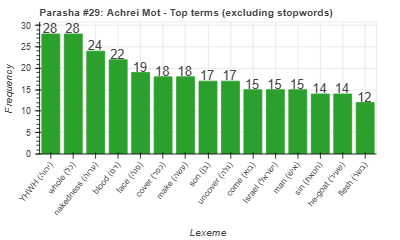
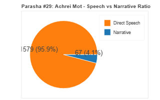
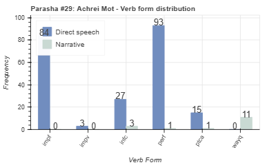
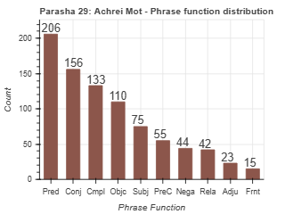

<a href="../28%20-%20Metzora">Previous parasha (#28): Metzora</a> &nbsp;&nbsp;<a href="../30%20-%20Kedoshim">Next parasha (#30): Kedoshim</a>

# Parasha #29: Achrei Mot (אַחֲרֵי מוֹת)

## Reading passages

Torah: [Lev. 16:1-18:30](https://www.stepbible.org/?q=version=NASB2020|reference=Lev.16:1-18:30&options=HNVUG) &nbsp;&nbsp; [(Hebrew: פָּרָשַׁת אַחֲרֵי מוֹת)](https://tikkun.io/#/p/achrei-mot) 
Haftarah: 
[Amos 9:7-15](https://www.stepbible.org/?q=version=NASB2020|reference=Amos.9:7-15&options=HNVUG) (Ashkenazim)
[Ezekiel 22:1-16](https://www.stepbible.org/?q=version=NASB2020|reference=Eze.22:1-16&options=HNVUG) (Sephardim)

## Summary

Parasha Achrei Mot begins with instructions for Yom Kippur (the Day of Atonement), detailing the special sacrifices and rituals the high priest must perform to atone for the sins of Israel. It continues with laws regarding the sanctity of blood and various prohibitions against forbidden sexual relationships. The portion emphasizes the importance of holiness and the need to separate the Israelites from the practices of surrounding nations​​.

## Parasha statistics

<a href="../../General/metrics_distribution.html" target="_blank">Interactive statistics for all parashot (# of words, sentences, etc.)</a>

## Parasha Data Sheet

<ul><li><a href="https://tonyjurg.github.io/Parashot/WeeklyParasha/29%20-%20Achrei%20Mot/hapax_legomena(Achrei_Mot).html" target="_blank">Overview unique words in this parasha</a>
</li><li><a href="https://tonyjurg.github.io/Parashot/WeeklyParasha/29%20-%20Achrei%20Mot/differences_MT_SP(Achrei_Mot).html" target="_blank">Differences between MT and SP for this parasha</a>
</li><li><a href="https://tonyjurg.github.io/Parashot/WeeklyParasha/29%20-%20Achrei%20Mot/levenshtein_differences_MT_SP(Achrei_Mot).html" target="_blank">Differences between MT and SP for this parasha (Lenenshtein distance)</a>
</li><li><a href="https://tonyjurg.github.io/Parashot/WeeklyParasha/29%20-%20Achrei%20Mot/spelling_differences_SP_MT(Achrei_Mot).html" target="_blank">Spelling differences in names between MT and SP for this parasha</a>
</li><li><a href="https://tonyjurg.github.io/Parashot/WeeklyParasha/29%20-%20Achrei%20Mot/lexical_parallels(Achrei_Mot).html" target="_blank">Lexical paralels between this parasha and the Tenach</a>
</li></ul>

## Related SHEBANQ queries

Verse | Query | Short description
--- | --- | --- 
<a href="https://www.stepbible.org/?q=version=NASB2020\|reference=Lev.16:16,34&options=HNVUG" target="_blank">Lev. 16:16,34</a> | <a href="https://shebanq.ancient-data.org/hebrew/text?iid=7045	&version=2021&page=1&mr=r&qw=q" target="_blank">'כפר' for the children of Israel</a> | Making atonement for the (holy place and the) children of Israel (Hermen van der Linden)

## Related Text-Fabric Notebooks

GitHub | NBviewer | Short description
---|---|---
<a href="https://github.com/tonyjurg/Parashot/tree/main/WeeklyParasha/29%20-%20Achrei%20Mot/hapax.ipynb" target="_blank">hapax</a> | <a href="https://nbviewer.org/github/tonyjurg/Parashot/blob/main/WeeklyParasha/29%20-%20Achrei%20Mot/hapax.ipynb" target="_blank">hapax</a>| Find unique words (*hapax legomena*) in this parasha.
<a href="https://github.com/tonyjurg/Parashot/tree/main/WeeklyParasha/29%20-%20Achrei%20Mot/lexical_parallels.ipynb" target="_blank">Lexical parallels</a> | <a href="https://nbviewer.org/github/tonyjurg/Parashot/blob/main/WeeklyParasha/29%20-%20Achrei%20Mot/lexical_parallels.ipynb" target="_blank">Lexical parallels</a>| Find lexical parallels between verses.
<a href="https://github.com/tonyjurg/Parashot/tree/main/WeeklyParasha/29%20-%20Achrei%20Mot/delta_mt_and_sp.ipynb" target="_blank">Delta SP and MT</a> | <a href="https://nbviewer.org/github/tonyjurg/Parashot/blob/main/WeeklyParasha/29%20-%20Achrei%20Mot/delta_mt_and_sp.ipynb" target="_blank">Delta SP and MT</a>| Identify differences between the Samaritan Pentateuch (SP) and Masoretic Text (MT).
<a href="https://github.com/tonyjurg/Parashot/tree/main/WeeklyParasha/29%20-%20Achrei%20Mot/parasha_analysis.ipynb" target="_blank">Parasha statistics</a> | <a href="https://nbviewer.org/github/tonyjurg/Parashot/blob/main/WeeklyParasha/29%20-%20Achrei%20Mot/parasha_analysis.ipynb" target="_blank">Parasha statistics</a>| Create graphical statistics for this parasha.

## Hebcal

Additional details about Jewish calendar and holiday information, offering users a resource for tracking Hebrew dates, candle lighting times, and other relevant information in the Jewish calendar. [Hebcal entry for parasha Achrei Mot](https://www.hebcal.com/sedrot/achrei-mot).

