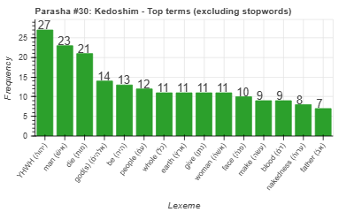
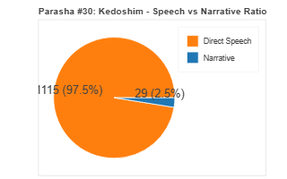
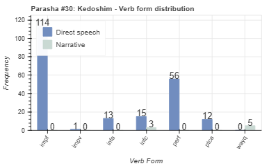
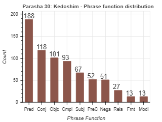

<a href="../29%20-%20Achrei%20Mot">Previous parasha (#29): Achrei Mot</a> &nbsp;&nbsp;<a href="../31%20-%20Emor">Next parasha (#31): Emor</a>

# Parasha #30: Kedoshim (קְדשִׁים)

## Reading passages

Torah: [Leviticus 19:1-20:27](https://www.stepbible.org/?q=version=NASB2020|reference=Lev.19:1-20:27&options=HNVUG) &nbsp;&nbsp; [(Hebrew: פָּרָשַׁת קְדשִׁים)](https://tikkun.io/#/p/kedoshim) 
Haftarah: 
[Ezekiel 22:1-19](https://www.stepbible.org/?q=version=NASB2020|reference=Eze.22:1-19&options=HNVUG) (Ashkenazim) or 
[Ezekiel 20:2-20](https://www.stepbible.org/?q=version=NASB2020|reference=Eze.20:2-20&options=HNVUG) (Sephardim) 

## Summary

Parasha Kedoshim ("Holy") is known for the commandment "You shall be holy, for I, the LORD your God, am holy." It includes a wide array of ethical and ritual laws, such as honoring parents, keeping the Sabbath, prohibitions against idolatry, theft, and false witness, and the famous injunction to "love your neighbor as yourself." The portion emphasizes the importance of holiness in daily life and the pursuit of justice and righteousness within the community​​.

## Parasha statistics

<a href="../../General/metrics_distribution.html" target="_blank">Interactive statistics for all parashot (# of words, sentences, etc.)</a>

## Related SHEBANQ queries

Verse | Query | Short description
--- | --- | --- 

## Related Text-Fabric Notebooks

GitHub | NBviewer | Short description
---|---|---
<a href="https://github.com/tonyjurg/Parashot/tree/main/WeeklyParasha/30%20-%20Kedoshim/hapax.ipynb" target="_blank">hapax</a> | <a href="https://nbviewer.org/github/tonyjurg/Parashot/blob/main/WeeklyParasha/30%20-%20Kedoshim/hapax.ipynb" target="_blank">hapax</a>| Find unique words (*hapax legomena*) in this parasha.
<a href="https://github.com/tonyjurg/Parashot/tree/main/WeeklyParasha/30%20-%20Kedoshim/parasha_analysis.ipynb" target="_blank">Parasha statistics</a> | <a href="https://nbviewer.org/github/tonyjurg/Parashot/blob/main/WeeklyParasha/30%20-%20Kedoshim/parasha_analysis.ipynb" target="_blank">Parasha statistics</a>| Create graphical statistics for this parasha.

## Hebcal

Additional details about Jewish calendar and holiday information, offering users a resource for tracking Hebrew dates, candle lighting times, and other relevant information in the Jewish calendar. [Hebcal entry for parasha Kedoshim](https://www.hebcal.com/sedrot/kedoshim).

