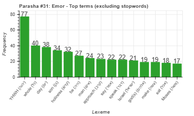
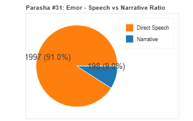
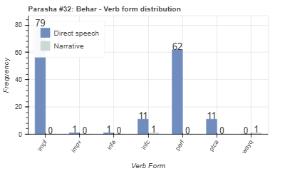
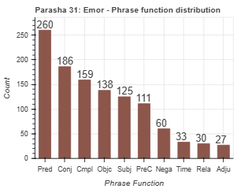

<a href="../30%20-%20Kedoshim">Previous parasha (#30): Kedoshim</a> &nbsp;&nbsp;<a href="../32%20-%20BeHar">Next parasha (#32): Behar</a>

# Parasha #31: Emor (אֱמוֹר)

## Reading passages

Torah: [Lev. 21:1-24:23](https://www.stepbible.org/?q=version=NASB2020|reference=Lev.21:1-24:23&options=HNVUG) &nbsp;&nbsp; [(Hebrew: פָּרָשַׁת אֱמוֹר)](https://tikkun.io/#/p/emor) 
Haftarah: 
[Ezek. 44:15-31 ](https://www.stepbible.org/?q=version=NASB2020|reference=Ezek.44:15-31&options=HNVUG)

## Summary

Parasha Emor provides detailed instructions regarding the holiness required of the priests, including restrictions on their conduct and physical blemishes that disqualify them from service. It also outlines the major festivals of the Lord, such as Passover, Shavuot, and Sukkot, emphasizing their observance and associated rituals. Additionally, the parasha addresses various laws about blasphemy, punishment, and the maintenance of the Mishkan's sacred items​​.

## Parasha statistics

<a href="../../General/metrics_distribution.html" target="_blank">Interactive statistics for all parashot (# of words, sentences, etc.)</a>

## Related SHEBANQ queries

Verse | Query | Short description
--- | --- | --- 
<a href="https://www.stepbible.org/?q=version=NASB2020\|reference=Lev.24:2&options=HNVUG" target="_blank">Lev. 24:2</a> | <a href="https://shebanq.ancient-data.org/hebrew/text?iid=7049&version=2021&page=1&mr=r&qw=q" target="_blank">Continues going up</a> | The light goes up continues. What else?

## Related Text-Fabric Notebooks

GitHub | NBviewer | Short description
---|---|---
<a href="https://github.com/tonyjurg/Parashot/tree/main/WeeklyParasha/31%20-%20Emor/hapax.ipynb" target="_blank">hapax</a> | <a href="https://nbviewer.org/github/tonyjurg/Parashot/blob/main/WeeklyParasha/31%20-%20Emor/hapax.ipynb" target="_blank">hapax</a>| Find unique words (*hapax legomena*) in this parasha.
<a href="https://github.com/tonyjurg/Parashot/tree/main/WeeklyParasha/31%20-%20Emor/parasha_analysis.ipynb" target="_blank">Parasha statistics</a> | <a href="https://nbviewer.org/github/tonyjurg/Parashot/blob/main/WeeklyParasha/31%20-%20Emor/parasha_analysis.ipynb" target="_blank">Parasha statistics</a>| Create graphical statistics for this parasha.

## Hebcal

Additional details about Jewish calendar and holiday information, offering users a resource for tracking Hebrew dates, candle lighting times, and other relevant information in the Jewish calendar. [Hebcal entry for parasha Emor](https://www.hebcal.com/sedrot/emor).

