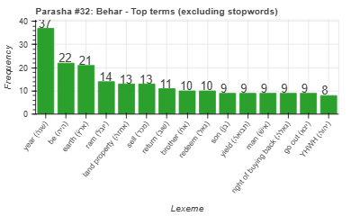
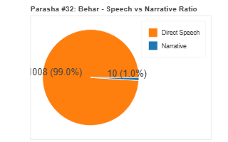
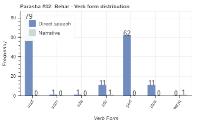
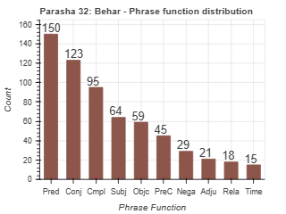

<a href="../31%20-%20Emor">Previous parasha (#31): Emor</a> &nbsp;&nbsp;<a href="../33%20-%20Bechukotai">Next parasha (#33): Bechukotai</a>

# Parasha #32: BeHar (בְּהַר)

## Reading passages

Torah: [Leviticus 25:1-26:2](https://www.stepbible.org/?q=version=NASB2020|reference=Lev.25:1-26:1&options=HNVUG) &nbsp;&nbsp; [(Hebrew: פָּרָשַׁת בְּהַר)](https://tikkun.io/#/p/behar) 
Haftarah: 
[Jeremia 32:6-27](https://www.stepbible.org/?q=version=NASB2020|reference=Jer.6:6-27&options=HNVUG)

## Summary

Parashat BeHar outlines the laws concerning the Sabbatical ([שׁמטה](https://shebanq.ancient-data.org/hebrew/word?id=1CMVHn&mr=r&qw=w)) and Jubilee ([יובל](https://shebanq.ancient-data.org/hebrew/word?id=1JWBLn&mr=r&qw=w)) years, emphasizing the divine mandate for periodic rest and renewal, both for the people and the land. It commands that every seventh year, the land must be left fallow, allowing it to rest and rejuvenate, a practice designed to encourage both ecological balance and faith in God’s provision. Every fiftieth year is designated as the Jubilee, a time when properties are to be returned to their original families, slaves are to be set free, and debts are forgiven, symbolizing a profound economic reset and an act of social justice aimed at restoring equality. By instituting these cycles, BeHar underscores principles of faith, reliance on God, communal responsibility, and compassion for those less fortunate, reminding the Israelites of their dependence on divine providence and the importance of humility and generosity within their society.

## Parasha statistics

<a href="../../General/metrics_distribution.html" target="_blank">Interactive statistics for all parashot (# of words, sentences, etc.)</a>

## Parasha Data Sheet

<ul><li><a href="https://tonyjurg.github.io/Parashot/WeeklyParasha/32%20-%20BeHar/hapax_legomena(Behar).html" target="_blank">Overview unique words in this parasha</a>
</li><li><a href="https://tonyjurg.github.io/Parashot/WeeklyParasha/32%20-%20BeHar/differences_MT_SP(Behar).html" target="_blank">Differences between MT and SP for this parasha</a>
</li><li><a href="https://tonyjurg.github.io/Parashot/WeeklyParasha/32%20-%20BeHar/levenshtein_differences_MT_SP(Behar).html" target="_blank">Differences between MT and SP for this parasha (Lenenshtein distance)</a>
</li><li><a href="https://tonyjurg.github.io/Parashot/WeeklyParasha/32%20-%20BeHar/spelling_differences_SP_MT(Behar).html" target="_blank">Spelling differences in names between MT and SP for this parasha</a>
</li><li><a href="https://tonyjurg.github.io/Parashot/WeeklyParasha/32%20-%20BeHar/lexical_parallels(Behar).html" target="_blank">Lexical paralels between this parasha and the Tenach</a>
</li></ul>

## Related SHEBANQ queries

Verse | Query | Short description
--- | --- | --- 
[Lev. 25:1](https://www.stepbible.org/?q=version=NASB2020\|reference=Lev.25:1&options=HNVUG) | [Where else BeHar?](https://shebanq.ancient-data.org/hebrew/text?iid=6639&page=1&mr=r&qw=q) | Where else are God and Mozes on a/the mountain?
[Lev. 25](https://www.stepbible.org/?q=version=NASB2020\|reference=Lev.25&options=HNVUG) | [שוב in parasha BeHar](https://shebanq.ancient-data.org/hebrew/text?iid=6640&page=1&mr=r&qw=q) | How is שוב (return) used in the context of year of Jubilee?
Lev. 25/27 | [Year of Jubilee](https://shebanq.ancient-data.org/hebrew/text?iid=6637&page=1&mr=r&qw=q) | Where is the word יֹובֵל used?
Lev. 25/27 | [What is sold?](https://shebanq.ancient-data.org/hebrew/text?iid=6638&page=1&mr=r&qw=q) | Examine ממכרת (*hapax legomenom*) and מִמְכַּ֥ר.

## Related Text-Fabric Notebooks

GitHub | NBviewer | Short description
---|---|---
<a href="https://github.com/tonyjurg/Parashot/tree/main/WeeklyParasha/32%20-%20BeHar/hapax.ipynb" target="_blank">hapax</a> | <a href="https://nbviewer.org/github/tonyjurg/Parashot/blob/main/WeeklyParasha/32%20-%20BeHar/hapax.ipynb" target="_blank">hapax</a>| Find unique words (*hapax legomena*) in this parasha.
<a href="https://github.com/tonyjurg/Parashot/tree/main/WeeklyParasha/32%20-%20BeHar/lexical_parallels.ipynb" target="_blank">Lexical parallels</a> | <a href="https://nbviewer.org/github/tonyjurg/Parashot/blob/main/WeeklyParasha/32%20-%20BeHar/lexical_parallels.ipynb" target="_blank">Lexical parallels</a>| Find lexical parallels between verses.
<a href="https://github.com/tonyjurg/Parashot/tree/main/WeeklyParasha/32%20-%20BeHar/delta_mt_and_sp.ipynb" target="_blank">Delta SP and MT</a> | <a href="https://nbviewer.org/github/tonyjurg/Parashot/blob/main/WeeklyParasha/32%20-%20BeHar/delta_mt_and_sp.ipynb" target="_blank">Delta SP and MT</a>| Identify differences between the Samaritan Pentateuch (SP) and Masoretic Text (MT).
<a href="https://github.com/tonyjurg/Parashot/tree/main/WeeklyParasha/32%20-%20BeHar/parasha_analysis.ipynb" target="_blank">Parasha statistics</a> | <a href="https://nbviewer.org/github/tonyjurg/Parashot/blob/main/WeeklyParasha/32%20-%20BeHar/parasha_analysis.ipynb" target="_blank">Parasha statistics</a>| Create graphical statistics for this parasha.

## Hebcal

Additional details about Jewish calendar and holiday information, offering users a resource for tracking Hebrew dates, candle lighting times, and other relevant information in the Jewish calendar. [Hebcal entry for parasha BeHar](https://www.hebcal.com/sedrot/behar).

