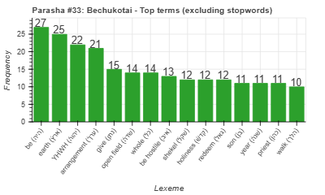
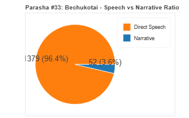
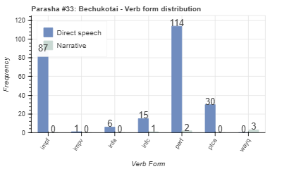
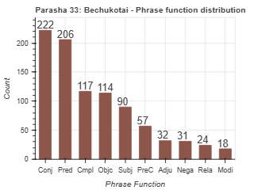

<a href="../32%20-%20BeHar">Previous parasha (#32): BeHar</a> &nbsp;&nbsp;<a href="../34%20-%20Bamidbar">Next parasha (#34): Bamidbar</a>

# Parasha #33: Bechukotai (בְּחֻקֹּתַי)

## Reading passages

Torah: [Leviticus 26:3-27:34](https://www.stepbible.org/?q=version=NASB2020|reference=Lev.26:3-27:34&options=HNVUG) &nbsp;&nbsp; [(Hebrew: פָּרָשַׁת בְּחֻקֹּתַי)](https://tikkun.io/#/p/bechukotai) 
Haftarah: 
[Jeremia 16:19-17:14](https://www.stepbible.org/?q=version=NASB2020|reference=Jer.16:19-17:14&options=HNVUG)

## Summary

Parasha Bechukotai ("in my laws") is the final portion in the Book of Leviticus. It sets forth the blessings that follow obedience and the curses that result from disobedience to God's commandments. It vividly describes the rewards for faithfully following God's laws, promising prosperity, security, peace, and an abundant harvest. However, it also contrasts these blessings with a sobering account of the consequences for abandoning God's ways, warning of famine, disease, defeat by enemies, and eventual exile from the land. Bechukotai emphasizes the covenantal relationship between God and the Israelites, showing both the rewards of loyalty and the gravity of straying. The portion concludes with detailed laws concerning vows, dedications, and valuations made to the Lord, underscoring the significance of commitment and integrity in serving Him.

## Parasha statistics

<a href="../../General/metrics_distribution.html" target="_blank">Interactive statistics for all parashot (# of words, sentences, etc.)</a>

## Parasha Data Sheet

<ul><li><a href="https://tonyjurg.github.io/Parashot/WeeklyParasha/33%20-%20Bechukotai/hapax_legomena(Bechukotai).html" target="_blank">Overview unique words in this parasha</a>
</li><li><a href="https://tonyjurg.github.io/Parashot/WeeklyParasha/33%20-%20Bechukotai/differences_MT_SP(Bechukotai).html" target="_blank">Differences between MT and SP for this parasha</a>
</li><li><a href="https://tonyjurg.github.io/Parashot/WeeklyParasha/33%20-%20Bechukotai/levenshtein_differences_MT_SP(Bechukotai).html" target="_blank">Differences between MT and SP for this parasha (Lenenshtein distance)</a>
</li><li><a href="https://tonyjurg.github.io/Parashot/WeeklyParasha/33%20-%20Bechukotai/spelling_differences_SP_MT(Bechukotai).html" target="_blank">Spelling differences in names between MT and SP for this parasha</a>
</li><li><a href="https://tonyjurg.github.io/Parashot/WeeklyParasha/33%20-%20Bechukotai/lexical_parallels(Bechukotai).html" target="_blank">Lexical paralels between this parasha and the Tenach</a>
</li></ul>

## Related SHEBANQ queries

Verse | Query | Short description
--- | --- | --- 
<a href="https://www.stepbible.org/?q=version=NASB2020\|reference=Lev.26:6&options=HNVUG" target="_blank">Lev. 26:6</a> | <a href="https://shebanq.ancient-data.org/hebrew/text?iid=6346&page=1&mr=r&qw=q" target="_blank">causative verb shabatizing</a> | Causing to take a rest.

## Related Text-Fabric Notebooks

GitHub | NBviewer | Short description
---|---|---
<a href="https://github.com/tonyjurg/Parashot/tree/main/WeeklyParasha/33%20-%20Bechukotai/hapax.ipynb" target="_blank">hapax</a> | <a href="https://nbviewer.org/github/tonyjurg/Parashot/blob/main/WeeklyParasha/33%20-%20Bechukotai/hapax.ipynb" target="_blank">hapax</a>| Find unique words (*hapax legomena*) in this parasha.
<a href="https://github.com/tonyjurg/Parashot/tree/main/WeeklyParasha/33%20-%20Bechukotai/lexical_parallels.ipynb" target="_blank">Lexical parallels</a> | <a href="https://nbviewer.org/github/tonyjurg/Parashot/blob/main/WeeklyParasha/33%20-%20Bechukotai/lexical_parallels.ipynb" target="_blank">Lexical parallels</a>| Find lexical parallels between verses.
<a href="https://github.com/tonyjurg/Parashot/tree/main/WeeklyParasha/33%20-%20Bechukotai/delta_mt_and_sp.ipynb" target="_blank">Delta SP and MT</a> | <a href="https://nbviewer.org/github/tonyjurg/Parashot/blob/main/WeeklyParasha/33%20-%20Bechukotai/delta_mt_and_sp.ipynb" target="_blank">Delta SP and MT</a>| Identify differences between the Samaritan Pentateuch (SP) and Masoretic Text (MT).
<a href="https://github.com/tonyjurg/Parashot/tree/main/WeeklyParasha/33%20-%20Bechukotai/parasha_analysis.ipynb" target="_blank">Parasha statistics</a> | <a href="https://nbviewer.org/github/tonyjurg/Parashot/blob/main/WeeklyParasha/33%20-%20Bechukotai/parasha_analysis.ipynb" target="_blank">Parasha statistics</a>| Create graphical statistics for this parasha.

## Hebcal

Additional details about Jewish calendar and holiday information, offering users a resource for tracking Hebrew dates, candle lighting times, and other relevant information in the Jewish calendar. [Hebcal entry for parasha Bechukotai](https://www.hebcal.com/sedrot/bechukotai).

