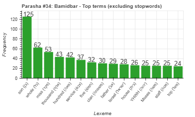
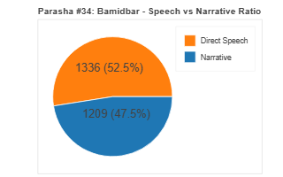
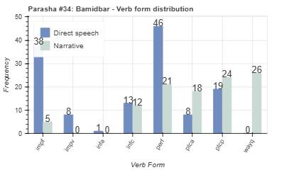
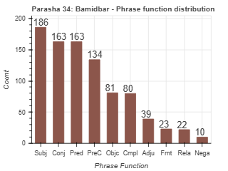

<a href="../33%20-%20Bechukotai">Previous parasha (#33): Bechukotai</a> &nbsp;&nbsp;<a href="../35%20-%20Nasso">Next parasha (#35): Nasso</a>

# Parasha #34: Bamidbar (בְּמִדְבַּר)

## Reading passages

Torah: [Numbers 1:1-4:20](https://www.stepbible.org/?q=version=NASB2020|reference=Num.1:1-4:20&options=HNVUG) &nbsp;&nbsp; [(Hebrew: פָּרָשַׁת בְּמִדְבַּר)](https://tikkun.io/#/p/bamidbar) 
Haftarah: 
[Hosea 2:1-22](https://www.stepbible.org/?q=version=NASB2020|reference=Hos.2:1-22&options=HNVUG)

## Summary

Parasha Bamidbar ("in the desert") opens the Book of Numbers and recounts the census of the Israelites taken in the wilderness of Sinai. This census, commanded by God, serves to organize and prepare the community for their journey through the desert. It not only numbers each of the twelve tribes but also arranges them around the Tabernacle in a specific formation, highlighting the central role of the Tabernacle in the community's life. Additionally, the portion assigns distinct responsibilities to the Levites, who are tasked with carrying and guarding the Tabernacle. Bamidbar emphasizes the necessity of order, structure, and unity within the Israelite camp as they prepare for their journey toward the Promised Land.

## Parasha statistics

<a href="../../General/metrics_distribution.html" target="_blank">Interactive statistics for all parashot (# of words, sentences, etc.)</a>

## Related SHEBANQ queries

Verse | Query | Short description
--- | --- | --- 
[Num. 3:21,27,33](https://www.stepbible.org/?q=version=NASB2020\|reference=Num.3:21,27,33&options=HNVUG)| [The clan of ...](https://shebanq.ancient-data.org/hebrew/text?iid=6667&version=2021&page=1&mr=r&qw=q)| Where is מִשְׁפַּחַת used in a construct to designate a clan?

## Related Text-Fabric Notebooks

GitHub | NBviewer | Short description
---|---|---
<a href="https://github.com/tonyjurg/Parashot/tree/main/WeeklyParasha/34%20-%20Bamidbar/hapax.ipynb" target="_blank">hapax</a> | <a href="https://nbviewer.org/github/tonyjurg/Parashot/blob/main/WeeklyParasha/34%20-%20Bamidbar/hapax.ipynb" target="_blank">hapax</a>| Find unique words (*hapax legomena*) in this parasha.
<a href="https://github.com/tonyjurg/Parashot/tree/main/WeeklyParasha/34%20-%20Bamidbar/parasha_analysis.ipynb" target="_blank">Parasha statistics</a> | <a href="https://nbviewer.org/github/tonyjurg/Parashot/blob/main/WeeklyParasha/34%20-%20Bamidbar/parasha_analysis.ipynb" target="_blank">Parasha statistics</a>| Create graphical statistics for this parasha.

## Hebcal

Additional details about Jewish calendar and holiday information, offering users a resource for tracking Hebrew dates, candle lighting times, and other relevant information in the Jewish calendar. [Hebcal entry for parasha Bamidbar](https://www.hebcal.com/sedrot/bamidbar).

