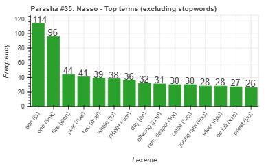
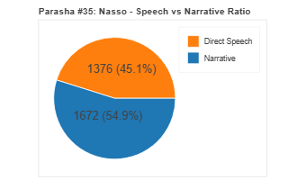
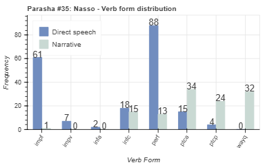
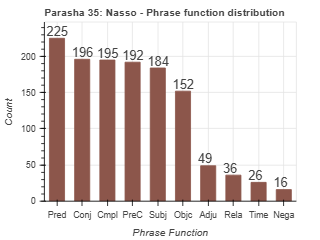

<a href="../34%20-%20Bamidbar">Previous parasha (#34): Bamidbar</a> &nbsp;&nbsp;<a href="../36%20-%20BehaAlotcha">Next parasha (#36): Beha'alotcha</a>

# Parasha #35: Nasso (נָשׂא)

## Reading passages

Torah: [Numbers 4:21-7:89](https://www.stepbible.org/?q=version=NASB2020|reference=Num.4:21-7:89&options=HNVUG) &nbsp;&nbsp; [(Hebrew: פָּרָשַׁת נָשׂא)](https://tikkun.io/#/p/naso) 
Haftarah: 
[Judges 13:2-25 ](https://www.stepbible.org/?q=version=NASB2020|reference=Jdg.13:2-25&options=HNVUG)

## Summary

Parasha Naso ("take a census") is the longest portion in the Torah and continues detailing the organization of the Israelite camp, focusing on the duties and responsibilities of the Levites in the service of the Tabernacle. It begins with the census of the Levite families of Gershon, Kohath, and Merari, each assigned specific tasks related to transporting and caring for the sacred objects and the Tabernacle structure itself. The portion then outlines the laws surrounding the Nazirite vow, a voluntary commitment to holiness through abstinence and dedication to God. It describes the unique offerings and rituals associated with the Nazirite, emphasizing personal sanctity within the community. Naso also includes the Priestly Blessing, a well-known and cherished blessing invoking divine protection, grace, and peace upon the Israelites. Throughout, the parasha underscores the significance of holiness, purity, and dedication, reflecting the Israelites' collective and individual responsibility in maintaining a sacred community as they journey through the wilderness.

## Parasha statistics

<a href="../../General/metrics_distribution.html" target="_blank">Interactive statistics for all parashot (# of words, sentences, etc.)</a>

## Related SHEBANQ queries

Verse | Query | Short description
--- | --- | --- 
<a href="https://www.stepbible.org/?q=version=NASB2020\|reference=Num.5:30&options=HNVUG" target="_blank">Num. 5:30</a> | <a href="https://shebanq.ancient-data.org/hebrew/text?iid=6312	&version=2021&page=1&mr=r&qw=q" target="_blank">Ruach as subject</a> | The use of רוּחַ as subject in a phrase

## Related Text-Fabric Notebooks

GitHub | NBviewer | Short description
---|---|---
<a href="https://github.com/tonyjurg/Parashot/tree/main/WeeklyParasha/35%20-%20Nasso/hapax.ipynb" target="_blank">hapax</a> | <a href="https://nbviewer.org/github/tonyjurg/Parashot/blob/main/WeeklyParasha/35%20-%20Nasso/hapax.ipynb" target="_blank">hapax</a>| Find unique words (*hapax legomena*) in this parasha.
<a href="https://github.com/tonyjurg/Parashot/tree/main/WeeklyParasha/35%20-%20Nasso/parasha_analysis.ipynb" target="_blank">Parasha statistics</a> | <a href="https://nbviewer.org/github/tonyjurg/Parashot/blob/main/WeeklyParasha/35%20-%20Nasso/parasha_analysis.ipynb" target="_blank">Parasha statistics</a>| Create graphical statistics for this parasha.

## Hebcal

Additional details about Jewish calendar and holiday information, offering users a resource for tracking Hebrew dates, candle lighting times, and other relevant information in the Jewish calendar. [Hebcal entry for parasha Nasso](https://www.hebcal.com/sedrot/nasso).

