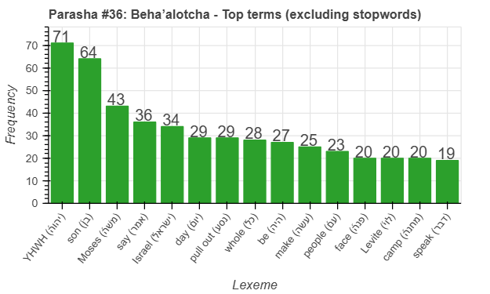
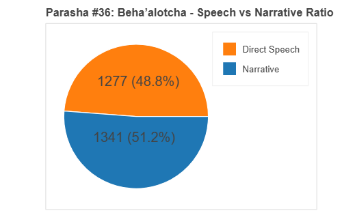
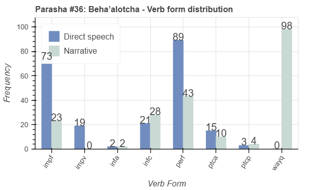
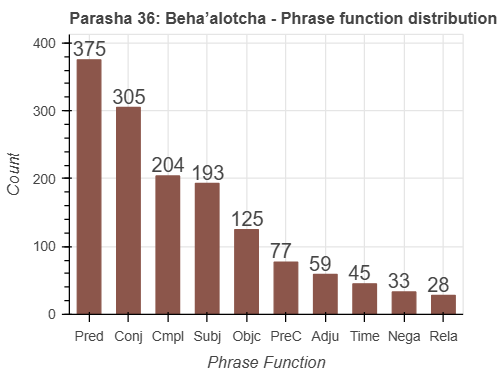

<a href="../35%20-%20Nasso">Previous parasha (#35): Nasso</a> &nbsp;&nbsp;<a href="../37%20-%20Shlach Lecha">Next parasha (#37): Sh'lach Lecha</a>

# Parasha #36: Beha'alotcha (בְּהַעֲלֹתְךָ)

## Reading passages

Torah: [Numbers 8:1-12:16](https://www.stepbible.org/?q=version=NASB2020|reference=Num.8:1-12:16&options=HNVUG) &nbsp;&nbsp; [(Hebrew: פָּרָשַׁת בְּהַעֲלֹתְךָ)](https://tikkun.io/#/p/behaalotcha) 
Haftarah: 
[Zechariah 2:14-4:7](https://www.stepbible.org/?q=version=NASB2020|reference=Zech.3:1-4:7&options=HNVUG) 

## Summary

Parasha Beha'alotcha ("when you raise") begins with instructions for Aaron to light the menorah and the consecration of the Levites for service in the Tabernacle. It continues with the Israelites' journey from Sinai to the wilderness of Paran, the institution of the Passover, and the cloud guiding their movement. The parasha also covers Miriam and Aaron's criticism of Moses, leading to Miriam's temporary affliction with tzara'at (צָרַעַת).

## Parasha statistics

<a href="../../General/metrics_distribution.html" target="_blank">Interactive statistics for all parashot (# of words, sentences, etc.)</a>

## Related SHEBANQ queries

Verse | Query | Short description
--- | --- | --- 
<a href="https://www.stepbible.org/?q=version=NASB2020\|reference=Num.8:4&options=HNVUG" target="_blank">Num. 8:4</a> | <a href="https://shebanq.ancient-data.org/hebrew/text?iid=6875	&version=2021&page=1&mr=r&qw=q" target="_blank">God caused to see</a> | God as subject with verb רָאָה with hifil stem (expressing causative actions)
<a href="https://www.stepbible.org/?q=version=NASB2020\|reference=Num.8:19&options=HNVUG" target="_blank">Num. 8:19</a> | <a href="https://shebanq.ancient-data.org/hebrew/text?iid=7045	&version=2021&page=1&mr=r&qw=q" target="_blank">'כפר' for the children of Israel</a> | Making atonement for the children of Israel (Hermen van der Linden)
<a href="https://www.stepbible.org/?q=version=NASB2020\|reference=Num.11:25,26,31&options=HNVUG" target="_blank">Num. 11:25,26,31</a> | <a href="https://shebanq.ancient-data.org/hebrew/text?iid=6312	&version=2021&page=1&mr=r&qw=q" target="_blank">Ruach as subject</a> | The use of רוּחַ as subject in a phrase

## Related Text-Fabric Notebooks

GitHub | NBviewer | Short description
---|---|---
[hapax](hapax.ipynb) | [hapax](https://nbviewer.org/github/tonyjurg/Parashot/blob/main/WeeklyParasha/36%20-%20BehaAlotcha/hapax.ipynb)| find unique words (*hapax legomena*)

## Hebcal

Additional details about Jewish calendar and holiday information, offering users a resource for tracking Hebrew dates, candle lighting times, and other relevant information in the Jewish calendar. [Hebcal entry for parasha Beha'alotcha](https://www.hebcal.com/sedrot/behaalotcha).

