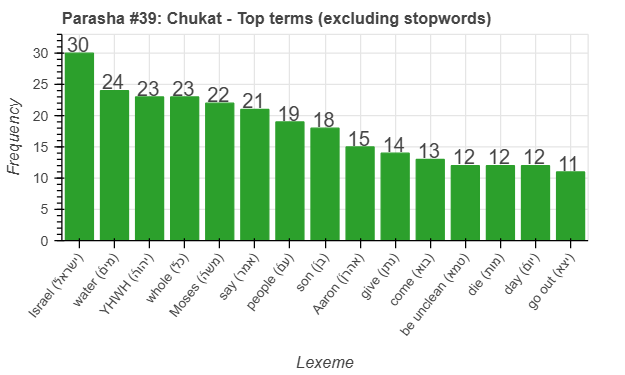
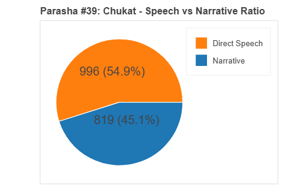
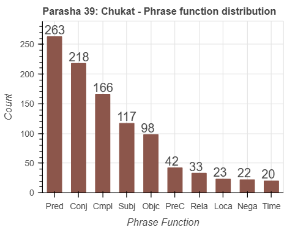

<a href="../38%20-%20Korach">Previous parasha (#38): Korach</a> &nbsp;&nbsp;<a href="../40%20-%20Balak">Next parasha (#40): Balak</a>

# Parasha #39: Chukat (חֻקַּת)

## Reading passages

Torah: [Numbers 19:1- 22:1](https://www.stepbible.org/?q=version=NASB2020|reference=Num.19:1-22:1&options=HNVUG) &nbsp;&nbsp; [(Hebrew: פָּרָשַׁת חֻקַּת)](https://tikkun.io/#/p/chukat) 
Haftarah: 
[Judges 11:1-33](https://www.stepbible.org/?q=version=NASB2020|reference=Jud.11:1-33&options=HNVUG)

## Summary

Parasha Chukat ("law of") introduces the laws of the red heifer, used for ritual purification after contact with the dead. It also recounts key events during Israel's journey in the wilderness, including the death of Miriam, Moses striking the rock instead of speaking to it, and the deaths of Aaron and the defeat of several enemies. The portion closes with the Israelites successfully defeating the kings Sihon and Og, marking a significant step toward entering the Promised Land.

## Parasha statistics

<a href="../../General/metrics_distribution.html" target="_blank">Interactive statistics for all parashot (# of words, sentences, etc.)</a>

## Related SHEBANQ queries

Verse | Query | Short description
--- | --- | --- 
<a href="https://www.stepbible.org/?q=version=NASB2020\|reference=Num.20:6&options=HNVUG" target="_blank">Num. 20:6</a> | <a href="https://shebanq.ancient-data.org/hebrew/text?iid=6876&version=2021&page=1&mr=r&qw=q" target="_blank">God appears</a> | God (or something of God) as subject to רָאָה in nifil stem.
<a href="https://www.stepbible.org/?q=version=NASB2020\|reference=Num.21:3&options=HNVUG" target="_blank">Num. 21:3</a> | <a href="https://shebanq.ancient-data.org/hebrew/text?iid=2937&version=2017&page=1&mr=r&qw=q" target="_blank">The Lord listened</a> | The Lord listened to the people of Israel (Query: Oliver Glanz)

## Related Text-Fabric Notebooks

GitHub | NBviewer | Short description
---|---|---
[hapax](hapax.ipynb) | [hapax](https://nbviewer.org/github/tonyjurg/Parashot/blob/main/WeeklyParasha/39%20-%20Chukat/hapax.ipynb)| find unique words (*hapax legomena*)

## Hebcal

Additional details about Jewish calendar and holiday information, offering users a resource for tracking Hebrew dates, candle lighting times, and other relevant information in the Jewish calendar. [Hebcal entry for parasha Chukat](https://www.hebcal.com/sedrot/chukat).

