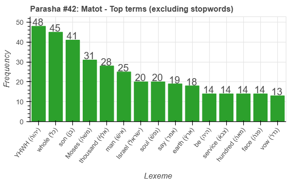
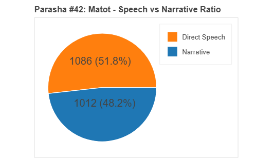
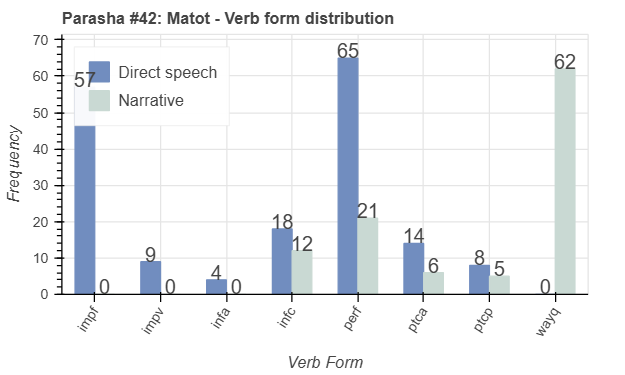
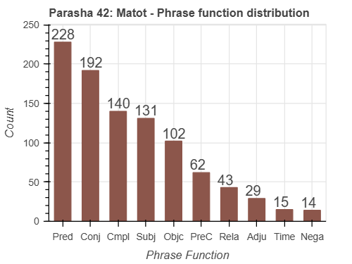

 <a href="../41%20-%20Pinchas">Previous parasha (#41): Pinchas</a> &nbsp;&nbsp; <a href="../43%20-%20Masei">Next parasha (#43): Masei</a>

# Parasha #42: Matot (מַּטּוֹת)

## Reading passages

Torah: <a href="https://www.stepbible.org/?q=version=NASB2020|reference=Num.30:2-32:42&options=HNVUG" target="_blank">Numbers 30:2-32:42</a> &nbsp;&nbsp; <a href="https://tikkun.io/#/p/mattot" target="_blank">(Hebrew: פָּרָשַׁת מַּטּוֹת)</a> 
Haftarah: 
<a href="https://www.stepbible.org/?q=version=NASB2020|reference=Jer.1:1-2:3&options=HNVUG" target="_blank">Jeremiah 1:1-2:3</a>

## Summary

Parasha Mattot ("tribes") opens with laws regarding vows and oaths, particularly focusing on the obligations and annulments of vows made by women. The portion then describes the Israelites' war against the Midianites, resulting in the defeat of Midian and the distribution of spoils. It concludes with the tribes of Reuben, Gad, and half of Manasseh requesting to settle on the east side of the Jordan River, an arrangement Moses permits after ensuring their commitment to help conquer the Promised Land.

## Parasha statistics

<a href="../../General/metrics_distribution.html" target="_blank">Interactive statistics for all parashot (# of words, sentences, etc.)</a>

## Related SHEBANQ queries

Verse | Query | Short description
--- | --- | --- 
||

## Related Text-Fabric Notebooks

GitHub | NBviewer | Short description
---|---|---
<a href="https://github.com/tonyjurg/Parashot/tree/main/WeeklyParasha/42%20-%20Matot/hapax.ipynb" target="_blank">hapax</a> | <a href="https://nbviewer.org/github/tonyjurg/Parashot/blob/main/WeeklyParasha/42%20-%20Matot/hapax.ipynb" target="_blank">hapax</a> | Find unique words (*hapax legomena*)
<a href="https://github.com/tonyjurg/Parashot/tree/main/WeeklyParasha/42%20-%20Matot/parasha_analysis.ipynb" target="_blank">Parasha statistics</a> | <a href="https://nbviewer.org/github/tonyjurg/Parashot/blob/main/WeeklyParasha/42%20-%20Matot/parasha_analysis.ipynb" target="_blank">Parasha statistics</a>| Create graphical statistics for this parasha.

## Hebcal

Additional details about Jewish calendar and holiday information, offering users a resource for tracking Hebrew dates, candle lighting times, and other relevant information in the Jewish calendar. <a href="https://www.hebcal.com/sedrot/matot" target="_blank">Hebcal entry for parasha Matot</a>.
