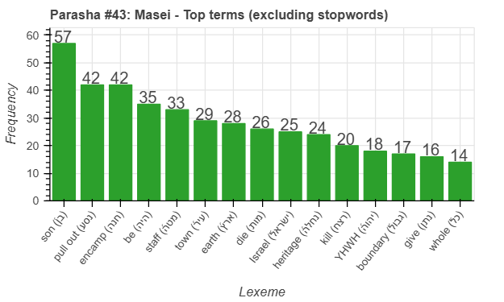
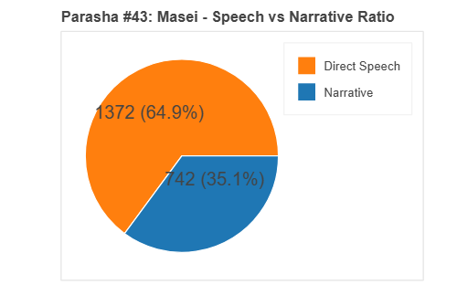
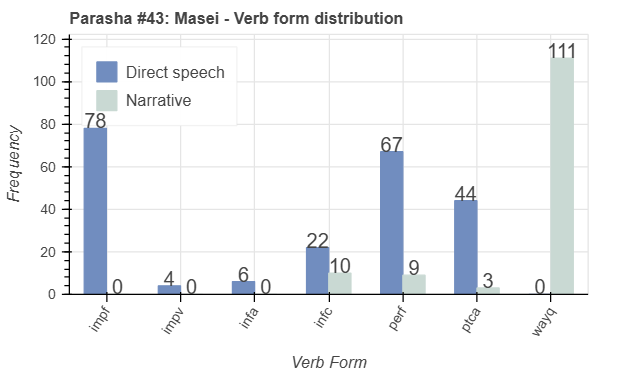
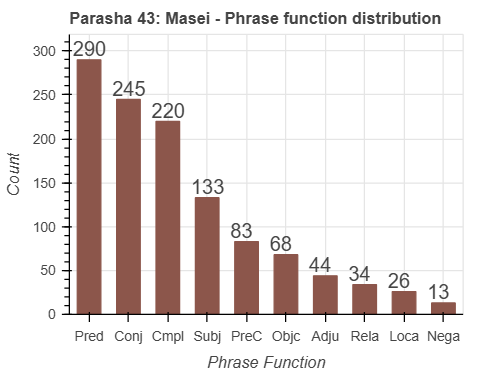

 <a href="../42%20-%20Matot">Previous parasha (#42): Matot</a> &nbsp;&nbsp; <a href="../44%20-%20Devarim">Next parasha (#44): Devarim</a>

# Parasha #43: Masei (מַסְעֵי)

## Reading passages

Torah: <a href="https://www.stepbible.org/?q=version=NASB2020|reference=Num.33:1-36:13&options=HNVUG" target="_blank">Numbers 33:1-36:13</a> &nbsp;&nbsp; <a href="https://tikkun.io/#/p/balak" target="_blank">(Hebrew: פָּרָשַׁת מַסְעֵי)</a> 
Haftarah: 
<a href="https://www.stepbible.org/?q=version=NASB2020|reference=Jer.2:4-28;3:4&options=HNVUG" target="_blank">Jeremiah 2:4-28, 3:4</a> (Ashkenazim) or
<a href="https://www.stepbible.org/?q=version=NASB2020|reference=Jer.2:4-28;4:1-2&options=HNVUG" target="_blank">Jeremiah 2:4-28, 4:1-2</a> (Sephardim)

## Summary

Parasha Masei ("travels") recounts the Israelites' journey through the wilderness, listing all the stages from their departure from Egypt to their encampment by the Jordan River. God instructs them to drive out the inhabitants of Canaan and allocate the land among the tribes by lot, establishing specific boundaries for the Promised Land. The portion concludes with laws regarding the cities of refuge, designed for those who commit manslaughter, and a final ruling on inheritance laws for the daughters of Zelophehad to ensure property remains within the tribe.

## Parasha statistics

<a href="../../General/metrics_distribution.html" target="_blank">Interactive statistics for all parashot (# of words, sentences, etc.)</a>

## Related SHEBANQ queries

Verse | Query | Short description
--- | --- | --- 
<a href="https://www.stepbible.org/?q=version=NASB2020\|reference=Num. 35:25&options=HNVUG" target="_blank">Num. 35:25</a>|  <a href="https://shebanq.ancient-data.org/hebrew/text?iid=5471&version=2021&page=1&mr=r&qw=q" target="_blank">Deliver from the hand</a>| Locate texts with the words (in any order) "delivered from the hand". (Timothy Baze)

## Related Text-Fabric Notebooks

GitHub | NBviewer | Short description
---|---|---
<a href="https://github.com/tonyjurg/Parashot/tree/main/WeeklyParasha/43%20-%20Masei/hapax.ipynb" target="_blank">hapax</a> | <a href="https://nbviewer.org/github/tonyjurg/Parashot/blob/main/WeeklyParasha/43%20-%20Masei/hapax.ipynb" target="_blank">hapax</a> | Find unique words (*hapax legomena*)
<a href="https://github.com/tonyjurg/Parashot/tree/main/WeeklyParasha/43%20-%20Masei/parasha_analysis.ipynb" target="_blank">Parasha statistics</a> | <a href="https://nbviewer.org/github/tonyjurg/Parashot/blob/main/WeeklyParasha/43%20-%20Masei/parasha_analysis.ipynb" target="_blank">Parasha statistics</a>| Create graphical statistics for this parasha.

## Hebcal

Additional details about Jewish calendar and holiday information, offering users a resource for tracking Hebrew dates, candle lighting times, and other relevant information in the Jewish calendar. <a href="https://www.hebcal.com/sedrot/masei" target="_blank">Hebcal entry for parasha Masei</a>.
