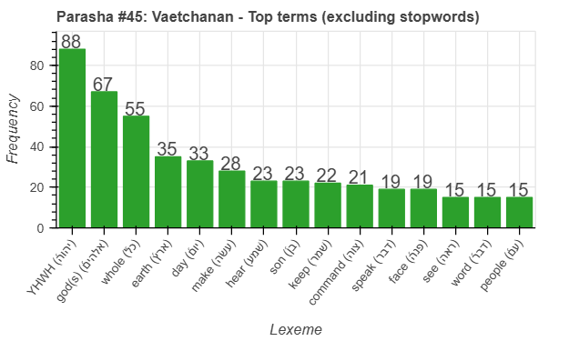
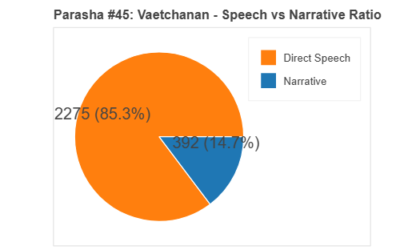
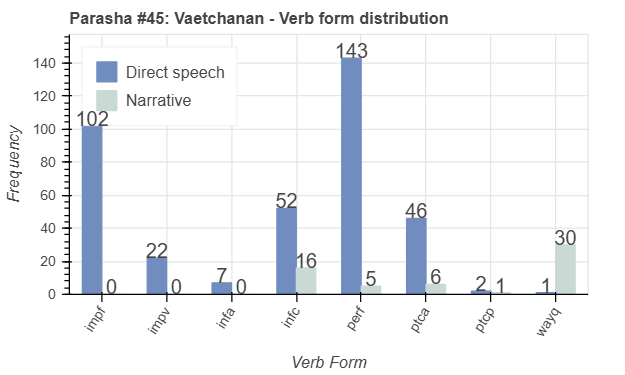
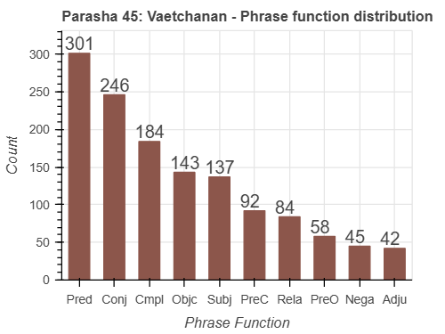

 <a href="../44%20-%20Devarim">Previous parasha (#44): Devarim</a> &nbsp;&nbsp; <a href="../46%20-%20Eikev">Next parasha (#46): Eikev</a> 

# Parasha #45: Va'etchanan (וָאֶתְחַנַּן)

## Reading passages

Torah: <a href="https://www.stepbible.org/?q=version=NASB2020|reference=Deut.3:23-7:11&options=HNVUG" target="_blank">Deuteronomy 3:23-7:11</a> &nbsp;&nbsp; <a href="https://tikkun.io/#/p/devarim" target="_blank">(Hebrew: פָּרָשַׁת וָאֶתְחַנַּן)</a> 
Haftarah: 
<a href="https://www.stepbible.org/?q=version=NASB2020|reference=Is.40:1-26&options=HNVUG" target="_blank">Isaiah 40:1-26</a>

## Summary

Parasha Va'etchanan ("I pleaded") features Moses' heartfelt plea to enter the Promised Land, which God denies, but He allows Moses to view it from afar. Moses then recaps essential commandments, including the Ten Commandments, and delivers the Shema, emphasizing Israel's duty to love and obey God alone. The portion reinforces the covenant, urging the Israelites to remain faithful and avoid idolatry to ensure their success and prosperity in the land.

## Parasha statistics

<a href="../../General/metrics_distribution.html" target="_blank">Interactive statistics for all parashot (# of words, sentences, etc.)</a>

## Related SHEBANQ queries

Verse | Query | Short description
--- | --- | --- 
||

## Related Text-Fabric Notebooks

GitHub | NBviewer | Short description
---|---|---
[hapax](hapax.ipynb) | <a href="https://nbviewer.org/github/tonyjurg/Parashot/blob/main/WeeklyParasha/45%20-%20Va'etchanan/hapax.ipynb" target="_blank">hapax</a> | find unique words (*hapax legomena*)

## Hebcal

Additional details about Jewish calendar and holiday information, offering users a resource for tracking Hebrew dates, candle lighting times, and other relevant information in the Jewish calendar. <a href="https://www.hebcal.com/sedrot/vaetchanan" target="_blank">Hebcal entry for parasha Va'etchanan</a>.
