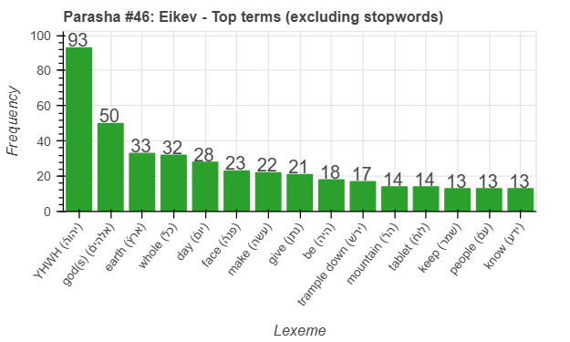
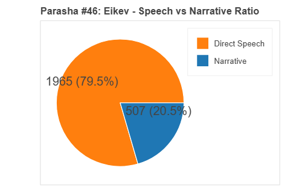
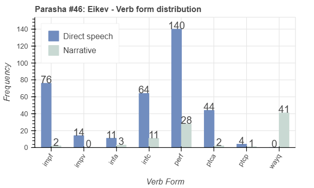
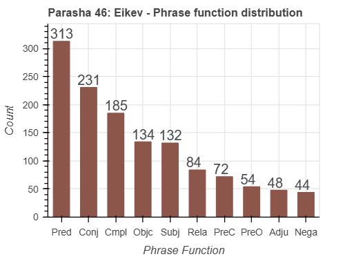

 <a href="../45%20-%20Va'etchanan">Previous parasha (#45): Va'etchanan</a> &nbsp;&nbsp; <a href="../47%20-%20Re'eh">Next parasha (#47): Re'eh</a>

# Parasha #46: Eikev (עֵקֶב)

## Reading passages

Torah: <a href="https://www.stepbible.org/?q=version=NASB2020|reference=Deut.7:12-11:25&options=HNVUG" target="_blank">Deuteronomy 7:12-11:25</a> &nbsp;&nbsp; <a href="https://tikkun.io/#/p/eikev" target="_blank">(Hebrew: פָּרָשַׁת עֵקֶב)</a> 
Haftarah: 
<a href="https://www.stepbible.org/?q=version=NASB2020|reference=Is.49:14-51:3&options=HNVUG" target="_blank">Isaiah 49:14-51:3</a>

## Summary

Parasha Eikev ("as a consequence") emphasizes the rewards of obedience to God's commandments, promising prosperity, victory over enemies, and blessings in the Promised Land if Israel remains faithful. Moses reminds the people of God's past faithfulness, their own past rebellions, and the importance of humility, urging them not to forget God once they experience success. The portion highlights the need for gratitude, trust in God's provision, and the continuous observance of His laws to ensure ongoing protection and favor.

## Parasha statistics

<a href="../../General/metrics_distribution.html" target="_blank">Interactive statistics for all parashot (# of words, sentences, etc.)</a>

## Related SHEBANQ queries

Verse | Query | Short description
--- | --- | --- 
<a href="https://www.stepbible.org/?q=version=NASB2020\|reference=Deut.8:10&options=HNVUG" target="_blank">Deut. 8:10</a> | <a href="https://shebanq.ancient-data.org/hebrew/text?iid=5542&version=2021&page=1&mr=r&qw=q" target="_blank">Elohim as object of blessing</a> | Where is God (elohiem) the object of blessing (ברך)?

## Related Text-Fabric Notebooks

GitHub | NBviewer | Short description
---|---|---
[hapax](hapax.ipynb) | <a href="https://nbviewer.org/github/tonyjurg/Parashot/blob/main/WeeklyParasha/46%20-%20Eikev/hapax.ipynb" target="_blank">hapax</a> | find unique words (*hapax legomena*)

## Hebcal

Additional details about Jewish calendar and holiday information, offering users a resource for tracking Hebrew dates, candle lighting times, and other relevant information in the Jewish calendar. <a href="https://www.hebcal.com/sedrot/eikev" target="_blank">Hebcal entry for parasha Eikev</a>.
