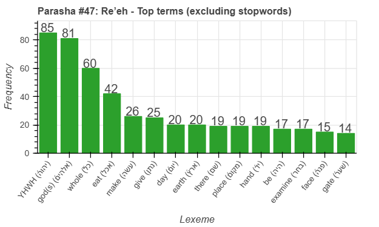
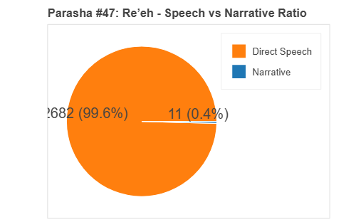
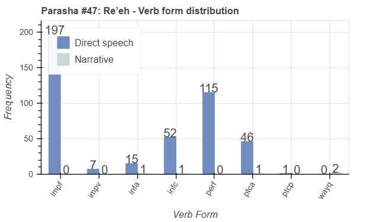
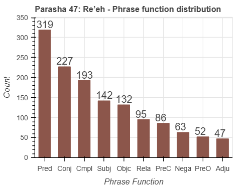

 <a href="../46%20-%20Eikev">Previous parasha (#46): Eikev</a> &nbsp;&nbsp; <a href="../48%20-%20Shoftim">Next parasha (#48): Shoftim</a>

# Parasha #47: Re’eh (רְאֵה)

## Reading passages

Torah: <a href="https://www.stepbible.org/?q=version=NASB2020|reference=Deut.11:26-16:17&options=HNVUG" target="_blank">Deuteronomy 11:26-16:17</a> &nbsp;&nbsp; <a href="https://tikkun.io/#/p/reeh" target="_blank">(Hebrew: פָּרָשַׁת דְּבָרִים)</a> 
Haftarah: 
<a href="https://www.stepbible.org/?q=version=NASB2020|reference=Is.54:11-55:5&options=HNVUG" target="_blank">Isaiah 54:11-55:5</a>

## Summary

Parasha Re'eh ("See") presents a choice between blessings and curses based on Israel's obedience to God's commandments, urging the people to follow His ways to receive blessings in the Promised Land. It includes laws concerning centralized worship, dietary restrictions, the treatment of false prophets, and the importance of caring for the poor. The portion also addresses the observance of festivals such as Passover, Shavuot, and Sukkot, reinforcing Israel's covenantal relationship with God. Additionally, Re'eh emphasizes the importance of maintaining spiritual and communal purity as they settle in the land.

## Parasha statistics

<a href="../../General/metrics_distribution.html" target="_blank">Interactive statistics for all parashot (# of words, sentences, etc.)</a>

## Related SHEBANQ queries

Verse | Query | Short description
--- | --- | --- 
<a href="https://www.stepbible.org/?q=version=NASB2020\|reference=Deut.12:5,11,14,18,21,26;14:24,25;15:20;16:2,6,7,11,15&options=HNVUG" target="_blank">Deut. 12:5,11,14,18,21,26; 14:24,25; 15:20; 16:2,6,7,11,15</a> | <a href="https://shebanq.ancient-data.org/hebrew/text?iid=6685&version=2021&page=1&mr=r&qw=q" target="_blank">The place chosen by the Lord</a> | Where else do we find the phrase הַמָּקֹ֞ום אֲשֶׁר־יִבְחַ֨ר יְהוָ֤ה?

## Related Text-Fabric Notebooks

GitHub | NBviewer | Short description
---|---|---
<a href="https://github.com/tonyjurg/Parashot/tree/main/WeeklyParasha/47%20-%20Re'eh/hapax.ipynb" target="_blank">hapax</a> | <a href="https://nbviewer.org/github/tonyjurg/Parashot/blob/main/WeeklyParasha/47%20-%20Re'eh/hapax.ipynb" target="_blank">hapax</a> | Find unique words (*hapax legomena*)
<a href="https://github.com/tonyjurg/Parashot/tree/main/WeeklyParasha/47%20-%20Re'eh/parasha_analysis.ipynb" target="_blank">Parasha statistics</a> | <a href="https://nbviewer.org/github/tonyjurg/Parashot/blob/main/WeeklyParasha/47%20-%20Re'eh/parasha_analysis.ipynb" target="_blank">Parasha statistics</a>| Create graphical statistics for this parasha.

## Hebcal

Additional details about Jewish calendar and holiday information, offering users a resource for tracking Hebrew dates, candle lighting times, and other relevant information in the Jewish calendar. <a href="https://www.hebcal.com/sedrot/reeh" target="_blank">Hebcal entry for parasha Re’eh</a>.
