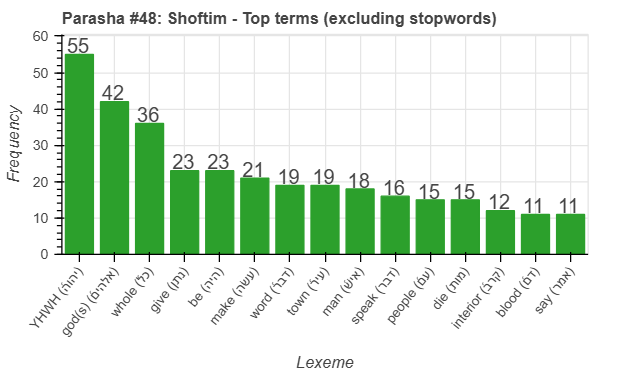
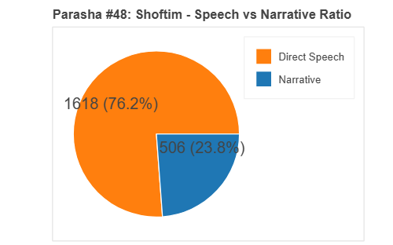
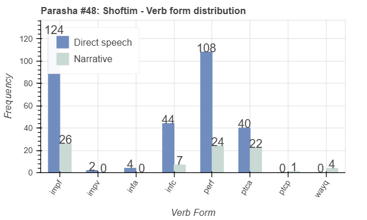
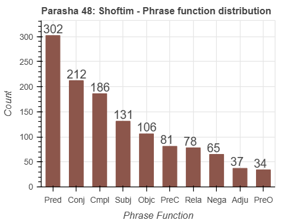

 <a href="../47%20-%20Re'eh">Previous parasha (#47): Re'eh</a> &nbsp;&nbsp; <a href="../49%20-%20Ki%20Teitzei">Next parasha (#49): Ki Teitzei</a>

# Parasha #48: Shoftim (שׁוֹפְטִים)

## Reading passages

Torah: <a href="https://www.stepbible.org/?q=version=NASB2020|reference=Deut.16:18-21:9&options=HNVUG" target="_blank">Deuteronomy 16:18-21:9</a> &nbsp;&nbsp; <a href="https://tikkun.io/#/p/shoftim" target="_blank">(Hebrew: פָּרָשַׁת שׁוֹפְטִים)</a> 
Haftarah: 
<a href="https://www.stepbible.org/?q=version=NASB2020|reference=Is.51:12-52:12&options=HNVUG" target="_blank">Isaiah 51:12-52:12</a>

## Summary

Parasha Shoftim ("Judges") focuses on establishing a fair and just society by setting guidelines for appointing judges and leaders, ensuring justice and righteousness in governance. It introduces laws regarding kings, priests, and prophets, emphasizing the need for integrity, humility, and adherence to God's law among leaders. The portion also outlines rules for warfare and provides instructions on handling unsolved murders to maintain communal responsibility and holiness. Additionally, it highlights the importance of witnesses and the fair treatment of accused individuals, reinforcing the pursuit of truth and justice.

## Parasha statistics

<a href="../../General/metrics_distribution.html" target="_blank">Interactive statistics for all parashot (# of words, sentences, etc.)</a>

## Parasha Data Sheets

<ul><li><a href="https://tonyjurg.github.io/Parashot/WeeklyParasha/48%20-%20Shoftim/hapax_legomena(Shoftim).html" target="_blank">Overview unique words in this parasha</a>
</li><li><a href="https://tonyjurg.github.io/Parashot/WeeklyParasha/48%20-%20Shoftim/differences_MT_SP(Shoftim).html" target="_blank">Differences between MT and SP for this parasha</a>
</li><li><a href="https://tonyjurg.github.io/Parashot/WeeklyParasha/48%20-%20Shoftim/levenshtein_differences_MT_SP(Shoftim).html" target="_blank">Differences between MT and SP for this parasha (Lenenshtein distance)</a>
</li><li><a href="https://tonyjurg.github.io/Parashot/WeeklyParasha/48%20-%20Shoftim/spelling_differences_SP_MT(Shoftim).html" target="_blank">Spelling differences in names between MT and SP for this parasha</a>
</li><li><a href="https://tonyjurg.github.io/Parashot/WeeklyParasha/48%20-%20Shoftim/lexical_parallels(Shoftim).html" target="_blank">Lexical paralels between this parasha and the Tenach</a>
</li><li><a href="https://tonyjurg.github.io/Parashot/WeeklyParasha/48%20-%20Shoftim/double_root(Shoftim).html" target="_blank">Repetition of word forms from the same lexical root</a>
</li></ul>

## Related SHEBANQ queries

Verse | Query | Short description
--- | --- | --- 
<a href="https://www.stepbible.org/?q=version=NASB2020\|reference=Deut.17:8;18:6&options=HNVUG" target="_blank">Deut. 17:8; 18:6</a> | <a href="https://shebanq.ancient-data.org/hebrew/text?iid=6685&version=2021&page=1&mr=r&qw=q" target="_blank">The place chosen by the Lord</a> | Where else do we find the phrase הַמָּקֹ֞ום אֲשֶׁר־יִבְחַ֨ר יְהוָ֤ה?
<a href="https://www.stepbible.org/?q=version=NASB2020\|reference=Deut.17:15;20:17&options=HNVUG" target="_blank">Deut. 17:15; 20:17</a> | <a href="https://shebanq.ancient-data.org/hebrew/text?iid=6089&version=2021&page=8&mr=r&qw=q" target="_blank">Verb radix repetition in same clause</a> | Radix repetition to bring emphasize.

## Related Text-Fabric Notebooks

GitHub | NBviewer | Short description
---|---|---
[hapax](hapax.ipynb) | <a href="https://nbviewer.org/github/tonyjurg/Parashot/blob/main/WeeklyParasha/48%20-%20Shoftim/hapax.ipynb" target="_blank">hapax</a> | find unique words (*hapax legomena*)
<a href="https://github.com/tonyjurg/Parashot/blob/main/WeeklyParasha/48%20-%20Shoftim/lexical_parallels.ipynb" target="_blank">Lexical parallels</a> | <a href="https://nbviewer.org/github/tonyjurg/Parashot/blob/main/WeeklyParasha/48%20-%20Shoftim/lexical_parallels.ipynb" target="_blank">Lexical parallels</a> | Find lexical parallels between verses
<a href="https://github.com/tonyjurg/Parashot/blob/main/WeeklyParasha/48%20-%20Shoftim/delta_mt_and_sp.ipynb" target="_blank">Delta SP and MT</a> | <a href="https://nbviewer.org/github/tonyjurg/Parashot/blob/main/WeeklyParasha/48%20-%20Shoftim/delta_mt_and_sp.ipynb" target="_blank">Delta SP and MT</a> | Identify differences between the Samaritan Pentateuch (SP) and Masoretic Text (MT)
<a href="https://github.com/tonyjurg/Parashot/tree/main/WeeklyParasha/48%20-%20Shoftim/parasha_analysis.ipynb" target="_blank">Parasha statistics</a> | <a href="https://nbviewer.org/github/tonyjurg/Parashot/blob/main/WeeklyParasha/48%20-%20Shoftim/parasha_analysis.ipynb" target="_blank">Parasha statistics</a>| Create graphical statistics for this parasha.
<a href="https://github.com/tonyjurg/Parashot/tree/main/WeeklyParasha/48%20-%20Shoftim/double_roots.ipynb" target="_blank">Double roots</a> | <a href="https://nbviewer.org/github/tonyjurg/Parashot/blob/main/WeeklyParasha/48%20-%20Shoftim/double_roots.ipynb" target="_blank">Double roots</a>| Identify occurences of consequence double roots in parasha and haftara.

## Hebcal

Additional details about Jewish calendar and holiday information, offering users a resource for tracking Hebrew dates, candle lighting times, and other relevant information in the Jewish calendar. <a href="https://www.hebcal.com/sedrot/shoftim" target="_blank">Hebcal entry for parasha Shoftim</a>.
