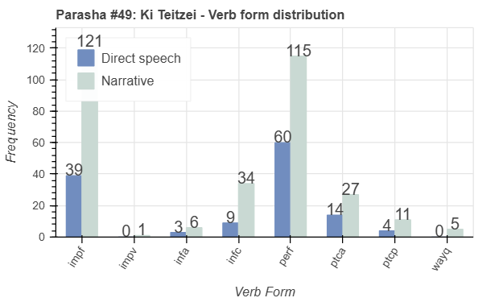

 <a href="../48%20-%20Shoftim">Previous parasha (#48): Shoftim</a> &nbsp;&nbsp; <a href="../50%20-%20Ki%20Tavo">Next parasha (#50): Ki Tavo</a>

# Parasha #49: Ki Teitzei (כִּי־תֵצֵא)

## Reading passages

Torah: <a href="https://www.stepbible.org/?q=version=NASB2020|reference=Deut.21:10-25:19&options=HNVUG" target="_blank">Deuteronomy 21:10-25:19</a> &nbsp;&nbsp; <a href="https://tikkun.io/#/p/ki-teitzei" target="_blank">(Hebrew: פָּרָשַׁת כִּי־תֵצֵא)</a> 
Haftarah: 
<a href="https://www.stepbible.org/?q=version=NASB2020|reference=Is.54:1-10&options=HNVUG" target="_blank">Isaiah 54:1-10</a>

## Summary

Parasha Ki Teitzei ("When you go out") contains a diverse collection of laws governing ethical behavior, social justice, and personal conduct, touching on topics such as family relationships, the treatment of captives, and economic fairness. It emphasizes the protection of vulnerable individuals, including widows, orphans, and strangers, while promoting honesty in business and community life. The portion also concludes with the command to remember the Amalekites' attack on Israel and to erase their memory as a matter of justice. Additionally, it underscores the significance of maintaining personal integrity and fulfilling vows made to God.

## Parasha statistics

<a href="../../General/metrics_distribution.html" target="_blank">Interactive statistics for all parashot (# of words, sentences, etc.)</a>

## Related SHEBANQ queries

Verse | Query | Short description
--- | --- | ---
<a href="https://www.stepbible.org/?q=version=NASB2020\|reference=Deut.21:23;22:1,4,7;23:22;24:13&options=HNVUG" target="_blank">Deut. 21:23; 22:1,4,7; 23:22; 24:13</a> | <a href="https://shebanq.ancient-data.org/hebrew/text?iid=6089&version=2021&page=1&mr=r&qw=q" target="_blank">Verb radix repetition</a> | Repetition of a verb radix to express emphasis
<a href="https://www.stepbible.org/?q=version=NASB2020\|reference=Deut.22:1&options=HNVUG" target="_blank">Deut. 22:1</a> | <a href="https://shebanq.ancient-data.org/hebrew/text?iid=6641&version=2021&page=1&mr=r&qw=q" target="_blank">'certain return' in Torah</a> | For certain bring back a stray sheep
<a href="https://www.stepbible.org/?q=version=NASB2020\|reference=Deut.25:11&options=HNVUG" target="_blank">Deut. 25:11</a>|  <a href="https://shebanq.ancient-data.org/hebrew/text?iid=5471&version=2021&page=1&mr=r&qw=q" target="_blank">Deliver from the hand</a>| Locate texts with the words (in any order) "delivered from the hand". (Timothy Baze)

## Related Text-Fabric Notebooks

GitHub | NBviewer | Short description
---|---|---
<a href="https://github.com/tonyjurg/Parashot/tree/main/WeeklyParasha/49%20-%20Ki%20Teitzei/hapax.ipynb" target="_blank">hapax</a> | <a href="https://nbviewer.org/github/tonyjurg/Parashot/blob/main/WeeklyParasha/49%20-%20Ki%20Teitzei/hapax.ipynb" target="_blank">hapax</a> | Find unique words (*hapax legomena*)
<a href="https://github.com/tonyjurg/Parashot/tree/main/WeeklyParasha/49%20-%20Ki%20Teitzei/parasha_analysis.ipynb" target="_blank">Parasha statistics</a> | <a href="https://nbviewer.org/github/tonyjurg/Parashot/blob/main/WeeklyParasha/49%20-%20Ki%20Teitzei/parasha_analysis.ipynb" target="_blank">Parasha statistics</a>| Create graphical statistics for this parasha.

## Hebcal

Additional details about Jewish calendar and holiday information, offering users a resource for tracking Hebrew dates, candle lighting times, and other relevant information in the Jewish calendar. <a href="https://www.hebcal.com/sedrot/ki-teitzei" target="_blank">Hebcal entry for parasha Ki Teitzei</a>.
