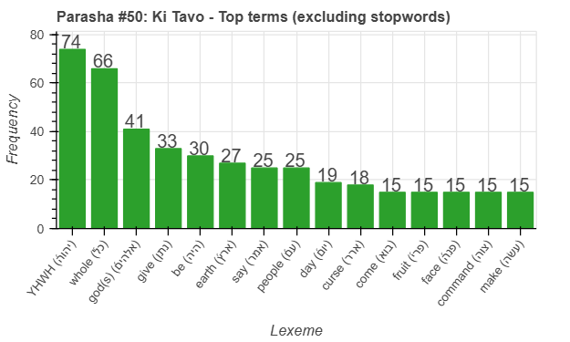
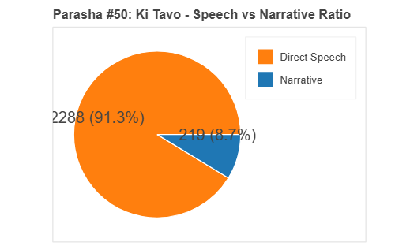
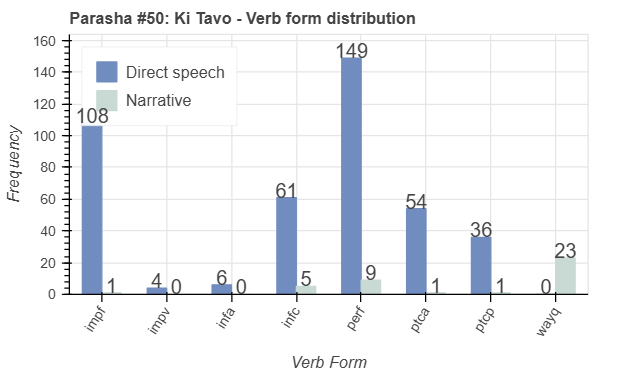
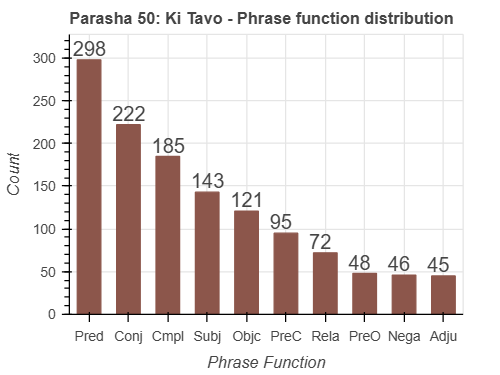

 <a href="../49%20-%20Ki%20Teitzei">Previous parasha (#49): Ki Teitzei</a> &nbsp;&nbsp; <a href="../51%20-%20Nitzavim">Next parasha (#51): Nitzavim</a>

# Parasha #50: Ki Tavo (כִּי־תָבוֹא)

## Reading passages

Torah: <a href="https://www.stepbible.org/?q=version=NASB2020|reference=Deut.26:1-29:8&options=HNVUG" target="_blank">Deuteronomy 26:1-29:8</a> &nbsp;&nbsp; <a href="https://tikkun.io/#/p/ki-tavo" target="_blank">(Hebrew: פָּרָשַׁת כִּי־תָבוֹא)</a> 
Haftarah: 
<a href="https://www.stepbible.org/?q=version=NASB2020|reference=Is.60:1-22&options=HNVUG" target="_blank">Isaiah 60:1-22</a>

## Summary

Parasha Ki Tavo ("when you come") outlines the rituals that the Israelites must perform once they enter the Promised Land, including offering the first fruits and making a declaration of their faithfulness to God. Moses then presents a detailed list of blessings for obedience and severe curses for disobedience, emphasizing the importance of keeping God's commandments. The portion concludes with a reminder that the Israelites have a unique covenant with God, and they must uphold it to ensure their prosperity and protection. Additionally, it reinforces the communal responsibility to live according to God's laws, as their collective fate depends on their faithfulness.

## Parasha statistics

<a href="../../General/metrics_distribution.html" target="_blank">Interactive statistics for all parashot (# of words, sentences, etc.)</a>

## Related SHEBANQ queries

Verse | Query | Short description
--- | --- | --- 
<a href="https://www.stepbible.org/?q=version=NASB2020\|reference=Deut.26:2&options=HNVUG" target="_blank">Deut. 26:2</a> | <a href="https://shebanq.ancient-data.org/hebrew/text?iid=6685&version=2021&page=1&mr=r&qw=q" target="_blank">The place chosen by the Lord</a> | Where else do we find the phrase הַמָּקֹ֞ום אֲשֶׁר־יִבְחַ֨ר יְהוָ֤ה?

## Related Text-Fabric Notebooks

GitHub | NBviewer | Short description
---|---|---
<a href="https://github.com/tonyjurg/Parashot/tree/main/WeeklyParasha/50%20-%20Ki%20Tavo/hapax.ipynb" target="_blank">hapax</a> | <a href="https://nbviewer.org/github/tonyjurg/Parashot/blob/main/WeeklyParasha/50%20-%20Ki%20Tavo/hapax.ipynb" target="_blank">hapax</a> | Find unique words (*hapax legomena*)
<a href="https://github.com/tonyjurg/Parashot/tree/main/WeeklyParasha/50%20-%20Ki%20Tavo/parasha_analysis.ipynb" target="_blank">Parasha statistics</a> | <a href="https://nbviewer.org/github/tonyjurg/Parashot/blob/main/WeeklyParasha/50%20-%20Ki%20Tavo/parasha_analysis.ipynb" target="_blank">Parasha statistics</a>| Create graphical statistics for this parasha.

## Hebcal

Additional details about Jewish calendar and holiday information, offering users a resource for tracking Hebrew dates, candle lighting times, and other relevant information in the Jewish calendar. <a href="https://www.hebcal.com/sedrot/ki-tavo" target="_blank">Hebcal entry for parasha Ki Tavo</a>.
