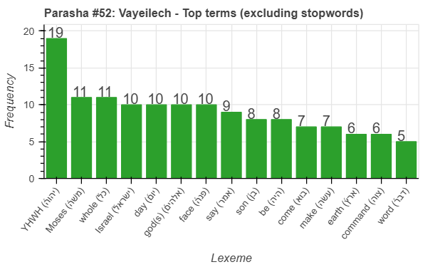
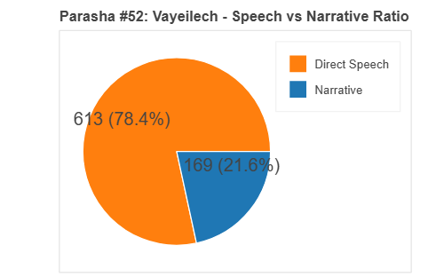
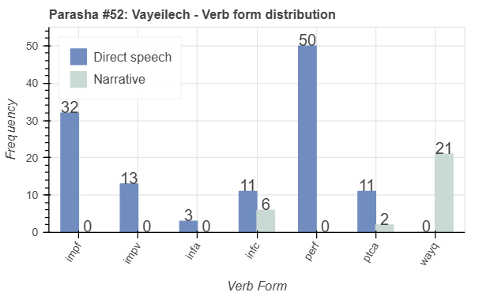
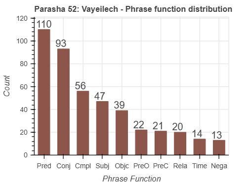

 <a href="../51%20-%20Nitzavim">Previous parasha (#51): Nitzavim</a> &nbsp;&nbsp; <a href="../53%20-%20Ha'azinu">Next parasha (#53): Ha'azinu</a>

# Parasha #52: Vayeilech (וַיֵּלֶךְ)

## Reading passages

Torah: <a href="https://www.stepbible.org/?q=version=NASB2020|reference=Deut.31-30&options=HNVUG" target="_blank">Deuteronomy 31:1-30</a> &nbsp;&nbsp; <a href="https://tikkun.io/#/p/vayeilech" target="_blank">(Hebrew: פָּרָשַׁת וַיֵּלֶךְ)</a> 
Haftarah: 
<a href="https://www.stepbible.org/?q=version=NASB2020|reference=Is.55:6-56:8&options=HNVUG" target="_blank">Isaiah 55:6-56:8</a>

## Summary

Parasha Vayeilech (“And he went”) describes Moses' final actions as he prepares for his death. He passes leadership to Joshua, encouraging him and the Israelites to be strong and courageous as they enter the Promised Land. God tells Moses to write down the Torah and a prophetic song (Ha'azinu), ensuring it will be a witness against Israel when they inevitably turn away, but also promising His enduring presence.

## Parasha statistics

<a href="../../General/metrics_distribution.html" target="_blank">Interactive statistics for all parashot (# of words, sentences, etc.)</a>

## Related SHEBANQ queries

Verse | Query | Short description
--- | --- | --- 
<a href="https://www.stepbible.org/?q=version=NASB2020\|reference=Deut.31:2&options=HNVUG" target="_blank">Deut. 21:2</a> | <a href="https://shebanq.ancient-data.org/hebrew/text?iid=7119&version=2021&page=1&mr=r&qw=q" target="_blank">Going out and going in</a> | Locate clauses akin to לָצֵ֣את וְלָבֹ֑וא.
<a href="https://www.stepbible.org/?q=version=NASB2020\|reference=Deut.31:15&options=HNVUG" target="_blank">Deut. 31:15</a> | <a href="https://shebanq.ancient-data.org/hebrew/text?iid=6876&version=2021&page=1&mr=r&qw=q" target="_blank">God appears</a> | God (or something of God) as subject to רָאָה in nifil stem.

## Related Text-Fabric Notebooks

GitHub | NBviewer | Short description
---|---|---
[hapax](hapax.ipynb) | <a href="https://nbviewer.org/github/tonyjurg/Parashot/blob/main/WeeklyParasha/52%20-%20Vayeilech/hapax.ipynb" target="_blank">hapax</a> | Find unique words (*hapax legomena*)

## Hebcal

Additional details about Jewish calendar and holiday information, offering users a resource for tracking Hebrew dates, candle lighting times, and other relevant information in the Jewish calendar. <a href="https://www.hebcal.com/sedrot/vayeilech" target="_blank">Hebcal entry for parasha Vayeilech</a>.
