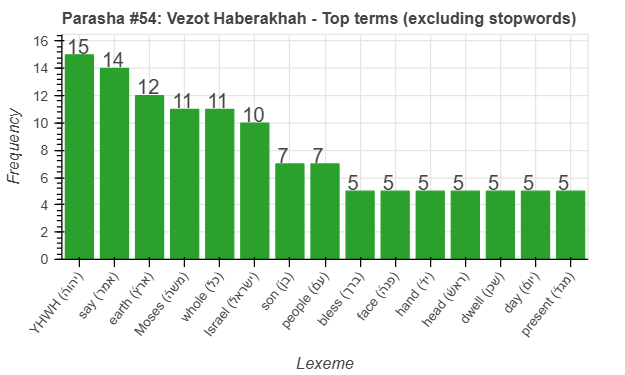
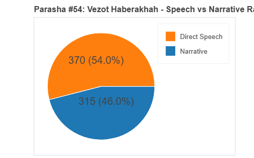
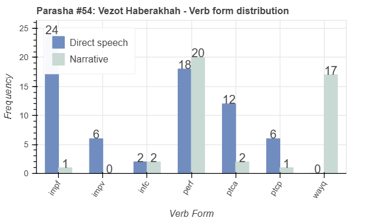
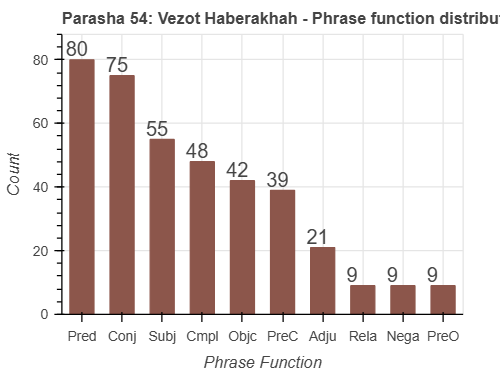

 <a href="../53%20-%20Ha'azinu">Previous parasha (#53): Ha'azinu</a> &nbsp;&nbsp; <a href="../01%20-%20Bereshit">Next parasha (#1): Bereshit</a>

# Parasha #54: Vezot Haberakhah (וְזֹאת הַבְּרָכָה)

## Reading passages

Torah: <a href="https://www.stepbible.org/?q=version=NASB2020|reference=Deut.33:1-34:12&options=HNVUG" target="_blank">Deuteronomy 33:1-34:12</a> &nbsp;&nbsp; <a href="https://tikkun.io/#/p/vezot-haberakhah" target="_blank">(Hebrew: פָּרָשַׁת וְזֹאת הַבְּרָכָה)</a> 
Haftarah: 
<a href="https://www.stepbible.org/?q=version=NASB2020|reference=Josh.1:1-18&options=HNVUG" target="_blank">Joshua 1:1-18</a> (Ashkenazim) or
<a href="https://www.stepbible.org/?q=version=NASB2020|reference=Josh.1:1-9&options=HNVUG" target="_blank">Joshua 1:1-9</a> (Sephardim)

## Summary

Parasha Vezot HaBerakhah ("and this is the blessing") is the final portion of the Torah, where Moses blesses each of the tribes of Israel before his death. He ascends Mount Nebo, where God shows him the Promised Land that he will not enter, and then Moses dies and is buried by God. The portion concludes by honoring Moses as the greatest prophet, whom God knew face to face, highlighting his unparalleled role in Israel's history.

## Parasha statistics

<a href="../../General/metrics_distribution.html" target="_blank">Interactive statistics for all parashot (# of words, sentences, etc.)</a>

## Related SHEBANQ queries

Verse | Query | Short description
--- | --- | --- 
||

## Related Text-Fabric Notebooks

GitHub | NBviewer | Short description
---|---|---
[hapax](hapax.ipynb) | <a href="https://nbviewer.org/github/tonyjurg/Parashot/blob/main/WeeklyParasha/54%20-%20Vezot%20Haberakhah/hapax.ipynb" target="_blank">hapax</a> | find unique words (*hapax legomena*)

## Hebcal

Additional details about Jewish calendar and holiday information, offering users a resource for tracking Hebrew dates, candle lighting times, and other relevant information in the Jewish calendar. <a href="https://www.hebcal.com/sedrot/vezot-haberakhah" target="_blank">Hebcal entry for parasha Vezot Haberakhah</a>.
